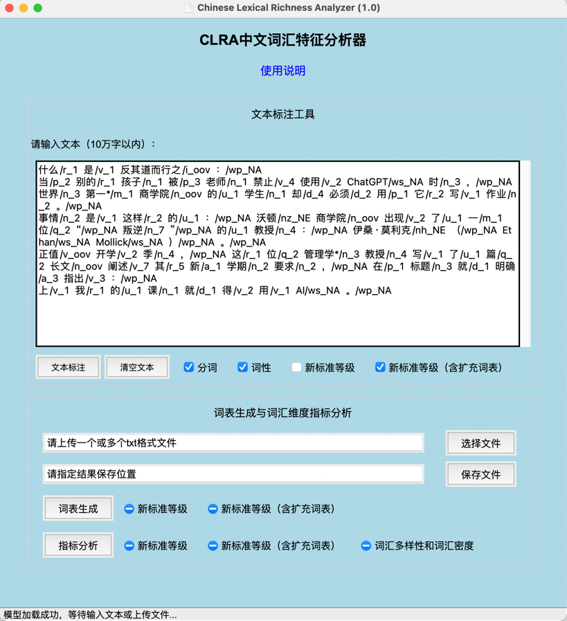
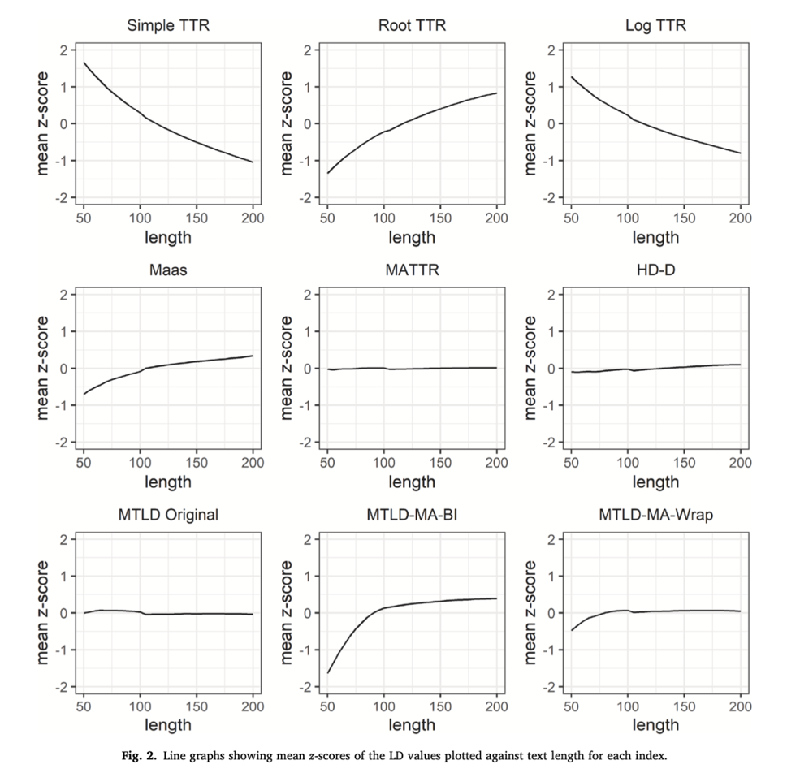

<h2 align="center">
  CLRA中文词汇特征分析器 V1.0 使用手册
</h2>

  2023/08/30<o:p></o:p
  >

  <b style="mso-bidi-font-weight: normal"
    >CLRA</b
  ><b style="mso-bidi-font-weight: normal"
    >工具</b
  ><b style="mso-bidi-font-weight: normal"
    >
      (Chinese Lexical Richness Analyzer)</b
  >
  由北京师范大学国际中文教育学院胡韧奋课题组主持研发，旨在为国际中文教育领域内的教材编撰、考试命题、学生写作以及口语产出研究提供<b
      style="mso-bidi-font-weight: normal"
      >词汇维度</b
    >的量化分析支持。CLRA参考《国际中文教育中文水平等级标准》三等九级词表，支持文本标注（分词、词性、词语等级）、词表生成、词汇复杂度和词汇多样性等多维度指标分析等功能。<o:p></o:p
  >

  <![if !supportLists]><b
    >1.&nbsp;&nbsp;&nbsp;
        </b
  ><![endif]><b
    >下载分析器</b
  ><b
    ><o:p></o:p></b>

  CLRA工具提供了Windows, MacOS (Intel), MacOS (Apple M1)三种客户端程序，填写试用申请后可获得下载链接：<a href="https://www.wjx.cn/vm/rUtXWDS.aspx" target="_blank"
        >https://www.wjx.cn/vm/rUtXWDS.aspx#</a
      >。请下载系统对应的程序，解压缩后无需安装：<o:p></o:p
  >

  <![if !supportLists]>➢&nbsp; <![endif]>Windows系统：双击直接打开；<o:p></o:p
  >

  <![if !supportLists]>➢&nbsp; <![endif]>Mac OS系统：首次运行程序如提示开发者身份未验证，请<code
    ><b style="mso-bidi-font-weight: normal"
      >右键点击</b
    ></code
  >打开，为方便后续使用，还可将程序拖至Mac应用程序目录，之后可通过<code
    >启动台</code
  >快捷访问CLRA。<o:p></o:p
  >

  <!--[if gte vml 1
      ]><v:shapetype
        id="_x0000_t75"
        coordsize="21600,21600"
        o:spt="75"
        o:preferrelative="t"
        path="m@4@5l@4@11@9@11@9@5xe"
        filled="f"
        stroked="f"
      >
        <v:stroke joinstyle="miter" />
        <v:formulas>
          <v:f eqn="if lineDrawn pixelLineWidth 0" />
          <v:f eqn="sum @0 1 0" />
          <v:f eqn="sum 0 0 @1" />
          <v:f eqn="prod @2 1 2" />
          <v:f eqn="prod @3 21600 pixelWidth" />
          <v:f eqn="prod @3 21600 pixelHeight" />
          <v:f eqn="sum @0 0 1" />
          <v:f eqn="prod @6 1 2" />
          <v:f eqn="prod @7 21600 pixelWidth" />
          <v:f eqn="sum @8 21600 0" />
          <v:f eqn="prod @7 21600 pixelHeight" />
          <v:f eqn="sum @10 21600 0" />
        </v:formulas>
        <v:path o:extrusionok="f" gradientshapeok="t" o:connecttype="rect" />
        <o:lock v:ext="edit" aspectratio="t" /> </v:shapetype
      ><v:shape
        id="图片_x0020_3"
        o:spid="_x0000_i1026"
        type="#_x0000_t75"
        style="
          width: 267pt;
          height: 292pt;
          visibility: visible;
          mso-wrap-style: square;
        "
      >
        <v:imagedata
          src="images/image001.png"
          o:title=""
        /> </v:shape><!
    [endif]--><![if !vml]><![endif]><o:p></o:p
  >

  CLRA界面<o:p></o:p
  >

  <![if !supportLists]><b
    >2.&nbsp;&nbsp;&nbsp;
        </b
  ><![endif]><b
    >文本标注工具</b
  ><b
    ><o:p></o:p></b>

  文本标注工具单次可处理10万字以内文本，包含<b style="mso-bidi-font-weight: normal">分词</b>、<b
      style="mso-bidi-font-weight: normal"
      >标注词性</b
    >、<b style="mso-bidi-font-weight: normal">标注新标准词语等级</b>、<b
      style="mso-bidi-font-weight: normal"
      >标注新标准词语等级（含扩充词表）</b
    >四项功能。<o:p></o:p
  >

  <b style="mso-bidi-font-weight: normal"
    >2.1
    </b
  ><b style="mso-bidi-font-weight: normal"
    >文本标注工具使用方法<o:p></o:p></b>

  <b style="mso-bidi-font-weight: normal"
    >Step1:</b
  >
  将待分析文本粘贴至文本框内，文本框输入支持最长10万字符；<o:p></o:p
  >

  <b style="mso-bidi-font-weight: normal"
    >Step2:</b
  >
  选择用户所需要的对应功能，点击“文本标注”（注：“新标准等级”和“新标准等级（含扩充词表）”不可同时选择）；<o:p></o:p
  >

  <b style="mso-bidi-font-weight: normal"
    >Step3:</b
  >
  文本框内显示标注成功后的文本，如需输入新文本，点击<b style="mso-bidi-font-weight: normal"
    >“</b
  ><b style="mso-bidi-font-weight: normal"
    >清空文本”</b
  >即可。<o:p></o:p
  >

  <b style="mso-bidi-font-weight: normal"
    >2.2</b
  ><b style="mso-bidi-font-weight: normal"
    >文本标注结果说明<o:p></o:p></b>

  <![if !supportLists]><b style="mso-bidi-font-weight: normal"
    >A.&nbsp;&nbsp;&nbsp;&nbsp;&nbsp;
        </b
  ><![endif]>在具体的标注结果中，各等级词语的标注结果对应等级数字，七至九级对应数字7；<o:p></o:p
  >

  <![if !supportLists]><b style="mso-bidi-font-weight: normal"
    >B.&nbsp;&nbsp;&nbsp;&nbsp;&nbsp;
        </b
  ><![endif]>超纲词标为<b style="mso-bidi-font-weight: normal"
    >“oov”</b
  >，即Out of Vocabulary；<o:p></o:p
  >

  <![if !supportLists]><b style="mso-bidi-font-weight: normal"
    >C.&nbsp;&nbsp;&nbsp;&nbsp;&nbsp;
        </b
  ><![endif]>标点符号、数字词和字母词等标为<b style="mso-bidi-font-weight: normal"
    >“NA”</b
  >，即Not Applied，无法查询等级；<o:p></o:p
  >

  <![if !supportLists]><b style="mso-bidi-font-weight: normal"
    >D.&nbsp;&nbsp;&nbsp;&nbsp;&nbsp;
        </b
  ><![endif]>人名、地名和专名等如不在词表内，则标为<b style="mso-bidi-font-weight: normal"
    >“NE”</b
  >，即Name Entity，同时不参与词汇指标计算。<o:p></o:p
  >

  <b style="mso-bidi-font-weight: normal"
    >2.3</b
  ><b style="mso-bidi-font-weight: normal"
    >文本标注功能说明<o:p></o:p></b>

  <![if !supportLists]><b style="mso-bidi-font-weight: normal"
    >A.&nbsp;&nbsp;&nbsp;
        </b
  ><![endif]><b style="mso-bidi-font-weight: normal"
    >标注等级</b
  ><b style="mso-bidi-font-weight: normal"
    ><o:p></o:p></b>

  词语等级信息参考《国际中文教育中文水平等级标准》词汇表（后文简称《新标准》词表），该表共收录
    11092 个词语，包括一级
    500词、二级
    772词、三级
    973词、四级
    1000词、五级
    1071词、六级
    1140词、
  七至九级
    5636 词。<o:p></o:p
  >

  <![if !supportLists]><b style="mso-bidi-font-weight: normal"
    >B.&nbsp;&nbsp;&nbsp;
        </b
  ><![endif]><b style="mso-bidi-font-weight: normal"
    >同形词等级消歧</b
  ><b style="mso-bidi-font-weight: normal"
    ><o:p></o:p></b>

  《新标准》词表收录了128个同形词，其中大多数分属不同等级，例如，“白”（形容词）属于一级，而“白”（副词）属于三级，如果仅在分词后进行词表匹配，则无法区分同形词的不同等级。为解决该问题，本工具利用词性、拼音等特征实现了级别自动消歧，如下例所示：<o:p></o:p
  >

  <![if !supportLists]>➢&nbsp; <![endif]>那/r_1  块/q_1  墙/n_2  刷/v_4  得/u_2  非常/d_1  <b
    >白</b
  ><b
    >/a_1</b
  >  。/wp_NA  <o:p></o:p
  >

  <![if !supportLists]>➢&nbsp; <![endif]>我/r_1  不/d_1  想/v_1  再/d_1  <b
    >白</b
  ><b
    >/d_3</b
  >  跑/v_1  一/m_1  趟/q_6  了/u_1  。/wp_NA  <o:p></o:p
  >

  <![if !supportLists]><b style="mso-bidi-font-weight: normal"
    >C.&nbsp;&nbsp;&nbsp;
        </b
  ><![endif]><b style="mso-bidi-font-weight: normal"
    >扩充词表</b
  ><b style="mso-bidi-font-weight: normal"
    ><o:p></o:p></b>

  对于《新标准》词表未收录的词语，可根据语素的形式和意义对其是否真正超纲进行判定。如下图所示，在文本标注工具中选择“新标准等级（含扩充词表）”后，会提供基于扩充词表的标注结果，词语后加<b style="mso-bidi-font-weight: normal"
      >“*”</b
    >以示区分，如下两例所示：<o:p></o:p>

  <![if !supportLists]>➢&nbsp; <![endif]><b style="mso-bidi-font-weight: normal"
    >这个</b
  ><b style="mso-bidi-font-weight: normal"
    >*/r_1</b
  >  苹果/n_3  看/v_1  起来/v_1  非常/d_1  新鲜/a_4  。/wp_NA <o:p></o:p
  >

  注：《新标准》词表未收录“这个”，但“这”与“个”同为一级词，且“这个”的词义可由其语素推理得到，因此扩充词表将其标记为一级，<o:p></o:p
  >

  <![if !supportLists]>➢&nbsp; <![endif]>我们/r_1  在/p_1  北京/ns_1  <b style="mso-bidi-font-weight: normal"
    >玩</b
  ><b style="mso-bidi-font-weight: normal"
    >*/v_1</b
  >  了/u_1  三/m_1  天/q_1  。/wp_NA  <o:p></o:p
  >

  注：《新标准》词表收录了“玩儿”（一级），据此将“玩”标记为一级。<o:p></o:p
  >

  <b
    ><o:p>&nbsp;</o:p></b
  >

  <![if !supportLists]><b
    >3.&nbsp;&nbsp;&nbsp;
        </b
  ><![endif]><b
    >词表生成与词汇丰富性指标分析</b
  ><b
    ><o:p></o:p></b>

  <b style="mso-bidi-font-weight: normal"
    >3.1
    </b
  ><b style="mso-bidi-font-weight: normal"
    >使用说明<o:p></o:p></b>

  <b style="mso-bidi-font-weight: normal"
    >Step1</b
  >: 点击“选择文件”上传txt格式文件，支持上传多个文件进行批量处理，上传文件限定最长100万字符/文件；<o:p></o:p
  >

  <b style="mso-bidi-font-weight: normal"
    >Step2</b
  >: 点击“保存文件”指定输出文件位置，默认结果保存为xlsx格式表格文件；<o:p></o:p
  >

  <b style="mso-bidi-font-weight: normal"
    >Step3</b
  >: 点击“词表生成”或者“指标分析”运行程序，程序运行进度在底部状态栏显示。程序处理速度约1万字/秒（与系统配置有关），如需处理较大规模语料，请耐心关注状态栏提示，运行过程中切勿点击其他按钮。<o:p></o:p
  >

  <b style="mso-bidi-font-weight: normal"
    >3.2
    </b
  ><b style="mso-bidi-font-weight: normal"
    >词表生成功能<o:p></o:p></b>

  本工具可基于《新标准》词表或《新标准》词表（含扩充词表）生成各等级词表，以表格形式输出文件名、词语、词性、级别等信息。
    <o:p></o:p>

  <b style="mso-bidi-font-weight: normal"
    >3.3
    </b
  ><b style="mso-bidi-font-weight: normal"
    >词汇丰富性指标分析功能<o:p></o:p></b>

  <a name="OLE_LINK1"></a
  ><a name="OLE_LINK2"
    >该功能支持基于《新标准》词表或其扩充词表对各等级词语数量和比例进行分析，供测量词汇复杂度参考，此外，还提供了多维度的词汇多样性和词汇密度</a
  >测量。<o:p></o:p
  >

  <b style="mso-bidi-font-weight: normal"
    >3.3.1
    </b
  ><b style="mso-bidi-font-weight: normal"
    >《新标准》词表指标</b
  ><b style="mso-bidi-font-weight: normal"
    ><o:p></o:p></b>

  本工具提供基于新标准词表的词汇复杂度指标，并包含多等级的量化指标分析，如中高级、中级及以上（包括超纲词）、高级及以上（包括超纲词）等不同组别，共80个（具体指标可参考附录A）。<o:p></o:p
  >

  <b style="mso-bidi-font-weight: normal"
    >3.3.2
    </b
  ><b style="mso-bidi-font-weight: normal"
    >词汇多样性和词汇密度指标</b
  ><o:p></o:p
  >

  本工具提供多维度的词汇多样性和词汇密度测量，共11个（具体指标可参考附录B）。传统的TTR和RTTR等指标容易受到文本长度影响，难以提供可靠的测量结果，根据Zenker
    &amp; Kyle (2021)的研究，我们集成了MATTR、HDD、MLTD等方法<a style="mso-footnote-id: ftn1" href="#_ftn1" name="_ftnref1" title=""
    ><![if !supportFootnotes]>[1]<![endif]></a
  >，在样本长度存在差异时也能提供稳定可靠的测量结果。<o:p></o:p
  >

  <!--[if gte vml 1
      ]><v:shape
        id="图片_x0020_2"
        o:spid="_x0000_i1025"
        type="#_x0000_t75"
        style="
          width: 321pt;
          height: 310pt;
          visibility: visible;
          mso-wrap-style: square;
        "
      >
        <v:imagedata
          src="images/image002.png"
          o:title=""
        /> </v:shape><!
    [endif]--><![if !vml]><![endif]><o:p></o:p
  >

  注：Zenker
    &amp; Kyle（2021）发现在50到200词的英语作文中，MATTR、HD-D、MTLD这三项指标受文本长度的影响较小。<o:p></o:p
  >

  <o:p>&nbsp;</o:p>

  如果在您的研究中使用了CLRA工具，欢迎参考和引用：<o:p></o:p
  >

  [1] 徐云洁, 王兆基, 胡韧奋. 基于新标准的汉语词汇复杂度自动分析工具及其应用. 第七届汉语中介语语料库建设与应用国际学术讨论会. 2021.<o:p></o:p>

  [2] 徐云洁, 胡韧奋. 汉语词汇丰富性的自动分析研究. 数字人文与阅读分级学术研讨会. 2021.<o:p></o:p>

  <o:p>&nbsp;</o:p>

  CLRA将持续迭代和更新，并集成更多丰富的功能，如果您对CLRA研发有任何问题或建议，欢迎与我们联系：<a href="mailto:crystalxu@mail.bnu.edu.cn"
      >crystalxu@mail.bnu.edu.cn</a
    >。<o:p></o:p
  >

  <o:p>&nbsp;</o:p>

  <b
    >附录：词汇维度分析指标类型介绍</b
  ><b
    ><o:p></o:p></b>

  <b
    >A.
    </b
  ><b
    >新标准等级词表指标（80个）<o:p></o:p></b>

<table
  class="MsoNormalTable"
  border="1"
  cellspacing="0"
  cellpadding="0"
  style="
    border-collapse: collapse;
    border: none;
    mso-border-alt: solid windowtext 0.5pt;
    mso-yfti-tbllook: 1184;
    mso-padding-alt: 0cm 0cm 0cm 0cm;
    mso-border-insideh: 0.5pt solid windowtext;
    mso-border-insidev: 0.5pt solid windowtext;
  "
>
  <thead>
    <tr style="mso-yfti-irow: 0; mso-yfti-firstrow: yes">
      <td
        width="66"
        style="
          width: 49.4pt;
          border: solid windowtext 1pt;
          mso-border-alt: solid windowtext 0.5pt;
          padding: 4.5pt 9.75pt 4.5pt 9.75pt;
        "
      >
        

          <b
            >编号<o:p></o:p></b>
        

      </td>
      <td
        width="246"
        style="
          width: 184.2pt;
          border: solid windowtext 1pt;
          border-left: none;
          mso-border-left-alt: solid windowtext 0.5pt;
          mso-border-alt: solid windowtext 0.5pt;
          padding: 4.5pt 9.75pt 4.5pt 9.75pt;
        "
      >
        

          <b
            >指标<o:p></o:p></b>
        

      </td>
      <td
        style="
          border: solid windowtext 1pt;
          border-left: none;
          mso-border-left-alt: solid windowtext 0.5pt;
          mso-border-alt: solid windowtext 0.5pt;
          padding: 4.5pt 9.75pt 4.5pt 9.75pt;
        "
      >
        

          <b
            >描述<o:p></o:p></b>
        

      </td>
    </tr>
  </thead>
  <tr style="mso-yfti-irow: 1">
    <td
      style="
        border: solid windowtext 1pt;
        border-top: none;
        mso-border-top-alt: solid windowtext 0.5pt;
        mso-border-alt: solid windowtext 0.5pt;
        padding: 4.5pt 9.75pt 4.5pt 9.75pt;
      "
    >
      

        1<o:p></o:p
        >
      

    </td>
    <td
      style="
        border-top: none;
        border-left: none;
        border-bottom: solid windowtext 1pt;
        border-right: solid windowtext 1pt;
        mso-border-top-alt: solid windowtext 0.5pt;
        mso-border-left-alt: solid windowtext 0.5pt;
        mso-border-alt: solid windowtext 0.5pt;
        padding: 4.5pt 9.75pt 4.5pt 9.75pt;
      "
    >
      

        token_sum_of_words<o:p></o:p
        >
      

    </td>
    <td
      style="
        border-top: none;
        border-left: none;
        border-bottom: solid windowtext 1pt;
        border-right: solid windowtext 1pt;
        mso-border-top-alt: solid windowtext 0.5pt;
        mso-border-left-alt: solid windowtext 0.5pt;
        mso-border-alt: solid windowtext 0.5pt;
        padding: 4.5pt 9.75pt 4.5pt 9.75pt;
      "
    >
      

        词形数量<o:p></o:p>
      

    </td>
  </tr>
  <tr style="mso-yfti-irow: 2">
    <td
      style="
        border: solid windowtext 1pt;
        border-top: none;
        mso-border-top-alt: solid windowtext 0.5pt;
        mso-border-alt: solid windowtext 0.5pt;
        padding: 4.5pt 9.75pt 4.5pt 9.75pt;
      "
    >
      

        2<o:p></o:p
        >
      

    </td>
    <td
      style="
        border-top: none;
        border-left: none;
        border-bottom: solid windowtext 1pt;
        border-right: solid windowtext 1pt;
        mso-border-top-alt: solid windowtext 0.5pt;
        mso-border-left-alt: solid windowtext 0.5pt;
        mso-border-alt: solid windowtext 0.5pt;
        padding: 4.5pt 9.75pt 4.5pt 9.75pt;
      "
    >
      

        token_first_level<o:p></o:p
        >
      

    </td>
    <td
      style="
        border-top: none;
        border-left: none;
        border-bottom: solid windowtext 1pt;
        border-right: solid windowtext 1pt;
        mso-border-top-alt: solid windowtext 0.5pt;
        mso-border-left-alt: solid windowtext 0.5pt;
        mso-border-alt: solid windowtext 0.5pt;
        padding: 4.5pt 9.75pt 4.5pt 9.75pt;
      "
    >
      

        一级词（词形）数量<o:p></o:p>
      

    </td>
  </tr>
  <tr style="mso-yfti-irow: 3">
    <td
      style="
        border: solid windowtext 1pt;
        border-top: none;
        mso-border-top-alt: solid windowtext 0.5pt;
        mso-border-alt: solid windowtext 0.5pt;
        padding: 4.5pt 9.75pt 4.5pt 9.75pt;
      "
    >
      

        3<o:p></o:p
        >
      

    </td>
    <td
      style="
        border-top: none;
        border-left: none;
        border-bottom: solid windowtext 1pt;
        border-right: solid windowtext 1pt;
        mso-border-top-alt: solid windowtext 0.5pt;
        mso-border-left-alt: solid windowtext 0.5pt;
        mso-border-alt: solid windowtext 0.5pt;
        padding: 4.5pt 9.75pt 4.5pt 9.75pt;
      "
    >
      

        token_first_level_ratio<o:p></o:p
        >
      

    </td>
    <td
      style="
        border-top: none;
        border-left: none;
        border-bottom: solid windowtext 1pt;
        border-right: solid windowtext 1pt;
        mso-border-top-alt: solid windowtext 0.5pt;
        mso-border-left-alt: solid windowtext 0.5pt;
        mso-border-alt: solid windowtext 0.5pt;
        padding: 4.5pt 9.75pt 4.5pt 9.75pt;
      "
    >
      

        一级词（词形）占比<o:p></o:p>
      

    </td>
  </tr>
  <tr style="mso-yfti-irow: 4">
    <td
      style="
        border: solid windowtext 1pt;
        border-top: none;
        mso-border-top-alt: solid windowtext 0.5pt;
        mso-border-alt: solid windowtext 0.5pt;
        padding: 4.5pt 9.75pt 4.5pt 9.75pt;
      "
    >
      

        4<o:p></o:p
        >
      

    </td>
    <td
      style="
        border-top: none;
        border-left: none;
        border-bottom: solid windowtext 1pt;
        border-right: solid windowtext 1pt;
        mso-border-top-alt: solid windowtext 0.5pt;
        mso-border-left-alt: solid windowtext 0.5pt;
        mso-border-alt: solid windowtext 0.5pt;
        padding: 4.5pt 9.75pt 4.5pt 9.75pt;
      "
    >
      

        token_first_level_rootratio<o:p></o:p
        >
      

    </td>
    <td
      style="
        border-top: none;
        border-left: none;
        border-bottom: solid windowtext 1pt;
        border-right: solid windowtext 1pt;
        mso-border-top-alt: solid windowtext 0.5pt;
        mso-border-left-alt: solid windowtext 0.5pt;
        mso-border-alt: solid windowtext 0.5pt;
        padding: 4.5pt 9.75pt 4.5pt 9.75pt;
      "
    >
      

        一级词（词形）开根占比<o:p></o:p>
      

    </td>
  </tr>
  <tr style="mso-yfti-irow: 5">
    <td
      style="
        border: solid windowtext 1pt;
        border-top: none;
        mso-border-top-alt: solid windowtext 0.5pt;
        mso-border-alt: solid windowtext 0.5pt;
        padding: 4.5pt 9.75pt 4.5pt 9.75pt;
      "
    >
      

        5<o:p></o:p
        >
      

    </td>
    <td
      style="
        border-top: none;
        border-left: none;
        border-bottom: solid windowtext 1pt;
        border-right: solid windowtext 1pt;
        mso-border-top-alt: solid windowtext 0.5pt;
        mso-border-left-alt: solid windowtext 0.5pt;
        mso-border-alt: solid windowtext 0.5pt;
        padding: 4.5pt 9.75pt 4.5pt 9.75pt;
      "
    >
      

        token_second_level<o:p></o:p
        >
      

    </td>
    <td
      style="
        border-top: none;
        border-left: none;
        border-bottom: solid windowtext 1pt;
        border-right: solid windowtext 1pt;
        mso-border-top-alt: solid windowtext 0.5pt;
        mso-border-left-alt: solid windowtext 0.5pt;
        mso-border-alt: solid windowtext 0.5pt;
        padding: 4.5pt 9.75pt 4.5pt 9.75pt;
      "
    >
      

        二级词（词形）数量<o:p></o:p>
      

    </td>
  </tr>
  <tr style="mso-yfti-irow: 6">
    <td
      style="
        border: solid windowtext 1pt;
        border-top: none;
        mso-border-top-alt: solid windowtext 0.5pt;
        mso-border-alt: solid windowtext 0.5pt;
        padding: 4.5pt 9.75pt 4.5pt 9.75pt;
      "
    >
      

        6<o:p></o:p
        >
      

    </td>
    <td
      style="
        border-top: none;
        border-left: none;
        border-bottom: solid windowtext 1pt;
        border-right: solid windowtext 1pt;
        mso-border-top-alt: solid windowtext 0.5pt;
        mso-border-left-alt: solid windowtext 0.5pt;
        mso-border-alt: solid windowtext 0.5pt;
        padding: 4.5pt 9.75pt 4.5pt 9.75pt;
      "
    >
      

        token_second_level_ratio<o:p></o:p
        >
      

    </td>
    <td
      style="
        border-top: none;
        border-left: none;
        border-bottom: solid windowtext 1pt;
        border-right: solid windowtext 1pt;
        mso-border-top-alt: solid windowtext 0.5pt;
        mso-border-left-alt: solid windowtext 0.5pt;
        mso-border-alt: solid windowtext 0.5pt;
        padding: 4.5pt 9.75pt 4.5pt 9.75pt;
      "
    >
      

        二级词（词形）占比<o:p></o:p>
      

    </td>
  </tr>
  <tr style="mso-yfti-irow: 7">
    <td
      style="
        border: solid windowtext 1pt;
        border-top: none;
        mso-border-top-alt: solid windowtext 0.5pt;
        mso-border-alt: solid windowtext 0.5pt;
        padding: 4.5pt 9.75pt 4.5pt 9.75pt;
      "
    >
      

        7<o:p></o:p
        >
      

    </td>
    <td
      style="
        border-top: none;
        border-left: none;
        border-bottom: solid windowtext 1pt;
        border-right: solid windowtext 1pt;
        mso-border-top-alt: solid windowtext 0.5pt;
        mso-border-left-alt: solid windowtext 0.5pt;
        mso-border-alt: solid windowtext 0.5pt;
        padding: 4.5pt 9.75pt 4.5pt 9.75pt;
      "
    >
      

        token_second_level_rootratio<o:p></o:p
        >
      

    </td>
    <td
      style="
        border-top: none;
        border-left: none;
        border-bottom: solid windowtext 1pt;
        border-right: solid windowtext 1pt;
        mso-border-top-alt: solid windowtext 0.5pt;
        mso-border-left-alt: solid windowtext 0.5pt;
        mso-border-alt: solid windowtext 0.5pt;
        padding: 4.5pt 9.75pt 4.5pt 9.75pt;
      "
    >
      

        二级词（词形）开根占比<o:p></o:p>
      

    </td>
  </tr>
  <tr style="mso-yfti-irow: 8">
    <td
      style="
        border: solid windowtext 1pt;
        border-top: none;
        mso-border-top-alt: solid windowtext 0.5pt;
        mso-border-alt: solid windowtext 0.5pt;
        padding: 4.5pt 9.75pt 4.5pt 9.75pt;
      "
    >
      

        8<o:p></o:p
        >
      

    </td>
    <td
      style="
        border-top: none;
        border-left: none;
        border-bottom: solid windowtext 1pt;
        border-right: solid windowtext 1pt;
        mso-border-top-alt: solid windowtext 0.5pt;
        mso-border-left-alt: solid windowtext 0.5pt;
        mso-border-alt: solid windowtext 0.5pt;
        padding: 4.5pt 9.75pt 4.5pt 9.75pt;
      "
    >
      

        token_third_level<o:p></o:p
        >
      

    </td>
    <td
      style="
        border-top: none;
        border-left: none;
        border-bottom: solid windowtext 1pt;
        border-right: solid windowtext 1pt;
        mso-border-top-alt: solid windowtext 0.5pt;
        mso-border-left-alt: solid windowtext 0.5pt;
        mso-border-alt: solid windowtext 0.5pt;
        padding: 4.5pt 9.75pt 4.5pt 9.75pt;
      "
    >
      

        三级词（词形）数量<o:p></o:p>
      

    </td>
  </tr>
  <tr style="mso-yfti-irow: 9">
    <td
      style="
        border: solid windowtext 1pt;
        border-top: none;
        mso-border-top-alt: solid windowtext 0.5pt;
        mso-border-alt: solid windowtext 0.5pt;
        padding: 4.5pt 9.75pt 4.5pt 9.75pt;
      "
    >
      

        9<o:p></o:p
        >
      

    </td>
    <td
      style="
        border-top: none;
        border-left: none;
        border-bottom: solid windowtext 1pt;
        border-right: solid windowtext 1pt;
        mso-border-top-alt: solid windowtext 0.5pt;
        mso-border-left-alt: solid windowtext 0.5pt;
        mso-border-alt: solid windowtext 0.5pt;
        padding: 4.5pt 9.75pt 4.5pt 9.75pt;
      "
    >
      

        token_third_level_ratio<o:p></o:p
        >
      

    </td>
    <td
      style="
        border-top: none;
        border-left: none;
        border-bottom: solid windowtext 1pt;
        border-right: solid windowtext 1pt;
        mso-border-top-alt: solid windowtext 0.5pt;
        mso-border-left-alt: solid windowtext 0.5pt;
        mso-border-alt: solid windowtext 0.5pt;
        padding: 4.5pt 9.75pt 4.5pt 9.75pt;
      "
    >
      

        三级词（词形）占比<o:p></o:p>
      

    </td>
  </tr>
  <tr style="mso-yfti-irow: 10">
    <td
      style="
        border: solid windowtext 1pt;
        border-top: none;
        mso-border-top-alt: solid windowtext 0.5pt;
        mso-border-alt: solid windowtext 0.5pt;
        padding: 4.5pt 9.75pt 4.5pt 9.75pt;
      "
    >
      

        10<o:p></o:p
        >
      

    </td>
    <td
      style="
        border-top: none;
        border-left: none;
        border-bottom: solid windowtext 1pt;
        border-right: solid windowtext 1pt;
        mso-border-top-alt: solid windowtext 0.5pt;
        mso-border-left-alt: solid windowtext 0.5pt;
        mso-border-alt: solid windowtext 0.5pt;
        padding: 4.5pt 9.75pt 4.5pt 9.75pt;
      "
    >
      

        token_third_level_rootratio<o:p></o:p
        >
      

    </td>
    <td
      style="
        border-top: none;
        border-left: none;
        border-bottom: solid windowtext 1pt;
        border-right: solid windowtext 1pt;
        mso-border-top-alt: solid windowtext 0.5pt;
        mso-border-left-alt: solid windowtext 0.5pt;
        mso-border-alt: solid windowtext 0.5pt;
        padding: 4.5pt 9.75pt 4.5pt 9.75pt;
      "
    >
      

        三级词（词形）开根占比<o:p></o:p>
      

    </td>
  </tr>
  <tr style="mso-yfti-irow: 11">
    <td
      style="
        border: solid windowtext 1pt;
        border-top: none;
        mso-border-top-alt: solid windowtext 0.5pt;
        mso-border-alt: solid windowtext 0.5pt;
        padding: 4.5pt 9.75pt 4.5pt 9.75pt;
      "
    >
      

        11<o:p></o:p
        >
      

    </td>
    <td
      style="
        border-top: none;
        border-left: none;
        border-bottom: solid windowtext 1pt;
        border-right: solid windowtext 1pt;
        mso-border-top-alt: solid windowtext 0.5pt;
        mso-border-left-alt: solid windowtext 0.5pt;
        mso-border-alt: solid windowtext 0.5pt;
        padding: 4.5pt 9.75pt 4.5pt 9.75pt;
      "
    >
      

        token_fourth_level<o:p></o:p
        >
      

    </td>
    <td
      style="
        border-top: none;
        border-left: none;
        border-bottom: solid windowtext 1pt;
        border-right: solid windowtext 1pt;
        mso-border-top-alt: solid windowtext 0.5pt;
        mso-border-left-alt: solid windowtext 0.5pt;
        mso-border-alt: solid windowtext 0.5pt;
        padding: 4.5pt 9.75pt 4.5pt 9.75pt;
      "
    >
      

        四级词（词形）数量<o:p></o:p>
      

    </td>
  </tr>
  <tr style="mso-yfti-irow: 12">
    <td
      style="
        border: solid windowtext 1pt;
        border-top: none;
        mso-border-top-alt: solid windowtext 0.5pt;
        mso-border-alt: solid windowtext 0.5pt;
        padding: 4.5pt 9.75pt 4.5pt 9.75pt;
      "
    >
      

        12<o:p></o:p
        >
      

    </td>
    <td
      style="
        border-top: none;
        border-left: none;
        border-bottom: solid windowtext 1pt;
        border-right: solid windowtext 1pt;
        mso-border-top-alt: solid windowtext 0.5pt;
        mso-border-left-alt: solid windowtext 0.5pt;
        mso-border-alt: solid windowtext 0.5pt;
        padding: 4.5pt 9.75pt 4.5pt 9.75pt;
      "
    >
      

        token_fourth_level_ratio<o:p></o:p
        >
      

    </td>
    <td
      style="
        border-top: none;
        border-left: none;
        border-bottom: solid windowtext 1pt;
        border-right: solid windowtext 1pt;
        mso-border-top-alt: solid windowtext 0.5pt;
        mso-border-left-alt: solid windowtext 0.5pt;
        mso-border-alt: solid windowtext 0.5pt;
        padding: 4.5pt 9.75pt 4.5pt 9.75pt;
      "
    >
      

        四级词（词形）占比<o:p></o:p>
      

    </td>
  </tr>
  <tr style="mso-yfti-irow: 13">
    <td
      style="
        border: solid windowtext 1pt;
        border-top: none;
        mso-border-top-alt: solid windowtext 0.5pt;
        mso-border-alt: solid windowtext 0.5pt;
        padding: 4.5pt 9.75pt 4.5pt 9.75pt;
      "
    >
      

        13<o:p></o:p
        >
      

    </td>
    <td
      style="
        border-top: none;
        border-left: none;
        border-bottom: solid windowtext 1pt;
        border-right: solid windowtext 1pt;
        mso-border-top-alt: solid windowtext 0.5pt;
        mso-border-left-alt: solid windowtext 0.5pt;
        mso-border-alt: solid windowtext 0.5pt;
        padding: 4.5pt 9.75pt 4.5pt 9.75pt;
      "
    >
      

        token_fourth_level_rootratio<o:p></o:p
        >
      

    </td>
    <td
      style="
        border-top: none;
        border-left: none;
        border-bottom: solid windowtext 1pt;
        border-right: solid windowtext 1pt;
        mso-border-top-alt: solid windowtext 0.5pt;
        mso-border-left-alt: solid windowtext 0.5pt;
        mso-border-alt: solid windowtext 0.5pt;
        padding: 4.5pt 9.75pt 4.5pt 9.75pt;
      "
    >
      

        四级词（词形）开根占比<o:p></o:p>
      

    </td>
  </tr>
  <tr style="mso-yfti-irow: 14">
    <td
      style="
        border: solid windowtext 1pt;
        border-top: none;
        mso-border-top-alt: solid windowtext 0.5pt;
        mso-border-alt: solid windowtext 0.5pt;
        padding: 4.5pt 9.75pt 4.5pt 9.75pt;
      "
    >
      

        14<o:p></o:p
        >
      

    </td>
    <td
      style="
        border-top: none;
        border-left: none;
        border-bottom: solid windowtext 1pt;
        border-right: solid windowtext 1pt;
        mso-border-top-alt: solid windowtext 0.5pt;
        mso-border-left-alt: solid windowtext 0.5pt;
        mso-border-alt: solid windowtext 0.5pt;
        padding: 4.5pt 9.75pt 4.5pt 9.75pt;
      "
    >
      

        token_fifth_level<o:p></o:p
        >
      

    </td>
    <td
      style="
        border-top: none;
        border-left: none;
        border-bottom: solid windowtext 1pt;
        border-right: solid windowtext 1pt;
        mso-border-top-alt: solid windowtext 0.5pt;
        mso-border-left-alt: solid windowtext 0.5pt;
        mso-border-alt: solid windowtext 0.5pt;
        padding: 4.5pt 9.75pt 4.5pt 9.75pt;
      "
    >
      

        五级词（词形）数量<o:p></o:p>
      

    </td>
  </tr>
  <tr style="mso-yfti-irow: 15">
    <td
      style="
        border: solid windowtext 1pt;
        border-top: none;
        mso-border-top-alt: solid windowtext 0.5pt;
        mso-border-alt: solid windowtext 0.5pt;
        padding: 4.5pt 9.75pt 4.5pt 9.75pt;
      "
    >
      

        15<o:p></o:p
        >
      

    </td>
    <td
      style="
        border-top: none;
        border-left: none;
        border-bottom: solid windowtext 1pt;
        border-right: solid windowtext 1pt;
        mso-border-top-alt: solid windowtext 0.5pt;
        mso-border-left-alt: solid windowtext 0.5pt;
        mso-border-alt: solid windowtext 0.5pt;
        padding: 4.5pt 9.75pt 4.5pt 9.75pt;
      "
    >
      

        token_fifth_level_ratio<o:p></o:p
        >
      

    </td>
    <td
      style="
        border-top: none;
        border-left: none;
        border-bottom: solid windowtext 1pt;
        border-right: solid windowtext 1pt;
        mso-border-top-alt: solid windowtext 0.5pt;
        mso-border-left-alt: solid windowtext 0.5pt;
        mso-border-alt: solid windowtext 0.5pt;
        padding: 4.5pt 9.75pt 4.5pt 9.75pt;
      "
    >
      

        五级词（词形）占比<o:p></o:p>
      

    </td>
  </tr>
  <tr style="mso-yfti-irow: 16">
    <td
      style="
        border: solid windowtext 1pt;
        border-top: none;
        mso-border-top-alt: solid windowtext 0.5pt;
        mso-border-alt: solid windowtext 0.5pt;
        padding: 4.5pt 9.75pt 4.5pt 9.75pt;
      "
    >
      

        16<o:p></o:p
        >
      

    </td>
    <td
      style="
        border-top: none;
        border-left: none;
        border-bottom: solid windowtext 1pt;
        border-right: solid windowtext 1pt;
        mso-border-top-alt: solid windowtext 0.5pt;
        mso-border-left-alt: solid windowtext 0.5pt;
        mso-border-alt: solid windowtext 0.5pt;
        padding: 4.5pt 9.75pt 4.5pt 9.75pt;
      "
    >
      

        token_fifth_level_rootratio<o:p></o:p
        >
      

    </td>
    <td
      style="
        border-top: none;
        border-left: none;
        border-bottom: solid windowtext 1pt;
        border-right: solid windowtext 1pt;
        mso-border-top-alt: solid windowtext 0.5pt;
        mso-border-left-alt: solid windowtext 0.5pt;
        mso-border-alt: solid windowtext 0.5pt;
        padding: 4.5pt 9.75pt 4.5pt 9.75pt;
      "
    >
      

        五级词（词形）开根占比<o:p></o:p>
      

    </td>
  </tr>
  <tr style="mso-yfti-irow: 17">
    <td
      style="
        border: solid windowtext 1pt;
        border-top: none;
        mso-border-top-alt: solid windowtext 0.5pt;
        mso-border-alt: solid windowtext 0.5pt;
        padding: 4.5pt 9.75pt 4.5pt 9.75pt;
      "
    >
      

        17<o:p></o:p
        >
      

    </td>
    <td
      style="
        border-top: none;
        border-left: none;
        border-bottom: solid windowtext 1pt;
        border-right: solid windowtext 1pt;
        mso-border-top-alt: solid windowtext 0.5pt;
        mso-border-left-alt: solid windowtext 0.5pt;
        mso-border-alt: solid windowtext 0.5pt;
        padding: 4.5pt 9.75pt 4.5pt 9.75pt;
      "
    >
      

        token_sixth_level<o:p></o:p
        >
      

    </td>
    <td
      style="
        border-top: none;
        border-left: none;
        border-bottom: solid windowtext 1pt;
        border-right: solid windowtext 1pt;
        mso-border-top-alt: solid windowtext 0.5pt;
        mso-border-left-alt: solid windowtext 0.5pt;
        mso-border-alt: solid windowtext 0.5pt;
        padding: 4.5pt 9.75pt 4.5pt 9.75pt;
      "
    >
      

        六级词（词形）数量<o:p></o:p>
      

    </td>
  </tr>
  <tr style="mso-yfti-irow: 18">
    <td
      style="
        border: solid windowtext 1pt;
        border-top: none;
        mso-border-top-alt: solid windowtext 0.5pt;
        mso-border-alt: solid windowtext 0.5pt;
        padding: 4.5pt 9.75pt 4.5pt 9.75pt;
      "
    >
      

        18<o:p></o:p
        >
      

    </td>
    <td
      style="
        border-top: none;
        border-left: none;
        border-bottom: solid windowtext 1pt;
        border-right: solid windowtext 1pt;
        mso-border-top-alt: solid windowtext 0.5pt;
        mso-border-left-alt: solid windowtext 0.5pt;
        mso-border-alt: solid windowtext 0.5pt;
        padding: 4.5pt 9.75pt 4.5pt 9.75pt;
      "
    >
      

        token_sixth_level_ratio<o:p></o:p
        >
      

    </td>
    <td
      style="
        border-top: none;
        border-left: none;
        border-bottom: solid windowtext 1pt;
        border-right: solid windowtext 1pt;
        mso-border-top-alt: solid windowtext 0.5pt;
        mso-border-left-alt: solid windowtext 0.5pt;
        mso-border-alt: solid windowtext 0.5pt;
        padding: 4.5pt 9.75pt 4.5pt 9.75pt;
      "
    >
      

        六级词（词形）占比<o:p></o:p>
      

    </td>
  </tr>
  <tr style="mso-yfti-irow: 19">
    <td
      style="
        border: solid windowtext 1pt;
        border-top: none;
        mso-border-top-alt: solid windowtext 0.5pt;
        mso-border-alt: solid windowtext 0.5pt;
        padding: 4.5pt 9.75pt 4.5pt 9.75pt;
      "
    >
      

        19<o:p></o:p
        >
      

    </td>
    <td
      style="
        border-top: none;
        border-left: none;
        border-bottom: solid windowtext 1pt;
        border-right: solid windowtext 1pt;
        mso-border-top-alt: solid windowtext 0.5pt;
        mso-border-left-alt: solid windowtext 0.5pt;
        mso-border-alt: solid windowtext 0.5pt;
        padding: 4.5pt 9.75pt 4.5pt 9.75pt;
      "
    >
      

        token_sixth_level_rootratio<o:p></o:p
        >
      

    </td>
    <td
      style="
        border-top: none;
        border-left: none;
        border-bottom: solid windowtext 1pt;
        border-right: solid windowtext 1pt;
        mso-border-top-alt: solid windowtext 0.5pt;
        mso-border-left-alt: solid windowtext 0.5pt;
        mso-border-alt: solid windowtext 0.5pt;
        padding: 4.5pt 9.75pt 4.5pt 9.75pt;
      "
    >
      

        六级词（词形）开根占比<o:p></o:p>
      

    </td>
  </tr>
  <tr style="mso-yfti-irow: 20">
    <td
      style="
        border: solid windowtext 1pt;
        border-top: none;
        mso-border-top-alt: solid windowtext 0.5pt;
        mso-border-alt: solid windowtext 0.5pt;
        padding: 4.5pt 9.75pt 4.5pt 9.75pt;
      "
    >
      

        20<o:p></o:p
        >
      

    </td>
    <td
      style="
        border-top: none;
        border-left: none;
        border-bottom: solid windowtext 1pt;
        border-right: solid windowtext 1pt;
        mso-border-top-alt: solid windowtext 0.5pt;
        mso-border-left-alt: solid windowtext 0.5pt;
        mso-border-alt: solid windowtext 0.5pt;
        padding: 4.5pt 9.75pt 4.5pt 9.75pt;
      "
    >
      

        token_high_level<o:p></o:p
        >
      

    </td>
    <td
      style="
        border-top: none;
        border-left: none;
        border-bottom: solid windowtext 1pt;
        border-right: solid windowtext 1pt;
        mso-border-top-alt: solid windowtext 0.5pt;
        mso-border-left-alt: solid windowtext 0.5pt;
        mso-border-alt: solid windowtext 0.5pt;
        padding: 4.5pt 9.75pt 4.5pt 9.75pt;
      "
    >
      

        七-九级词（词形）数量<o:p></o:p>
      

    </td>
  </tr>
  <tr style="mso-yfti-irow: 21">
    <td
      style="
        border: solid windowtext 1pt;
        border-top: none;
        mso-border-top-alt: solid windowtext 0.5pt;
        mso-border-alt: solid windowtext 0.5pt;
        padding: 4.5pt 9.75pt 4.5pt 9.75pt;
      "
    >
      

        21<o:p></o:p
        >
      

    </td>
    <td
      style="
        border-top: none;
        border-left: none;
        border-bottom: solid windowtext 1pt;
        border-right: solid windowtext 1pt;
        mso-border-top-alt: solid windowtext 0.5pt;
        mso-border-left-alt: solid windowtext 0.5pt;
        mso-border-alt: solid windowtext 0.5pt;
        padding: 4.5pt 9.75pt 4.5pt 9.75pt;
      "
    >
      

        token_high_level_ratio<o:p></o:p
        >
      

    </td>
    <td
      style="
        border-top: none;
        border-left: none;
        border-bottom: solid windowtext 1pt;
        border-right: solid windowtext 1pt;
        mso-border-top-alt: solid windowtext 0.5pt;
        mso-border-left-alt: solid windowtext 0.5pt;
        mso-border-alt: solid windowtext 0.5pt;
        padding: 4.5pt 9.75pt 4.5pt 9.75pt;
      "
    >
      

        七-九级词（词形）占比<o:p></o:p>
      

    </td>
  </tr>
  <tr style="mso-yfti-irow: 22">
    <td
      style="
        border: solid windowtext 1pt;
        border-top: none;
        mso-border-top-alt: solid windowtext 0.5pt;
        mso-border-alt: solid windowtext 0.5pt;
        padding: 4.5pt 9.75pt 4.5pt 9.75pt;
      "
    >
      

        22<o:p></o:p
        >
      

    </td>
    <td
      style="
        border-top: none;
        border-left: none;
        border-bottom: solid windowtext 1pt;
        border-right: solid windowtext 1pt;
        mso-border-top-alt: solid windowtext 0.5pt;
        mso-border-left-alt: solid windowtext 0.5pt;
        mso-border-alt: solid windowtext 0.5pt;
        padding: 4.5pt 9.75pt 4.5pt 9.75pt;
      "
    >
      

        token_high_level_rootratio<o:p></o:p
        >
      

    </td>
    <td
      style="
        border-top: none;
        border-left: none;
        border-bottom: solid windowtext 1pt;
        border-right: solid windowtext 1pt;
        mso-border-top-alt: solid windowtext 0.5pt;
        mso-border-left-alt: solid windowtext 0.5pt;
        mso-border-alt: solid windowtext 0.5pt;
        padding: 4.5pt 9.75pt 4.5pt 9.75pt;
      "
    >
      

        七-九级词（词形）开根占比<o:p></o:p>
      

    </td>
  </tr>
  <tr style="mso-yfti-irow: 23">
    <td
      style="
        border: solid windowtext 1pt;
        border-top: none;
        mso-border-top-alt: solid windowtext 0.5pt;
        mso-border-alt: solid windowtext 0.5pt;
        padding: 4.5pt 9.75pt 4.5pt 9.75pt;
      "
    >
      

        23<o:p></o:p
        >
      

    </td>
    <td
      style="
        border-top: none;
        border-left: none;
        border-bottom: solid windowtext 1pt;
        border-right: solid windowtext 1pt;
        mso-border-top-alt: solid windowtext 0.5pt;
        mso-border-left-alt: solid windowtext 0.5pt;
        mso-border-alt: solid windowtext 0.5pt;
        padding: 4.5pt 9.75pt 4.5pt 9.75pt;
      "
    >
      

        token_elementary_level<o:p></o:p
        >
      

    </td>
    <td
      style="
        border-top: none;
        border-left: none;
        border-bottom: solid windowtext 1pt;
        border-right: solid windowtext 1pt;
        mso-border-top-alt: solid windowtext 0.5pt;
        mso-border-left-alt: solid windowtext 0.5pt;
        mso-border-alt: solid windowtext 0.5pt;
        padding: 4.5pt 9.75pt 4.5pt 9.75pt;
      "
    >
      

        一-三级词（词形）数量<o:p></o:p>
      

    </td>
  </tr>
  <tr style="mso-yfti-irow: 24">
    <td
      style="
        border: solid windowtext 1pt;
        border-top: none;
        mso-border-top-alt: solid windowtext 0.5pt;
        mso-border-alt: solid windowtext 0.5pt;
        padding: 4.5pt 9.75pt 4.5pt 9.75pt;
      "
    >
      

        24<o:p></o:p
        >
      

    </td>
    <td
      style="
        border-top: none;
        border-left: none;
        border-bottom: solid windowtext 1pt;
        border-right: solid windowtext 1pt;
        mso-border-top-alt: solid windowtext 0.5pt;
        mso-border-left-alt: solid windowtext 0.5pt;
        mso-border-alt: solid windowtext 0.5pt;
        padding: 4.5pt 9.75pt 4.5pt 9.75pt;
      "
    >
      

        token_elementary_level_ratio<o:p></o:p
        >
      

    </td>
    <td
      style="
        border-top: none;
        border-left: none;
        border-bottom: solid windowtext 1pt;
        border-right: solid windowtext 1pt;
        mso-border-top-alt: solid windowtext 0.5pt;
        mso-border-left-alt: solid windowtext 0.5pt;
        mso-border-alt: solid windowtext 0.5pt;
        padding: 4.5pt 9.75pt 4.5pt 9.75pt;
      "
    >
      

        一-三级词（词形）占比<o:p></o:p>
      

    </td>
  </tr>
  <tr style="mso-yfti-irow: 25">
    <td
      style="
        border: solid windowtext 1pt;
        border-top: none;
        mso-border-top-alt: solid windowtext 0.5pt;
        mso-border-alt: solid windowtext 0.5pt;
        padding: 4.5pt 9.75pt 4.5pt 9.75pt;
      "
    >
      

        25<o:p></o:p
        >
      

    </td>
    <td
      style="
        border-top: none;
        border-left: none;
        border-bottom: solid windowtext 1pt;
        border-right: solid windowtext 1pt;
        mso-border-top-alt: solid windowtext 0.5pt;
        mso-border-left-alt: solid windowtext 0.5pt;
        mso-border-alt: solid windowtext 0.5pt;
        padding: 4.5pt 9.75pt 4.5pt 9.75pt;
      "
    >
      

        token_elementary_level_rootratio<o:p></o:p
        >
      

    </td>
    <td
      style="
        border-top: none;
        border-left: none;
        border-bottom: solid windowtext 1pt;
        border-right: solid windowtext 1pt;
        mso-border-top-alt: solid windowtext 0.5pt;
        mso-border-left-alt: solid windowtext 0.5pt;
        mso-border-alt: solid windowtext 0.5pt;
        padding: 4.5pt 9.75pt 4.5pt 9.75pt;
      "
    >
      

        一-三级词（词形）开根占比<o:p></o:p>
      

    </td>
  </tr>
  <tr style="mso-yfti-irow: 26">
    <td
      style="
        border: solid windowtext 1pt;
        border-top: none;
        mso-border-top-alt: solid windowtext 0.5pt;
        mso-border-alt: solid windowtext 0.5pt;
        padding: 4.5pt 9.75pt 4.5pt 9.75pt;
      "
    >
      

        26<o:p></o:p
        >
      

    </td>
    <td
      style="
        border-top: none;
        border-left: none;
        border-bottom: solid windowtext 1pt;
        border-right: solid windowtext 1pt;
        mso-border-top-alt: solid windowtext 0.5pt;
        mso-border-left-alt: solid windowtext 0.5pt;
        mso-border-alt: solid windowtext 0.5pt;
        padding: 4.5pt 9.75pt 4.5pt 9.75pt;
      "
    >
      

        token_medium_level<o:p></o:p
        >
      

    </td>
    <td
      style="
        border-top: none;
        border-left: none;
        border-bottom: solid windowtext 1pt;
        border-right: solid windowtext 1pt;
        mso-border-top-alt: solid windowtext 0.5pt;
        mso-border-left-alt: solid windowtext 0.5pt;
        mso-border-alt: solid windowtext 0.5pt;
        padding: 4.5pt 9.75pt 4.5pt 9.75pt;
      "
    >
      

        四-六级词（词形）数量<o:p></o:p>
      

    </td>
  </tr>
  <tr style="mso-yfti-irow: 27">
    <td
      style="
        border: solid windowtext 1pt;
        border-top: none;
        mso-border-top-alt: solid windowtext 0.5pt;
        mso-border-alt: solid windowtext 0.5pt;
        padding: 4.5pt 9.75pt 4.5pt 9.75pt;
      "
    >
      

        27<o:p></o:p
        >
      

    </td>
    <td
      style="
        border-top: none;
        border-left: none;
        border-bottom: solid windowtext 1pt;
        border-right: solid windowtext 1pt;
        mso-border-top-alt: solid windowtext 0.5pt;
        mso-border-left-alt: solid windowtext 0.5pt;
        mso-border-alt: solid windowtext 0.5pt;
        padding: 4.5pt 9.75pt 4.5pt 9.75pt;
      "
    >
      

        token_medium_level_ratio<o:p></o:p
        >
      

    </td>
    <td
      style="
        border-top: none;
        border-left: none;
        border-bottom: solid windowtext 1pt;
        border-right: solid windowtext 1pt;
        mso-border-top-alt: solid windowtext 0.5pt;
        mso-border-left-alt: solid windowtext 0.5pt;
        mso-border-alt: solid windowtext 0.5pt;
        padding: 4.5pt 9.75pt 4.5pt 9.75pt;
      "
    >
      

        四-六级词（词形）占比<o:p></o:p>
      

    </td>
  </tr>
  <tr style="mso-yfti-irow: 28">
    <td
      style="
        border: solid windowtext 1pt;
        border-top: none;
        mso-border-top-alt: solid windowtext 0.5pt;
        mso-border-alt: solid windowtext 0.5pt;
        padding: 4.5pt 9.75pt 4.5pt 9.75pt;
      "
    >
      

        28<o:p></o:p
        >
      

    </td>
    <td
      style="
        border-top: none;
        border-left: none;
        border-bottom: solid windowtext 1pt;
        border-right: solid windowtext 1pt;
        mso-border-top-alt: solid windowtext 0.5pt;
        mso-border-left-alt: solid windowtext 0.5pt;
        mso-border-alt: solid windowtext 0.5pt;
        padding: 4.5pt 9.75pt 4.5pt 9.75pt;
      "
    >
      

        token_medium_level_rootratio<o:p></o:p
        >
      

    </td>
    <td
      style="
        border-top: none;
        border-left: none;
        border-bottom: solid windowtext 1pt;
        border-right: solid windowtext 1pt;
        mso-border-top-alt: solid windowtext 0.5pt;
        mso-border-left-alt: solid windowtext 0.5pt;
        mso-border-alt: solid windowtext 0.5pt;
        padding: 4.5pt 9.75pt 4.5pt 9.75pt;
      "
    >
      

        四-六级词（词形）开根占比<o:p></o:p>
      

    </td>
  </tr>
  <tr style="mso-yfti-irow: 29">
    <td
      style="
        border: solid windowtext 1pt;
        border-top: none;
        mso-border-top-alt: solid windowtext 0.5pt;
        mso-border-alt: solid windowtext 0.5pt;
        padding: 4.5pt 9.75pt 4.5pt 9.75pt;
      "
    >
      

        29<o:p></o:p
        >
      

    </td>
    <td
      style="
        border-top: none;
        border-left: none;
        border-bottom: solid windowtext 1pt;
        border-right: solid windowtext 1pt;
        mso-border-top-alt: solid windowtext 0.5pt;
        mso-border-left-alt: solid windowtext 0.5pt;
        mso-border-alt: solid windowtext 0.5pt;
        padding: 4.5pt 9.75pt 4.5pt 9.75pt;
      "
    >
      

        token_medium&amp;high_level<o:p></o:p
        >
      

    </td>
    <td
      style="
        border-top: none;
        border-left: none;
        border-bottom: solid windowtext 1pt;
        border-right: solid windowtext 1pt;
        mso-border-top-alt: solid windowtext 0.5pt;
        mso-border-left-alt: solid windowtext 0.5pt;
        mso-border-alt: solid windowtext 0.5pt;
        padding: 4.5pt 9.75pt 4.5pt 9.75pt;
      "
    >
      

        四-九级词（词形）数量<o:p></o:p>
      

    </td>
  </tr>
  <tr style="mso-yfti-irow: 30">
    <td
      style="
        border: solid windowtext 1pt;
        border-top: none;
        mso-border-top-alt: solid windowtext 0.5pt;
        mso-border-alt: solid windowtext 0.5pt;
        padding: 4.5pt 9.75pt 4.5pt 9.75pt;
      "
    >
      

        30<o:p></o:p
        >
      

    </td>
    <td
      style="
        border-top: none;
        border-left: none;
        border-bottom: solid windowtext 1pt;
        border-right: solid windowtext 1pt;
        mso-border-top-alt: solid windowtext 0.5pt;
        mso-border-left-alt: solid windowtext 0.5pt;
        mso-border-alt: solid windowtext 0.5pt;
        padding: 4.5pt 9.75pt 4.5pt 9.75pt;
      "
    >
      

        token_medium&amp;high_level_ratio<o:p></o:p
        >
      

    </td>
    <td
      style="
        border-top: none;
        border-left: none;
        border-bottom: solid windowtext 1pt;
        border-right: solid windowtext 1pt;
        mso-border-top-alt: solid windowtext 0.5pt;
        mso-border-left-alt: solid windowtext 0.5pt;
        mso-border-alt: solid windowtext 0.5pt;
        padding: 4.5pt 9.75pt 4.5pt 9.75pt;
      "
    >
      

        四-九级词（词形）占比<o:p></o:p>
      

    </td>
  </tr>
  <tr style="mso-yfti-irow: 31">
    <td
      style="
        border: solid windowtext 1pt;
        border-top: none;
        mso-border-top-alt: solid windowtext 0.5pt;
        mso-border-alt: solid windowtext 0.5pt;
        padding: 4.5pt 9.75pt 4.5pt 9.75pt;
      "
    >
      

        31<o:p></o:p
        >
      

    </td>
    <td
      style="
        border-top: none;
        border-left: none;
        border-bottom: solid windowtext 1pt;
        border-right: solid windowtext 1pt;
        mso-border-top-alt: solid windowtext 0.5pt;
        mso-border-left-alt: solid windowtext 0.5pt;
        mso-border-alt: solid windowtext 0.5pt;
        padding: 4.5pt 9.75pt 4.5pt 9.75pt;
      "
    >
      

        token_medium&amp;high_level_rootratio<o:p></o:p
        >
      

    </td>
    <td
      style="
        border-top: none;
        border-left: none;
        border-bottom: solid windowtext 1pt;
        border-right: solid windowtext 1pt;
        mso-border-top-alt: solid windowtext 0.5pt;
        mso-border-left-alt: solid windowtext 0.5pt;
        mso-border-alt: solid windowtext 0.5pt;
        padding: 4.5pt 9.75pt 4.5pt 9.75pt;
      "
    >
      

        四-九级词（词形）开根占比<o:p></o:p>
      

    </td>
  </tr>
  <tr style="mso-yfti-irow: 32">
    <td
      style="
        border: solid windowtext 1pt;
        border-top: none;
        mso-border-top-alt: solid windowtext 0.5pt;
        mso-border-alt: solid windowtext 0.5pt;
        padding: 4.5pt 9.75pt 4.5pt 9.75pt;
      "
    >
      

        32<o:p></o:p
        >
      

    </td>
    <td
      style="
        border-top: none;
        border-left: none;
        border-bottom: solid windowtext 1pt;
        border-right: solid windowtext 1pt;
        mso-border-top-alt: solid windowtext 0.5pt;
        mso-border-left-alt: solid windowtext 0.5pt;
        mso-border-alt: solid windowtext 0.5pt;
        padding: 4.5pt 9.75pt 4.5pt 9.75pt;
      "
    >
      

        token_out_of_voc<o:p></o:p
        >
      

    </td>
    <td
      style="
        border-top: none;
        border-left: none;
        border-bottom: solid windowtext 1pt;
        border-right: solid windowtext 1pt;
        mso-border-top-alt: solid windowtext 0.5pt;
        mso-border-left-alt: solid windowtext 0.5pt;
        mso-border-alt: solid windowtext 0.5pt;
        padding: 4.5pt 9.75pt 4.5pt 9.75pt;
      "
    >
      

        超纲词（词形）数量<o:p></o:p>
      

    </td>
  </tr>
  <tr style="mso-yfti-irow: 33">
    <td
      style="
        border: solid windowtext 1pt;
        border-top: none;
        mso-border-top-alt: solid windowtext 0.5pt;
        mso-border-alt: solid windowtext 0.5pt;
        padding: 4.5pt 9.75pt 4.5pt 9.75pt;
      "
    >
      

        33<o:p></o:p
        >
      

    </td>
    <td
      style="
        border-top: none;
        border-left: none;
        border-bottom: solid windowtext 1pt;
        border-right: solid windowtext 1pt;
        mso-border-top-alt: solid windowtext 0.5pt;
        mso-border-left-alt: solid windowtext 0.5pt;
        mso-border-alt: solid windowtext 0.5pt;
        padding: 4.5pt 9.75pt 4.5pt 9.75pt;
      "
    >
      

        token_out_of_voc_ratio<o:p></o:p
        >
      

    </td>
    <td
      style="
        border-top: none;
        border-left: none;
        border-bottom: solid windowtext 1pt;
        border-right: solid windowtext 1pt;
        mso-border-top-alt: solid windowtext 0.5pt;
        mso-border-left-alt: solid windowtext 0.5pt;
        mso-border-alt: solid windowtext 0.5pt;
        padding: 4.5pt 9.75pt 4.5pt 9.75pt;
      "
    >
      

        超纲词（词形）占比<o:p></o:p>
      

    </td>
  </tr>
  <tr style="mso-yfti-irow: 34">
    <td
      style="
        border: solid windowtext 1pt;
        border-top: none;
        mso-border-top-alt: solid windowtext 0.5pt;
        mso-border-alt: solid windowtext 0.5pt;
        padding: 4.5pt 9.75pt 4.5pt 9.75pt;
      "
    >
      

        34<o:p></o:p
        >
      

    </td>
    <td
      style="
        border-top: none;
        border-left: none;
        border-bottom: solid windowtext 1pt;
        border-right: solid windowtext 1pt;
        mso-border-top-alt: solid windowtext 0.5pt;
        mso-border-left-alt: solid windowtext 0.5pt;
        mso-border-alt: solid windowtext 0.5pt;
        padding: 4.5pt 9.75pt 4.5pt 9.75pt;
      "
    >
      

        token_out_of_voc_rootratio<o:p></o:p
        >
      

    </td>
    <td
      style="
        border-top: none;
        border-left: none;
        border-bottom: solid windowtext 1pt;
        border-right: solid windowtext 1pt;
        mso-border-top-alt: solid windowtext 0.5pt;
        mso-border-left-alt: solid windowtext 0.5pt;
        mso-border-alt: solid windowtext 0.5pt;
        padding: 4.5pt 9.75pt 4.5pt 9.75pt;
      "
    >
      

        超纲词（词形）开根占比<o:p></o:p>
      

    </td>
  </tr>
  <tr style="mso-yfti-irow: 35">
    <td
      style="
        border: solid windowtext 1pt;
        border-top: none;
        mso-border-top-alt: solid windowtext 0.5pt;
        mso-border-alt: solid windowtext 0.5pt;
        padding: 4.5pt 9.75pt 4.5pt 9.75pt;
      "
    >
      

        35<o:p></o:p
        >
      

    </td>
    <td
      style="
        border-top: none;
        border-left: none;
        border-bottom: solid windowtext 1pt;
        border-right: solid windowtext 1pt;
        mso-border-top-alt: solid windowtext 0.5pt;
        mso-border-left-alt: solid windowtext 0.5pt;
        mso-border-alt: solid windowtext 0.5pt;
        padding: 4.5pt 9.75pt 4.5pt 9.75pt;
      "
    >
      

        token_medium_and_above<o:p></o:p
        >
      

    </td>
    <td
      style="
        border-top: none;
        border-left: none;
        border-bottom: solid windowtext 1pt;
        border-right: solid windowtext 1pt;
        mso-border-top-alt: solid windowtext 0.5pt;
        mso-border-left-alt: solid windowtext 0.5pt;
        mso-border-alt: solid windowtext 0.5pt;
        padding: 4.5pt 9.75pt 4.5pt 9.75pt;
      "
    >
      

        四-九级及超纲词（词形）数量<o:p></o:p>
      

    </td>
  </tr>
  <tr style="mso-yfti-irow: 36">
    <td
      style="
        border: solid windowtext 1pt;
        border-top: none;
        mso-border-top-alt: solid windowtext 0.5pt;
        mso-border-alt: solid windowtext 0.5pt;
        padding: 4.5pt 9.75pt 4.5pt 9.75pt;
      "
    >
      

        36<o:p></o:p
        >
      

    </td>
    <td
      style="
        border-top: none;
        border-left: none;
        border-bottom: solid windowtext 1pt;
        border-right: solid windowtext 1pt;
        mso-border-top-alt: solid windowtext 0.5pt;
        mso-border-left-alt: solid windowtext 0.5pt;
        mso-border-alt: solid windowtext 0.5pt;
        padding: 4.5pt 9.75pt 4.5pt 9.75pt;
      "
    >
      

        token_medium_and_above_ratio<o:p></o:p
        >
      

    </td>
    <td
      style="
        border-top: none;
        border-left: none;
        border-bottom: solid windowtext 1pt;
        border-right: solid windowtext 1pt;
        mso-border-top-alt: solid windowtext 0.5pt;
        mso-border-left-alt: solid windowtext 0.5pt;
        mso-border-alt: solid windowtext 0.5pt;
        padding: 4.5pt 9.75pt 4.5pt 9.75pt;
      "
    >
      

        四-九级及超纲词（词形）占比<o:p></o:p>
      

    </td>
  </tr>
  <tr style="mso-yfti-irow: 37">
    <td
      style="
        border: solid windowtext 1pt;
        border-top: none;
        mso-border-top-alt: solid windowtext 0.5pt;
        mso-border-alt: solid windowtext 0.5pt;
        padding: 4.5pt 9.75pt 4.5pt 9.75pt;
      "
    >
      

        37<o:p></o:p
        >
      

    </td>
    <td
      style="
        border-top: none;
        border-left: none;
        border-bottom: solid windowtext 1pt;
        border-right: solid windowtext 1pt;
        mso-border-top-alt: solid windowtext 0.5pt;
        mso-border-left-alt: solid windowtext 0.5pt;
        mso-border-alt: solid windowtext 0.5pt;
        padding: 4.5pt 9.75pt 4.5pt 9.75pt;
      "
    >
      

        token_medium_and_above_rootratio<o:p></o:p
        >
      

    </td>
    <td
      style="
        border-top: none;
        border-left: none;
        border-bottom: solid windowtext 1pt;
        border-right: solid windowtext 1pt;
        mso-border-top-alt: solid windowtext 0.5pt;
        mso-border-left-alt: solid windowtext 0.5pt;
        mso-border-alt: solid windowtext 0.5pt;
        padding: 4.5pt 9.75pt 4.5pt 9.75pt;
      "
    >
      

        四-九级及超纲词（词形）开根占比<o:p></o:p>
      

    </td>
  </tr>
  <tr style="mso-yfti-irow: 38">
    <td
      style="
        border: solid windowtext 1pt;
        border-top: none;
        mso-border-top-alt: solid windowtext 0.5pt;
        mso-border-alt: solid windowtext 0.5pt;
        padding: 4.5pt 9.75pt 4.5pt 9.75pt;
      "
    >
      

        38<o:p></o:p
        >
      

    </td>
    <td
      style="
        border-top: none;
        border-left: none;
        border-bottom: solid windowtext 1pt;
        border-right: solid windowtext 1pt;
        mso-border-top-alt: solid windowtext 0.5pt;
        mso-border-left-alt: solid windowtext 0.5pt;
        mso-border-alt: solid windowtext 0.5pt;
        padding: 4.5pt 9.75pt 4.5pt 9.75pt;
      "
    >
      

        token_high_and_above<o:p></o:p
        >
      

    </td>
    <td
      style="
        border-top: none;
        border-left: none;
        border-bottom: solid windowtext 1pt;
        border-right: solid windowtext 1pt;
        mso-border-top-alt: solid windowtext 0.5pt;
        mso-border-left-alt: solid windowtext 0.5pt;
        mso-border-alt: solid windowtext 0.5pt;
        padding: 4.5pt 9.75pt 4.5pt 9.75pt;
      "
    >
      

        七-九级及超纲词（词形）数量<o:p></o:p>
      

    </td>
  </tr>
  <tr style="mso-yfti-irow: 39">
    <td
      style="
        border: solid windowtext 1pt;
        border-top: none;
        mso-border-top-alt: solid windowtext 0.5pt;
        mso-border-alt: solid windowtext 0.5pt;
        padding: 4.5pt 9.75pt 4.5pt 9.75pt;
      "
    >
      

        39<o:p></o:p
        >
      

    </td>
    <td
      style="
        border-top: none;
        border-left: none;
        border-bottom: solid windowtext 1pt;
        border-right: solid windowtext 1pt;
        mso-border-top-alt: solid windowtext 0.5pt;
        mso-border-left-alt: solid windowtext 0.5pt;
        mso-border-alt: solid windowtext 0.5pt;
        padding: 4.5pt 9.75pt 4.5pt 9.75pt;
      "
    >
      

        token_high_and_above_ratio<o:p></o:p
        >
      

    </td>
    <td
      style="
        border-top: none;
        border-left: none;
        border-bottom: solid windowtext 1pt;
        border-right: solid windowtext 1pt;
        mso-border-top-alt: solid windowtext 0.5pt;
        mso-border-left-alt: solid windowtext 0.5pt;
        mso-border-alt: solid windowtext 0.5pt;
        padding: 4.5pt 9.75pt 4.5pt 9.75pt;
      "
    >
      

        七-九级及超纲词（词形）占比<o:p></o:p>
      

    </td>
  </tr>
  <tr style="mso-yfti-irow: 40">
    <td
      style="
        border: solid windowtext 1pt;
        border-top: none;
        mso-border-top-alt: solid windowtext 0.5pt;
        mso-border-alt: solid windowtext 0.5pt;
        padding: 4.5pt 9.75pt 4.5pt 9.75pt;
      "
    >
      

        40<o:p></o:p
        >
      

    </td>
    <td
      style="
        border-top: none;
        border-left: none;
        border-bottom: solid windowtext 1pt;
        border-right: solid windowtext 1pt;
        mso-border-top-alt: solid windowtext 0.5pt;
        mso-border-left-alt: solid windowtext 0.5pt;
        mso-border-alt: solid windowtext 0.5pt;
        padding: 4.5pt 9.75pt 4.5pt 9.75pt;
      "
    >
      

        token_high_and_above_rootratio<o:p></o:p
        >
      

    </td>
    <td
      style="
        border-top: none;
        border-left: none;
        border-bottom: solid windowtext 1pt;
        border-right: solid windowtext 1pt;
        mso-border-top-alt: solid windowtext 0.5pt;
        mso-border-left-alt: solid windowtext 0.5pt;
        mso-border-alt: solid windowtext 0.5pt;
        padding: 4.5pt 9.75pt 4.5pt 9.75pt;
      "
    >
      

        七-九级及超纲词（词形）开根占比<o:p></o:p>
      

    </td>
  </tr>
  <tr style="mso-yfti-irow: 41">
    <td
      style="
        border: solid windowtext 1pt;
        border-top: none;
        mso-border-top-alt: solid windowtext 0.5pt;
        mso-border-alt: solid windowtext 0.5pt;
        padding: 4.5pt 9.75pt 4.5pt 9.75pt;
      "
    >
      

        41<o:p></o:p
        >
      

    </td>
    <td
      style="
        border-top: none;
        border-left: none;
        border-bottom: solid windowtext 1pt;
        border-right: solid windowtext 1pt;
        mso-border-top-alt: solid windowtext 0.5pt;
        mso-border-left-alt: solid windowtext 0.5pt;
        mso-border-alt: solid windowtext 0.5pt;
        padding: 4.5pt 9.75pt 4.5pt 9.75pt;
      "
    >
      

        type_sum_of_words<o:p></o:p
        >
      

    </td>
    <td
      style="
        border-top: none;
        border-left: none;
        border-bottom: solid windowtext 1pt;
        border-right: solid windowtext 1pt;
        mso-border-top-alt: solid windowtext 0.5pt;
        mso-border-left-alt: solid windowtext 0.5pt;
        mso-border-alt: solid windowtext 0.5pt;
        padding: 4.5pt 9.75pt 4.5pt 9.75pt;
      "
    >
      

        词种数量<o:p></o:p>
      

    </td>
  </tr>
  <tr style="mso-yfti-irow: 42">
    <td
      style="
        border: solid windowtext 1pt;
        border-top: none;
        mso-border-top-alt: solid windowtext 0.5pt;
        mso-border-alt: solid windowtext 0.5pt;
        padding: 4.5pt 9.75pt 4.5pt 9.75pt;
      "
    >
      

        42<o:p></o:p
        >
      

    </td>
    <td
      style="
        border-top: none;
        border-left: none;
        border-bottom: solid windowtext 1pt;
        border-right: solid windowtext 1pt;
        mso-border-top-alt: solid windowtext 0.5pt;
        mso-border-left-alt: solid windowtext 0.5pt;
        mso-border-alt: solid windowtext 0.5pt;
        padding: 4.5pt 9.75pt 4.5pt 9.75pt;
      "
    >
      

        type_first_level<o:p></o:p
        >
      

    </td>
    <td
      style="
        border-top: none;
        border-left: none;
        border-bottom: solid windowtext 1pt;
        border-right: solid windowtext 1pt;
        mso-border-top-alt: solid windowtext 0.5pt;
        mso-border-left-alt: solid windowtext 0.5pt;
        mso-border-alt: solid windowtext 0.5pt;
        padding: 4.5pt 9.75pt 4.5pt 9.75pt;
      "
    >
      

        一级词（词种）数量<o:p></o:p>
      

    </td>
  </tr>
  <tr style="mso-yfti-irow: 43">
    <td
      style="
        border: solid windowtext 1pt;
        border-top: none;
        mso-border-top-alt: solid windowtext 0.5pt;
        mso-border-alt: solid windowtext 0.5pt;
        padding: 4.5pt 9.75pt 4.5pt 9.75pt;
      "
    >
      

        43<o:p></o:p
        >
      

    </td>
    <td
      style="
        border-top: none;
        border-left: none;
        border-bottom: solid windowtext 1pt;
        border-right: solid windowtext 1pt;
        mso-border-top-alt: solid windowtext 0.5pt;
        mso-border-left-alt: solid windowtext 0.5pt;
        mso-border-alt: solid windowtext 0.5pt;
        padding: 4.5pt 9.75pt 4.5pt 9.75pt;
      "
    >
      

        type_first_level_ratio<o:p></o:p
        >
      

    </td>
    <td
      style="
        border-top: none;
        border-left: none;
        border-bottom: solid windowtext 1pt;
        border-right: solid windowtext 1pt;
        mso-border-top-alt: solid windowtext 0.5pt;
        mso-border-left-alt: solid windowtext 0.5pt;
        mso-border-alt: solid windowtext 0.5pt;
        padding: 4.5pt 9.75pt 4.5pt 9.75pt;
      "
    >
      

        一级词（词种）占比<o:p></o:p>
      

    </td>
  </tr>
  <tr style="mso-yfti-irow: 44">
    <td
      style="
        border: solid windowtext 1pt;
        border-top: none;
        mso-border-top-alt: solid windowtext 0.5pt;
        mso-border-alt: solid windowtext 0.5pt;
        padding: 4.5pt 9.75pt 4.5pt 9.75pt;
      "
    >
      

        44<o:p></o:p
        >
      

    </td>
    <td
      style="
        border-top: none;
        border-left: none;
        border-bottom: solid windowtext 1pt;
        border-right: solid windowtext 1pt;
        mso-border-top-alt: solid windowtext 0.5pt;
        mso-border-left-alt: solid windowtext 0.5pt;
        mso-border-alt: solid windowtext 0.5pt;
        padding: 4.5pt 9.75pt 4.5pt 9.75pt;
      "
    >
      

        type_first_level_rootratio<o:p></o:p
        >
      

    </td>
    <td
      style="
        border-top: none;
        border-left: none;
        border-bottom: solid windowtext 1pt;
        border-right: solid windowtext 1pt;
        mso-border-top-alt: solid windowtext 0.5pt;
        mso-border-left-alt: solid windowtext 0.5pt;
        mso-border-alt: solid windowtext 0.5pt;
        padding: 4.5pt 9.75pt 4.5pt 9.75pt;
      "
    >
      

        一级词（词种）开根占比<o:p></o:p>
      

    </td>
  </tr>
  <tr style="mso-yfti-irow: 45">
    <td
      style="
        border: solid windowtext 1pt;
        border-top: none;
        mso-border-top-alt: solid windowtext 0.5pt;
        mso-border-alt: solid windowtext 0.5pt;
        padding: 4.5pt 9.75pt 4.5pt 9.75pt;
      "
    >
      

        45<o:p></o:p
        >
      

    </td>
    <td
      style="
        border-top: none;
        border-left: none;
        border-bottom: solid windowtext 1pt;
        border-right: solid windowtext 1pt;
        mso-border-top-alt: solid windowtext 0.5pt;
        mso-border-left-alt: solid windowtext 0.5pt;
        mso-border-alt: solid windowtext 0.5pt;
        padding: 4.5pt 9.75pt 4.5pt 9.75pt;
      "
    >
      

        type_second_level<o:p></o:p
        >
      

    </td>
    <td
      style="
        border-top: none;
        border-left: none;
        border-bottom: solid windowtext 1pt;
        border-right: solid windowtext 1pt;
        mso-border-top-alt: solid windowtext 0.5pt;
        mso-border-left-alt: solid windowtext 0.5pt;
        mso-border-alt: solid windowtext 0.5pt;
        padding: 4.5pt 9.75pt 4.5pt 9.75pt;
      "
    >
      

        二级词（词种）数量<o:p></o:p>
      

    </td>
  </tr>
  <tr style="mso-yfti-irow: 46">
    <td
      style="
        border: solid windowtext 1pt;
        border-top: none;
        mso-border-top-alt: solid windowtext 0.5pt;
        mso-border-alt: solid windowtext 0.5pt;
        padding: 4.5pt 9.75pt 4.5pt 9.75pt;
      "
    >
      

        46<o:p></o:p
        >
      

    </td>
    <td
      style="
        border-top: none;
        border-left: none;
        border-bottom: solid windowtext 1pt;
        border-right: solid windowtext 1pt;
        mso-border-top-alt: solid windowtext 0.5pt;
        mso-border-left-alt: solid windowtext 0.5pt;
        mso-border-alt: solid windowtext 0.5pt;
        padding: 4.5pt 9.75pt 4.5pt 9.75pt;
      "
    >
      

        type_second_level_ratio<o:p></o:p
        >
      

    </td>
    <td
      style="
        border-top: none;
        border-left: none;
        border-bottom: solid windowtext 1pt;
        border-right: solid windowtext 1pt;
        mso-border-top-alt: solid windowtext 0.5pt;
        mso-border-left-alt: solid windowtext 0.5pt;
        mso-border-alt: solid windowtext 0.5pt;
        padding: 4.5pt 9.75pt 4.5pt 9.75pt;
      "
    >
      

        二级词（词种）占比<o:p></o:p>
      

    </td>
  </tr>
  <tr style="mso-yfti-irow: 47">
    <td
      style="
        border: solid windowtext 1pt;
        border-top: none;
        mso-border-top-alt: solid windowtext 0.5pt;
        mso-border-alt: solid windowtext 0.5pt;
        padding: 4.5pt 9.75pt 4.5pt 9.75pt;
      "
    >
      

        47<o:p></o:p
        >
      

    </td>
    <td
      style="
        border-top: none;
        border-left: none;
        border-bottom: solid windowtext 1pt;
        border-right: solid windowtext 1pt;
        mso-border-top-alt: solid windowtext 0.5pt;
        mso-border-left-alt: solid windowtext 0.5pt;
        mso-border-alt: solid windowtext 0.5pt;
        padding: 4.5pt 9.75pt 4.5pt 9.75pt;
      "
    >
      

        type_second_level_rootratio<o:p></o:p
        >
      

    </td>
    <td
      style="
        border-top: none;
        border-left: none;
        border-bottom: solid windowtext 1pt;
        border-right: solid windowtext 1pt;
        mso-border-top-alt: solid windowtext 0.5pt;
        mso-border-left-alt: solid windowtext 0.5pt;
        mso-border-alt: solid windowtext 0.5pt;
        padding: 4.5pt 9.75pt 4.5pt 9.75pt;
      "
    >
      

        二级词（词种）开根占比<o:p></o:p>
      

    </td>
  </tr>
  <tr style="mso-yfti-irow: 48">
    <td
      style="
        border: solid windowtext 1pt;
        border-top: none;
        mso-border-top-alt: solid windowtext 0.5pt;
        mso-border-alt: solid windowtext 0.5pt;
        padding: 4.5pt 9.75pt 4.5pt 9.75pt;
      "
    >
      

        48<o:p></o:p
        >
      

    </td>
    <td
      style="
        border-top: none;
        border-left: none;
        border-bottom: solid windowtext 1pt;
        border-right: solid windowtext 1pt;
        mso-border-top-alt: solid windowtext 0.5pt;
        mso-border-left-alt: solid windowtext 0.5pt;
        mso-border-alt: solid windowtext 0.5pt;
        padding: 4.5pt 9.75pt 4.5pt 9.75pt;
      "
    >
      

        type_third_level<o:p></o:p
        >
      

    </td>
    <td
      style="
        border-top: none;
        border-left: none;
        border-bottom: solid windowtext 1pt;
        border-right: solid windowtext 1pt;
        mso-border-top-alt: solid windowtext 0.5pt;
        mso-border-left-alt: solid windowtext 0.5pt;
        mso-border-alt: solid windowtext 0.5pt;
        padding: 4.5pt 9.75pt 4.5pt 9.75pt;
      "
    >
      

        三级词（词种）数量<o:p></o:p>
      

    </td>
  </tr>
  <tr style="mso-yfti-irow: 49">
    <td
      style="
        border: solid windowtext 1pt;
        border-top: none;
        mso-border-top-alt: solid windowtext 0.5pt;
        mso-border-alt: solid windowtext 0.5pt;
        padding: 4.5pt 9.75pt 4.5pt 9.75pt;
      "
    >
      

        49<o:p></o:p
        >
      

    </td>
    <td
      style="
        border-top: none;
        border-left: none;
        border-bottom: solid windowtext 1pt;
        border-right: solid windowtext 1pt;
        mso-border-top-alt: solid windowtext 0.5pt;
        mso-border-left-alt: solid windowtext 0.5pt;
        mso-border-alt: solid windowtext 0.5pt;
        padding: 4.5pt 9.75pt 4.5pt 9.75pt;
      "
    >
      

        type_third_level_ratio<o:p></o:p
        >
      

    </td>
    <td
      style="
        border-top: none;
        border-left: none;
        border-bottom: solid windowtext 1pt;
        border-right: solid windowtext 1pt;
        mso-border-top-alt: solid windowtext 0.5pt;
        mso-border-left-alt: solid windowtext 0.5pt;
        mso-border-alt: solid windowtext 0.5pt;
        padding: 4.5pt 9.75pt 4.5pt 9.75pt;
      "
    >
      

        三级词（词种）占比<o:p></o:p>
      

    </td>
  </tr>
  <tr style="mso-yfti-irow: 50">
    <td
      style="
        border: solid windowtext 1pt;
        border-top: none;
        mso-border-top-alt: solid windowtext 0.5pt;
        mso-border-alt: solid windowtext 0.5pt;
        padding: 4.5pt 9.75pt 4.5pt 9.75pt;
      "
    >
      

        50<o:p></o:p
        >
      

    </td>
    <td
      style="
        border-top: none;
        border-left: none;
        border-bottom: solid windowtext 1pt;
        border-right: solid windowtext 1pt;
        mso-border-top-alt: solid windowtext 0.5pt;
        mso-border-left-alt: solid windowtext 0.5pt;
        mso-border-alt: solid windowtext 0.5pt;
        padding: 4.5pt 9.75pt 4.5pt 9.75pt;
      "
    >
      

        type_third_level_rootratio<o:p></o:p
        >
      

    </td>
    <td
      style="
        border-top: none;
        border-left: none;
        border-bottom: solid windowtext 1pt;
        border-right: solid windowtext 1pt;
        mso-border-top-alt: solid windowtext 0.5pt;
        mso-border-left-alt: solid windowtext 0.5pt;
        mso-border-alt: solid windowtext 0.5pt;
        padding: 4.5pt 9.75pt 4.5pt 9.75pt;
      "
    >
      

        三级词（词种）开根占比<o:p></o:p>
      

    </td>
  </tr>
  <tr style="mso-yfti-irow: 51">
    <td
      style="
        border: solid windowtext 1pt;
        border-top: none;
        mso-border-top-alt: solid windowtext 0.5pt;
        mso-border-alt: solid windowtext 0.5pt;
        padding: 4.5pt 9.75pt 4.5pt 9.75pt;
      "
    >
      

        51<o:p></o:p
        >
      

    </td>
    <td
      style="
        border-top: none;
        border-left: none;
        border-bottom: solid windowtext 1pt;
        border-right: solid windowtext 1pt;
        mso-border-top-alt: solid windowtext 0.5pt;
        mso-border-left-alt: solid windowtext 0.5pt;
        mso-border-alt: solid windowtext 0.5pt;
        padding: 4.5pt 9.75pt 4.5pt 9.75pt;
      "
    >
      

        type_fourth_level<o:p></o:p
        >
      

    </td>
    <td
      style="
        border-top: none;
        border-left: none;
        border-bottom: solid windowtext 1pt;
        border-right: solid windowtext 1pt;
        mso-border-top-alt: solid windowtext 0.5pt;
        mso-border-left-alt: solid windowtext 0.5pt;
        mso-border-alt: solid windowtext 0.5pt;
        padding: 4.5pt 9.75pt 4.5pt 9.75pt;
      "
    >
      

        四级词（词种）数量<o:p></o:p>
      

    </td>
  </tr>
  <tr style="mso-yfti-irow: 52">
    <td
      style="
        border: solid windowtext 1pt;
        border-top: none;
        mso-border-top-alt: solid windowtext 0.5pt;
        mso-border-alt: solid windowtext 0.5pt;
        padding: 4.5pt 9.75pt 4.5pt 9.75pt;
      "
    >
      

        52<o:p></o:p
        >
      

    </td>
    <td
      style="
        border-top: none;
        border-left: none;
        border-bottom: solid windowtext 1pt;
        border-right: solid windowtext 1pt;
        mso-border-top-alt: solid windowtext 0.5pt;
        mso-border-left-alt: solid windowtext 0.5pt;
        mso-border-alt: solid windowtext 0.5pt;
        padding: 4.5pt 9.75pt 4.5pt 9.75pt;
      "
    >
      

        type_fourth_level_ratio<o:p></o:p
        >
      

    </td>
    <td
      style="
        border-top: none;
        border-left: none;
        border-bottom: solid windowtext 1pt;
        border-right: solid windowtext 1pt;
        mso-border-top-alt: solid windowtext 0.5pt;
        mso-border-left-alt: solid windowtext 0.5pt;
        mso-border-alt: solid windowtext 0.5pt;
        padding: 4.5pt 9.75pt 4.5pt 9.75pt;
      "
    >
      

        四级词（词种）占比<o:p></o:p>
      

    </td>
  </tr>
  <tr style="mso-yfti-irow: 53">
    <td
      style="
        border: solid windowtext 1pt;
        border-top: none;
        mso-border-top-alt: solid windowtext 0.5pt;
        mso-border-alt: solid windowtext 0.5pt;
        padding: 4.5pt 9.75pt 4.5pt 9.75pt;
      "
    >
      

        53<o:p></o:p
        >
      

    </td>
    <td
      style="
        border-top: none;
        border-left: none;
        border-bottom: solid windowtext 1pt;
        border-right: solid windowtext 1pt;
        mso-border-top-alt: solid windowtext 0.5pt;
        mso-border-left-alt: solid windowtext 0.5pt;
        mso-border-alt: solid windowtext 0.5pt;
        padding: 4.5pt 9.75pt 4.5pt 9.75pt;
      "
    >
      

        type_fourth_level_rootratio<o:p></o:p
        >
      

    </td>
    <td
      style="
        border-top: none;
        border-left: none;
        border-bottom: solid windowtext 1pt;
        border-right: solid windowtext 1pt;
        mso-border-top-alt: solid windowtext 0.5pt;
        mso-border-left-alt: solid windowtext 0.5pt;
        mso-border-alt: solid windowtext 0.5pt;
        padding: 4.5pt 9.75pt 4.5pt 9.75pt;
      "
    >
      

        四级词（词种）开根占比<o:p></o:p>
      

    </td>
  </tr>
  <tr style="mso-yfti-irow: 54">
    <td
      style="
        border: solid windowtext 1pt;
        border-top: none;
        mso-border-top-alt: solid windowtext 0.5pt;
        mso-border-alt: solid windowtext 0.5pt;
        padding: 4.5pt 9.75pt 4.5pt 9.75pt;
      "
    >
      

        54<o:p></o:p
        >
      

    </td>
    <td
      style="
        border-top: none;
        border-left: none;
        border-bottom: solid windowtext 1pt;
        border-right: solid windowtext 1pt;
        mso-border-top-alt: solid windowtext 0.5pt;
        mso-border-left-alt: solid windowtext 0.5pt;
        mso-border-alt: solid windowtext 0.5pt;
        padding: 4.5pt 9.75pt 4.5pt 9.75pt;
      "
    >
      

        type_fifth_level<o:p></o:p
        >
      

    </td>
    <td
      style="
        border-top: none;
        border-left: none;
        border-bottom: solid windowtext 1pt;
        border-right: solid windowtext 1pt;
        mso-border-top-alt: solid windowtext 0.5pt;
        mso-border-left-alt: solid windowtext 0.5pt;
        mso-border-alt: solid windowtext 0.5pt;
        padding: 4.5pt 9.75pt 4.5pt 9.75pt;
      "
    >
      

        五级词（词种）数量<o:p></o:p>
      

    </td>
  </tr>
  <tr style="mso-yfti-irow: 55">
    <td
      style="
        border: solid windowtext 1pt;
        border-top: none;
        mso-border-top-alt: solid windowtext 0.5pt;
        mso-border-alt: solid windowtext 0.5pt;
        padding: 4.5pt 9.75pt 4.5pt 9.75pt;
      "
    >
      

        55<o:p></o:p
        >
      

    </td>
    <td
      style="
        border-top: none;
        border-left: none;
        border-bottom: solid windowtext 1pt;
        border-right: solid windowtext 1pt;
        mso-border-top-alt: solid windowtext 0.5pt;
        mso-border-left-alt: solid windowtext 0.5pt;
        mso-border-alt: solid windowtext 0.5pt;
        padding: 4.5pt 9.75pt 4.5pt 9.75pt;
      "
    >
      

        type_fifth_level_ratio<o:p></o:p
        >
      

    </td>
    <td
      style="
        border-top: none;
        border-left: none;
        border-bottom: solid windowtext 1pt;
        border-right: solid windowtext 1pt;
        mso-border-top-alt: solid windowtext 0.5pt;
        mso-border-left-alt: solid windowtext 0.5pt;
        mso-border-alt: solid windowtext 0.5pt;
        padding: 4.5pt 9.75pt 4.5pt 9.75pt;
      "
    >
      

        五级词（词种）占比<o:p></o:p>
      

    </td>
  </tr>
  <tr style="mso-yfti-irow: 56">
    <td
      style="
        border: solid windowtext 1pt;
        border-top: none;
        mso-border-top-alt: solid windowtext 0.5pt;
        mso-border-alt: solid windowtext 0.5pt;
        padding: 4.5pt 9.75pt 4.5pt 9.75pt;
      "
    >
      

        56<o:p></o:p
        >
      

    </td>
    <td
      style="
        border-top: none;
        border-left: none;
        border-bottom: solid windowtext 1pt;
        border-right: solid windowtext 1pt;
        mso-border-top-alt: solid windowtext 0.5pt;
        mso-border-left-alt: solid windowtext 0.5pt;
        mso-border-alt: solid windowtext 0.5pt;
        padding: 4.5pt 9.75pt 4.5pt 9.75pt;
      "
    >
      

        type_fifth_level_rootratio<o:p></o:p
        >
      

    </td>
    <td
      style="
        border-top: none;
        border-left: none;
        border-bottom: solid windowtext 1pt;
        border-right: solid windowtext 1pt;
        mso-border-top-alt: solid windowtext 0.5pt;
        mso-border-left-alt: solid windowtext 0.5pt;
        mso-border-alt: solid windowtext 0.5pt;
        padding: 4.5pt 9.75pt 4.5pt 9.75pt;
      "
    >
      

        五级词（词种）开根占比<o:p></o:p>
      

    </td>
  </tr>
  <tr style="mso-yfti-irow: 57">
    <td
      style="
        border: solid windowtext 1pt;
        border-top: none;
        mso-border-top-alt: solid windowtext 0.5pt;
        mso-border-alt: solid windowtext 0.5pt;
        padding: 4.5pt 9.75pt 4.5pt 9.75pt;
      "
    >
      

        57<o:p></o:p
        >
      

    </td>
    <td
      style="
        border-top: none;
        border-left: none;
        border-bottom: solid windowtext 1pt;
        border-right: solid windowtext 1pt;
        mso-border-top-alt: solid windowtext 0.5pt;
        mso-border-left-alt: solid windowtext 0.5pt;
        mso-border-alt: solid windowtext 0.5pt;
        padding: 4.5pt 9.75pt 4.5pt 9.75pt;
      "
    >
      

        type_sixth_level<o:p></o:p
        >
      

    </td>
    <td
      style="
        border-top: none;
        border-left: none;
        border-bottom: solid windowtext 1pt;
        border-right: solid windowtext 1pt;
        mso-border-top-alt: solid windowtext 0.5pt;
        mso-border-left-alt: solid windowtext 0.5pt;
        mso-border-alt: solid windowtext 0.5pt;
        padding: 4.5pt 9.75pt 4.5pt 9.75pt;
      "
    >
      

        六级词（词种）数量<o:p></o:p>
      

    </td>
  </tr>
  <tr style="mso-yfti-irow: 58">
    <td
      style="
        border: solid windowtext 1pt;
        border-top: none;
        mso-border-top-alt: solid windowtext 0.5pt;
        mso-border-alt: solid windowtext 0.5pt;
        padding: 4.5pt 9.75pt 4.5pt 9.75pt;
      "
    >
      

        58<o:p></o:p
        >
      

    </td>
    <td
      style="
        border-top: none;
        border-left: none;
        border-bottom: solid windowtext 1pt;
        border-right: solid windowtext 1pt;
        mso-border-top-alt: solid windowtext 0.5pt;
        mso-border-left-alt: solid windowtext 0.5pt;
        mso-border-alt: solid windowtext 0.5pt;
        padding: 4.5pt 9.75pt 4.5pt 9.75pt;
      "
    >
      

        type_sixth_level_ratio<o:p></o:p
        >
      

    </td>
    <td
      style="
        border-top: none;
        border-left: none;
        border-bottom: solid windowtext 1pt;
        border-right: solid windowtext 1pt;
        mso-border-top-alt: solid windowtext 0.5pt;
        mso-border-left-alt: solid windowtext 0.5pt;
        mso-border-alt: solid windowtext 0.5pt;
        padding: 4.5pt 9.75pt 4.5pt 9.75pt;
      "
    >
      

        六级词（词种）占比<o:p></o:p>
      

    </td>
  </tr>
  <tr style="mso-yfti-irow: 59">
    <td
      style="
        border: solid windowtext 1pt;
        border-top: none;
        mso-border-top-alt: solid windowtext 0.5pt;
        mso-border-alt: solid windowtext 0.5pt;
        padding: 4.5pt 9.75pt 4.5pt 9.75pt;
      "
    >
      

        59<o:p></o:p
        >
      

    </td>
    <td
      style="
        border-top: none;
        border-left: none;
        border-bottom: solid windowtext 1pt;
        border-right: solid windowtext 1pt;
        mso-border-top-alt: solid windowtext 0.5pt;
        mso-border-left-alt: solid windowtext 0.5pt;
        mso-border-alt: solid windowtext 0.5pt;
        padding: 4.5pt 9.75pt 4.5pt 9.75pt;
      "
    >
      

        type_sixth_level_rootratio<o:p></o:p
        >
      

    </td>
    <td
      style="
        border-top: none;
        border-left: none;
        border-bottom: solid windowtext 1pt;
        border-right: solid windowtext 1pt;
        mso-border-top-alt: solid windowtext 0.5pt;
        mso-border-left-alt: solid windowtext 0.5pt;
        mso-border-alt: solid windowtext 0.5pt;
        padding: 4.5pt 9.75pt 4.5pt 9.75pt;
      "
    >
      

        六级词（词种）开根占比<o:p></o:p>
      

    </td>
  </tr>
  <tr style="mso-yfti-irow: 60">
    <td
      style="
        border: solid windowtext 1pt;
        border-top: none;
        mso-border-top-alt: solid windowtext 0.5pt;
        mso-border-alt: solid windowtext 0.5pt;
        padding: 4.5pt 9.75pt 4.5pt 9.75pt;
      "
    >
      

        60<o:p></o:p
        >
      

    </td>
    <td
      style="
        border-top: none;
        border-left: none;
        border-bottom: solid windowtext 1pt;
        border-right: solid windowtext 1pt;
        mso-border-top-alt: solid windowtext 0.5pt;
        mso-border-left-alt: solid windowtext 0.5pt;
        mso-border-alt: solid windowtext 0.5pt;
        padding: 4.5pt 9.75pt 4.5pt 9.75pt;
      "
    >
      

        type_high_level<o:p></o:p
        >
      

    </td>
    <td
      style="
        border-top: none;
        border-left: none;
        border-bottom: solid windowtext 1pt;
        border-right: solid windowtext 1pt;
        mso-border-top-alt: solid windowtext 0.5pt;
        mso-border-left-alt: solid windowtext 0.5pt;
        mso-border-alt: solid windowtext 0.5pt;
        padding: 4.5pt 9.75pt 4.5pt 9.75pt;
      "
    >
      

        七-九级词（词种）数量<o:p></o:p>
      

    </td>
  </tr>
  <tr style="mso-yfti-irow: 61">
    <td
      style="
        border: solid windowtext 1pt;
        border-top: none;
        mso-border-top-alt: solid windowtext 0.5pt;
        mso-border-alt: solid windowtext 0.5pt;
        padding: 4.5pt 9.75pt 4.5pt 9.75pt;
      "
    >
      

        61<o:p></o:p
        >
      

    </td>
    <td
      style="
        border-top: none;
        border-left: none;
        border-bottom: solid windowtext 1pt;
        border-right: solid windowtext 1pt;
        mso-border-top-alt: solid windowtext 0.5pt;
        mso-border-left-alt: solid windowtext 0.5pt;
        mso-border-alt: solid windowtext 0.5pt;
        padding: 4.5pt 9.75pt 4.5pt 9.75pt;
      "
    >
      

        type_high_level_ratio<o:p></o:p
        >
      

    </td>
    <td
      style="
        border-top: none;
        border-left: none;
        border-bottom: solid windowtext 1pt;
        border-right: solid windowtext 1pt;
        mso-border-top-alt: solid windowtext 0.5pt;
        mso-border-left-alt: solid windowtext 0.5pt;
        mso-border-alt: solid windowtext 0.5pt;
        padding: 4.5pt 9.75pt 4.5pt 9.75pt;
      "
    >
      

        七-九级词（词种）占比<o:p></o:p>
      

    </td>
  </tr>
  <tr style="mso-yfti-irow: 62">
    <td
      style="
        border: solid windowtext 1pt;
        border-top: none;
        mso-border-top-alt: solid windowtext 0.5pt;
        mso-border-alt: solid windowtext 0.5pt;
        padding: 4.5pt 9.75pt 4.5pt 9.75pt;
      "
    >
      

        62<o:p></o:p
        >
      

    </td>
    <td
      style="
        border-top: none;
        border-left: none;
        border-bottom: solid windowtext 1pt;
        border-right: solid windowtext 1pt;
        mso-border-top-alt: solid windowtext 0.5pt;
        mso-border-left-alt: solid windowtext 0.5pt;
        mso-border-alt: solid windowtext 0.5pt;
        padding: 4.5pt 9.75pt 4.5pt 9.75pt;
      "
    >
      

        type_high_level_rootratio<o:p></o:p
        >
      

    </td>
    <td
      style="
        border-top: none;
        border-left: none;
        border-bottom: solid windowtext 1pt;
        border-right: solid windowtext 1pt;
        mso-border-top-alt: solid windowtext 0.5pt;
        mso-border-left-alt: solid windowtext 0.5pt;
        mso-border-alt: solid windowtext 0.5pt;
        padding: 4.5pt 9.75pt 4.5pt 9.75pt;
      "
    >
      

        七-九级词（词种）开根占比<o:p></o:p>
      

    </td>
  </tr>
  <tr style="mso-yfti-irow: 63">
    <td
      style="
        border: solid windowtext 1pt;
        border-top: none;
        mso-border-top-alt: solid windowtext 0.5pt;
        mso-border-alt: solid windowtext 0.5pt;
        padding: 4.5pt 9.75pt 4.5pt 9.75pt;
      "
    >
      

        63<o:p></o:p
        >
      

    </td>
    <td
      style="
        border-top: none;
        border-left: none;
        border-bottom: solid windowtext 1pt;
        border-right: solid windowtext 1pt;
        mso-border-top-alt: solid windowtext 0.5pt;
        mso-border-left-alt: solid windowtext 0.5pt;
        mso-border-alt: solid windowtext 0.5pt;
        padding: 4.5pt 9.75pt 4.5pt 9.75pt;
      "
    >
      

        type_elementary_level<o:p></o:p
        >
      

    </td>
    <td
      style="
        border-top: none;
        border-left: none;
        border-bottom: solid windowtext 1pt;
        border-right: solid windowtext 1pt;
        mso-border-top-alt: solid windowtext 0.5pt;
        mso-border-left-alt: solid windowtext 0.5pt;
        mso-border-alt: solid windowtext 0.5pt;
        padding: 4.5pt 9.75pt 4.5pt 9.75pt;
      "
    >
      

        一-三级词（词种）数量<o:p></o:p>
      

    </td>
  </tr>
  <tr style="mso-yfti-irow: 64">
    <td
      style="
        border: solid windowtext 1pt;
        border-top: none;
        mso-border-top-alt: solid windowtext 0.5pt;
        mso-border-alt: solid windowtext 0.5pt;
        padding: 4.5pt 9.75pt 4.5pt 9.75pt;
      "
    >
      

        64<o:p></o:p
        >
      

    </td>
    <td
      style="
        border-top: none;
        border-left: none;
        border-bottom: solid windowtext 1pt;
        border-right: solid windowtext 1pt;
        mso-border-top-alt: solid windowtext 0.5pt;
        mso-border-left-alt: solid windowtext 0.5pt;
        mso-border-alt: solid windowtext 0.5pt;
        padding: 4.5pt 9.75pt 4.5pt 9.75pt;
      "
    >
      

        type_elementary_level_ratio<o:p></o:p
        >
      

    </td>
    <td
      style="
        border-top: none;
        border-left: none;
        border-bottom: solid windowtext 1pt;
        border-right: solid windowtext 1pt;
        mso-border-top-alt: solid windowtext 0.5pt;
        mso-border-left-alt: solid windowtext 0.5pt;
        mso-border-alt: solid windowtext 0.5pt;
        padding: 4.5pt 9.75pt 4.5pt 9.75pt;
      "
    >
      

        一-三级词（词种）占比<o:p></o:p>
      

    </td>
  </tr>
  <tr style="mso-yfti-irow: 65">
    <td
      style="
        border: solid windowtext 1pt;
        border-top: none;
        mso-border-top-alt: solid windowtext 0.5pt;
        mso-border-alt: solid windowtext 0.5pt;
        padding: 4.5pt 9.75pt 4.5pt 9.75pt;
      "
    >
      

        65<o:p></o:p
        >
      

    </td>
    <td
      style="
        border-top: none;
        border-left: none;
        border-bottom: solid windowtext 1pt;
        border-right: solid windowtext 1pt;
        mso-border-top-alt: solid windowtext 0.5pt;
        mso-border-left-alt: solid windowtext 0.5pt;
        mso-border-alt: solid windowtext 0.5pt;
        padding: 4.5pt 9.75pt 4.5pt 9.75pt;
      "
    >
      

        type_elementary_level_rootratio<o:p></o:p
        >
      

    </td>
    <td
      style="
        border-top: none;
        border-left: none;
        border-bottom: solid windowtext 1pt;
        border-right: solid windowtext 1pt;
        mso-border-top-alt: solid windowtext 0.5pt;
        mso-border-left-alt: solid windowtext 0.5pt;
        mso-border-alt: solid windowtext 0.5pt;
        padding: 4.5pt 9.75pt 4.5pt 9.75pt;
      "
    >
      

        一-三级词（词种）开根占比<o:p></o:p>
      

    </td>
  </tr>
  <tr style="mso-yfti-irow: 66">
    <td
      style="
        border: solid windowtext 1pt;
        border-top: none;
        mso-border-top-alt: solid windowtext 0.5pt;
        mso-border-alt: solid windowtext 0.5pt;
        padding: 4.5pt 9.75pt 4.5pt 9.75pt;
      "
    >
      

        66<o:p></o:p
        >
      

    </td>
    <td
      style="
        border-top: none;
        border-left: none;
        border-bottom: solid windowtext 1pt;
        border-right: solid windowtext 1pt;
        mso-border-top-alt: solid windowtext 0.5pt;
        mso-border-left-alt: solid windowtext 0.5pt;
        mso-border-alt: solid windowtext 0.5pt;
        padding: 4.5pt 9.75pt 4.5pt 9.75pt;
      "
    >
      

        type_medium_level<o:p></o:p
        >
      

    </td>
    <td
      style="
        border-top: none;
        border-left: none;
        border-bottom: solid windowtext 1pt;
        border-right: solid windowtext 1pt;
        mso-border-top-alt: solid windowtext 0.5pt;
        mso-border-left-alt: solid windowtext 0.5pt;
        mso-border-alt: solid windowtext 0.5pt;
        padding: 4.5pt 9.75pt 4.5pt 9.75pt;
      "
    >
      

        四-六级词（词种）数量<o:p></o:p>
      

    </td>
  </tr>
  <tr style="mso-yfti-irow: 67">
    <td
      style="
        border: solid windowtext 1pt;
        border-top: none;
        mso-border-top-alt: solid windowtext 0.5pt;
        mso-border-alt: solid windowtext 0.5pt;
        padding: 4.5pt 9.75pt 4.5pt 9.75pt;
      "
    >
      

        67<o:p></o:p
        >
      

    </td>
    <td
      style="
        border-top: none;
        border-left: none;
        border-bottom: solid windowtext 1pt;
        border-right: solid windowtext 1pt;
        mso-border-top-alt: solid windowtext 0.5pt;
        mso-border-left-alt: solid windowtext 0.5pt;
        mso-border-alt: solid windowtext 0.5pt;
        padding: 4.5pt 9.75pt 4.5pt 9.75pt;
      "
    >
      

        type_medium_level_ratio<o:p></o:p
        >
      

    </td>
    <td
      style="
        border-top: none;
        border-left: none;
        border-bottom: solid windowtext 1pt;
        border-right: solid windowtext 1pt;
        mso-border-top-alt: solid windowtext 0.5pt;
        mso-border-left-alt: solid windowtext 0.5pt;
        mso-border-alt: solid windowtext 0.5pt;
        padding: 4.5pt 9.75pt 4.5pt 9.75pt;
      "
    >
      

        四-六级词（词种）占比<o:p></o:p>
      

    </td>
  </tr>
  <tr style="mso-yfti-irow: 68">
    <td
      style="
        border: solid windowtext 1pt;
        border-top: none;
        mso-border-top-alt: solid windowtext 0.5pt;
        mso-border-alt: solid windowtext 0.5pt;
        padding: 4.5pt 9.75pt 4.5pt 9.75pt;
      "
    >
      

        68<o:p></o:p
        >
      

    </td>
    <td
      style="
        border-top: none;
        border-left: none;
        border-bottom: solid windowtext 1pt;
        border-right: solid windowtext 1pt;
        mso-border-top-alt: solid windowtext 0.5pt;
        mso-border-left-alt: solid windowtext 0.5pt;
        mso-border-alt: solid windowtext 0.5pt;
        padding: 4.5pt 9.75pt 4.5pt 9.75pt;
      "
    >
      

        type_medium_level_rootratio<o:p></o:p
        >
      

    </td>
    <td
      style="
        border-top: none;
        border-left: none;
        border-bottom: solid windowtext 1pt;
        border-right: solid windowtext 1pt;
        mso-border-top-alt: solid windowtext 0.5pt;
        mso-border-left-alt: solid windowtext 0.5pt;
        mso-border-alt: solid windowtext 0.5pt;
        padding: 4.5pt 9.75pt 4.5pt 9.75pt;
      "
    >
      

        四-六级词（词种）开根占比<o:p></o:p>
      

    </td>
  </tr>
  <tr style="mso-yfti-irow: 69">
    <td
      style="
        border: solid windowtext 1pt;
        border-top: none;
        mso-border-top-alt: solid windowtext 0.5pt;
        mso-border-alt: solid windowtext 0.5pt;
        padding: 4.5pt 9.75pt 4.5pt 9.75pt;
      "
    >
      

        69<o:p></o:p
        >
      

    </td>
    <td
      style="
        border-top: none;
        border-left: none;
        border-bottom: solid windowtext 1pt;
        border-right: solid windowtext 1pt;
        mso-border-top-alt: solid windowtext 0.5pt;
        mso-border-left-alt: solid windowtext 0.5pt;
        mso-border-alt: solid windowtext 0.5pt;
        padding: 4.5pt 9.75pt 4.5pt 9.75pt;
      "
    >
      

        type_medium&amp;high_level<o:p></o:p
        >
      

    </td>
    <td
      style="
        border-top: none;
        border-left: none;
        border-bottom: solid windowtext 1pt;
        border-right: solid windowtext 1pt;
        mso-border-top-alt: solid windowtext 0.5pt;
        mso-border-left-alt: solid windowtext 0.5pt;
        mso-border-alt: solid windowtext 0.5pt;
        padding: 4.5pt 9.75pt 4.5pt 9.75pt;
      "
    >
      

        四-九级词（词种）数量<o:p></o:p>
      

    </td>
  </tr>
  <tr style="mso-yfti-irow: 70">
    <td
      style="
        border: solid windowtext 1pt;
        border-top: none;
        mso-border-top-alt: solid windowtext 0.5pt;
        mso-border-alt: solid windowtext 0.5pt;
        padding: 4.5pt 9.75pt 4.5pt 9.75pt;
      "
    >
      

        70<o:p></o:p
        >
      

    </td>
    <td
      style="
        border-top: none;
        border-left: none;
        border-bottom: solid windowtext 1pt;
        border-right: solid windowtext 1pt;
        mso-border-top-alt: solid windowtext 0.5pt;
        mso-border-left-alt: solid windowtext 0.5pt;
        mso-border-alt: solid windowtext 0.5pt;
        padding: 4.5pt 9.75pt 4.5pt 9.75pt;
      "
    >
      

        type_medium&amp;high_level_ratio<o:p></o:p
        >
      

    </td>
    <td
      style="
        border-top: none;
        border-left: none;
        border-bottom: solid windowtext 1pt;
        border-right: solid windowtext 1pt;
        mso-border-top-alt: solid windowtext 0.5pt;
        mso-border-left-alt: solid windowtext 0.5pt;
        mso-border-alt: solid windowtext 0.5pt;
        padding: 4.5pt 9.75pt 4.5pt 9.75pt;
      "
    >
      

        四-九级词（词种）占比<o:p></o:p>
      

    </td>
  </tr>
  <tr style="mso-yfti-irow: 71">
    <td
      style="
        border: solid windowtext 1pt;
        border-top: none;
        mso-border-top-alt: solid windowtext 0.5pt;
        mso-border-alt: solid windowtext 0.5pt;
        padding: 4.5pt 9.75pt 4.5pt 9.75pt;
      "
    >
      

        71<o:p></o:p
        >
      

    </td>
    <td
      style="
        border-top: none;
        border-left: none;
        border-bottom: solid windowtext 1pt;
        border-right: solid windowtext 1pt;
        mso-border-top-alt: solid windowtext 0.5pt;
        mso-border-left-alt: solid windowtext 0.5pt;
        mso-border-alt: solid windowtext 0.5pt;
        padding: 4.5pt 9.75pt 4.5pt 9.75pt;
      "
    >
      

        type_medium&amp;high_level_rootratio<o:p></o:p
        >
      

    </td>
    <td
      style="
        border-top: none;
        border-left: none;
        border-bottom: solid windowtext 1pt;
        border-right: solid windowtext 1pt;
        mso-border-top-alt: solid windowtext 0.5pt;
        mso-border-left-alt: solid windowtext 0.5pt;
        mso-border-alt: solid windowtext 0.5pt;
        padding: 4.5pt 9.75pt 4.5pt 9.75pt;
      "
    >
      

        四-九级词（词种）开根占比<o:p></o:p>
      

    </td>
  </tr>
  <tr style="mso-yfti-irow: 72">
    <td
      style="
        border: solid windowtext 1pt;
        border-top: none;
        mso-border-top-alt: solid windowtext 0.5pt;
        mso-border-alt: solid windowtext 0.5pt;
        padding: 4.5pt 9.75pt 4.5pt 9.75pt;
      "
    >
      

        72<o:p></o:p
        >
      

    </td>
    <td
      style="
        border-top: none;
        border-left: none;
        border-bottom: solid windowtext 1pt;
        border-right: solid windowtext 1pt;
        mso-border-top-alt: solid windowtext 0.5pt;
        mso-border-left-alt: solid windowtext 0.5pt;
        mso-border-alt: solid windowtext 0.5pt;
        padding: 4.5pt 9.75pt 4.5pt 9.75pt;
      "
    >
      

        type_out_of_voc<o:p></o:p
        >
      

    </td>
    <td
      style="
        border-top: none;
        border-left: none;
        border-bottom: solid windowtext 1pt;
        border-right: solid windowtext 1pt;
        mso-border-top-alt: solid windowtext 0.5pt;
        mso-border-left-alt: solid windowtext 0.5pt;
        mso-border-alt: solid windowtext 0.5pt;
        padding: 4.5pt 9.75pt 4.5pt 9.75pt;
      "
    >
      

        超纲词（词种）数量<o:p></o:p>
      

    </td>
  </tr>
  <tr style="mso-yfti-irow: 73">
    <td
      style="
        border: solid windowtext 1pt;
        border-top: none;
        mso-border-top-alt: solid windowtext 0.5pt;
        mso-border-alt: solid windowtext 0.5pt;
        padding: 4.5pt 9.75pt 4.5pt 9.75pt;
      "
    >
      

        73<o:p></o:p
        >
      

    </td>
    <td
      style="
        border-top: none;
        border-left: none;
        border-bottom: solid windowtext 1pt;
        border-right: solid windowtext 1pt;
        mso-border-top-alt: solid windowtext 0.5pt;
        mso-border-left-alt: solid windowtext 0.5pt;
        mso-border-alt: solid windowtext 0.5pt;
        padding: 4.5pt 9.75pt 4.5pt 9.75pt;
      "
    >
      

        type_out_of_voc_ratio<o:p></o:p
        >
      

    </td>
    <td
      style="
        border-top: none;
        border-left: none;
        border-bottom: solid windowtext 1pt;
        border-right: solid windowtext 1pt;
        mso-border-top-alt: solid windowtext 0.5pt;
        mso-border-left-alt: solid windowtext 0.5pt;
        mso-border-alt: solid windowtext 0.5pt;
        padding: 4.5pt 9.75pt 4.5pt 9.75pt;
      "
    >
      

        超纲词（词种）占比<o:p></o:p>
      

    </td>
  </tr>
  <tr style="mso-yfti-irow: 74">
    <td
      style="
        border: solid windowtext 1pt;
        border-top: none;
        mso-border-top-alt: solid windowtext 0.5pt;
        mso-border-alt: solid windowtext 0.5pt;
        padding: 4.5pt 9.75pt 4.5pt 9.75pt;
      "
    >
      

        74<o:p></o:p
        >
      

    </td>
    <td
      style="
        border-top: none;
        border-left: none;
        border-bottom: solid windowtext 1pt;
        border-right: solid windowtext 1pt;
        mso-border-top-alt: solid windowtext 0.5pt;
        mso-border-left-alt: solid windowtext 0.5pt;
        mso-border-alt: solid windowtext 0.5pt;
        padding: 4.5pt 9.75pt 4.5pt 9.75pt;
      "
    >
      

        type_out_of_voc_rootratio<o:p></o:p
        >
      

    </td>
    <td
      style="
        border-top: none;
        border-left: none;
        border-bottom: solid windowtext 1pt;
        border-right: solid windowtext 1pt;
        mso-border-top-alt: solid windowtext 0.5pt;
        mso-border-left-alt: solid windowtext 0.5pt;
        mso-border-alt: solid windowtext 0.5pt;
        padding: 4.5pt 9.75pt 4.5pt 9.75pt;
      "
    >
      

        超纲词（词种）开根占比<o:p></o:p>
      

    </td>
  </tr>
  <tr style="mso-yfti-irow: 75">
    <td
      style="
        border: solid windowtext 1pt;
        border-top: none;
        mso-border-top-alt: solid windowtext 0.5pt;
        mso-border-alt: solid windowtext 0.5pt;
        padding: 4.5pt 9.75pt 4.5pt 9.75pt;
      "
    >
      

        75<o:p></o:p
        >
      

    </td>
    <td
      style="
        border-top: none;
        border-left: none;
        border-bottom: solid windowtext 1pt;
        border-right: solid windowtext 1pt;
        mso-border-top-alt: solid windowtext 0.5pt;
        mso-border-left-alt: solid windowtext 0.5pt;
        mso-border-alt: solid windowtext 0.5pt;
        padding: 4.5pt 9.75pt 4.5pt 9.75pt;
      "
    >
      

        type_medium_and_above<o:p></o:p
        >
      

    </td>
    <td
      style="
        border-top: none;
        border-left: none;
        border-bottom: solid windowtext 1pt;
        border-right: solid windowtext 1pt;
        mso-border-top-alt: solid windowtext 0.5pt;
        mso-border-left-alt: solid windowtext 0.5pt;
        mso-border-alt: solid windowtext 0.5pt;
        padding: 4.5pt 9.75pt 4.5pt 9.75pt;
      "
    >
      

        四-九级及超纲词（词种）数量<o:p></o:p>
      

    </td>
  </tr>
  <tr style="mso-yfti-irow: 76">
    <td
      style="
        border: solid windowtext 1pt;
        border-top: none;
        mso-border-top-alt: solid windowtext 0.5pt;
        mso-border-alt: solid windowtext 0.5pt;
        padding: 4.5pt 9.75pt 4.5pt 9.75pt;
      "
    >
      

        76<o:p></o:p
        >
      

    </td>
    <td
      style="
        border-top: none;
        border-left: none;
        border-bottom: solid windowtext 1pt;
        border-right: solid windowtext 1pt;
        mso-border-top-alt: solid windowtext 0.5pt;
        mso-border-left-alt: solid windowtext 0.5pt;
        mso-border-alt: solid windowtext 0.5pt;
        padding: 4.5pt 9.75pt 4.5pt 9.75pt;
      "
    >
      

        type_medium_and_above_ratio<o:p></o:p
        >
      

    </td>
    <td
      style="
        border-top: none;
        border-left: none;
        border-bottom: solid windowtext 1pt;
        border-right: solid windowtext 1pt;
        mso-border-top-alt: solid windowtext 0.5pt;
        mso-border-left-alt: solid windowtext 0.5pt;
        mso-border-alt: solid windowtext 0.5pt;
        padding: 4.5pt 9.75pt 4.5pt 9.75pt;
      "
    >
      

        四-九级及超纲词（词种）占比<o:p></o:p>
      

    </td>
  </tr>
  <tr style="mso-yfti-irow: 77">
    <td
      style="
        border: solid windowtext 1pt;
        border-top: none;
        mso-border-top-alt: solid windowtext 0.5pt;
        mso-border-alt: solid windowtext 0.5pt;
        padding: 4.5pt 9.75pt 4.5pt 9.75pt;
      "
    >
      

        77<o:p></o:p
        >
      

    </td>
    <td
      style="
        border-top: none;
        border-left: none;
        border-bottom: solid windowtext 1pt;
        border-right: solid windowtext 1pt;
        mso-border-top-alt: solid windowtext 0.5pt;
        mso-border-left-alt: solid windowtext 0.5pt;
        mso-border-alt: solid windowtext 0.5pt;
        padding: 4.5pt 9.75pt 4.5pt 9.75pt;
      "
    >
      

        type_medium_and_above_rootratio<o:p></o:p
        >
      

    </td>
    <td
      style="
        border-top: none;
        border-left: none;
        border-bottom: solid windowtext 1pt;
        border-right: solid windowtext 1pt;
        mso-border-top-alt: solid windowtext 0.5pt;
        mso-border-left-alt: solid windowtext 0.5pt;
        mso-border-alt: solid windowtext 0.5pt;
        padding: 4.5pt 9.75pt 4.5pt 9.75pt;
      "
    >
      

        四-九级及超纲词（词种）开根占比<o:p></o:p>
      

    </td>
  </tr>
  <tr style="mso-yfti-irow: 78">
    <td
      style="
        border: solid windowtext 1pt;
        border-top: none;
        mso-border-top-alt: solid windowtext 0.5pt;
        mso-border-alt: solid windowtext 0.5pt;
        padding: 4.5pt 9.75pt 4.5pt 9.75pt;
      "
    >
      

        78<o:p></o:p
        >
      

    </td>
    <td
      style="
        border-top: none;
        border-left: none;
        border-bottom: solid windowtext 1pt;
        border-right: solid windowtext 1pt;
        mso-border-top-alt: solid windowtext 0.5pt;
        mso-border-left-alt: solid windowtext 0.5pt;
        mso-border-alt: solid windowtext 0.5pt;
        padding: 4.5pt 9.75pt 4.5pt 9.75pt;
      "
    >
      

        type_high_and_above<o:p></o:p
        >
      

    </td>
    <td
      style="
        border-top: none;
        border-left: none;
        border-bottom: solid windowtext 1pt;
        border-right: solid windowtext 1pt;
        mso-border-top-alt: solid windowtext 0.5pt;
        mso-border-left-alt: solid windowtext 0.5pt;
        mso-border-alt: solid windowtext 0.5pt;
        padding: 4.5pt 9.75pt 4.5pt 9.75pt;
      "
    >
      

        七-九级及超纲词（词种）数量<o:p></o:p>
      

    </td>
  </tr>
  <tr style="mso-yfti-irow: 79">
    <td
      style="
        border: solid windowtext 1pt;
        border-top: none;
        mso-border-top-alt: solid windowtext 0.5pt;
        mso-border-alt: solid windowtext 0.5pt;
        padding: 4.5pt 9.75pt 4.5pt 9.75pt;
      "
    >
      

        79<o:p></o:p
        >
      

    </td>
    <td
      style="
        border-top: none;
        border-left: none;
        border-bottom: solid windowtext 1pt;
        border-right: solid windowtext 1pt;
        mso-border-top-alt: solid windowtext 0.5pt;
        mso-border-left-alt: solid windowtext 0.5pt;
        mso-border-alt: solid windowtext 0.5pt;
        padding: 4.5pt 9.75pt 4.5pt 9.75pt;
      "
    >
      

        type_high_and_above_ratio<o:p></o:p
        >
      

    </td>
    <td
      style="
        border-top: none;
        border-left: none;
        border-bottom: solid windowtext 1pt;
        border-right: solid windowtext 1pt;
        mso-border-top-alt: solid windowtext 0.5pt;
        mso-border-left-alt: solid windowtext 0.5pt;
        mso-border-alt: solid windowtext 0.5pt;
        padding: 4.5pt 9.75pt 4.5pt 9.75pt;
      "
    >
      

        七-九级及超纲词（词种）占比<o:p></o:p>
      

    </td>
  </tr>
  <tr style="mso-yfti-irow: 80; mso-yfti-lastrow: yes">
    <td
      style="
        border: solid windowtext 1pt;
        border-top: none;
        mso-border-top-alt: solid windowtext 0.5pt;
        mso-border-alt: solid windowtext 0.5pt;
        padding: 4.5pt 9.75pt 4.5pt 9.75pt;
      "
    >
      

        80<o:p></o:p
        >
      

    </td>
    <td
      style="
        border-top: none;
        border-left: none;
        border-bottom: solid windowtext 1pt;
        border-right: solid windowtext 1pt;
        mso-border-top-alt: solid windowtext 0.5pt;
        mso-border-left-alt: solid windowtext 0.5pt;
        mso-border-alt: solid windowtext 0.5pt;
        padding: 4.5pt 9.75pt 4.5pt 9.75pt;
      "
    >
      

        type_high_and_above_rootratio<o:p></o:p
        >
      

    </td>
    <td
      style="
        border-top: none;
        border-left: none;
        border-bottom: solid windowtext 1pt;
        border-right: solid windowtext 1pt;
        mso-border-top-alt: solid windowtext 0.5pt;
        mso-border-left-alt: solid windowtext 0.5pt;
        mso-border-alt: solid windowtext 0.5pt;
        padding: 4.5pt 9.75pt 4.5pt 9.75pt;
      "
    >
      

        七-九级及超纲词（词种）开根占比<o:p></o:p>
      

    </td>
  </tr>
</table>

  <b
    >B.
    </b
  ><b
    >词汇多样性和词汇密度指标（11个）<o:p></o:p></b>

<table
  class="MsoNormalTable"
  border="1"
  cellspacing="0"
  cellpadding="0"
  style="
    border-collapse: collapse;
    border: none;
    mso-border-alt: solid windowtext 0.5pt;
    mso-yfti-tbllook: 1184;
    mso-padding-alt: 0cm 0cm 0cm 0cm;
    mso-border-insideh: 0.5pt solid windowtext;
    mso-border-insidev: 0.5pt solid windowtext;
  "
>
  <thead>
    <tr style="mso-yfti-irow: 0; mso-yfti-firstrow: yes">
      <td
        style="
          border: solid windowtext 1pt;
          mso-border-alt: solid windowtext 0.5pt;
          padding: 4.5pt 9.75pt 4.5pt 9.75pt;
        "
      >
        

          <b
            >编号<o:p></o:p></b>
        

      </td>
      <td
        style="
          border: solid windowtext 1pt;
          border-left: none;
          mso-border-left-alt: solid windowtext 0.5pt;
          mso-border-alt: solid windowtext 0.5pt;
          padding: 4.5pt 9.75pt 4.5pt 9.75pt;
        "
      >
        

          <b
            >指标<o:p></o:p></b>
        

      </td>
      <td
        style="
          border: solid windowtext 1pt;
          border-left: none;
          mso-border-left-alt: solid windowtext 0.5pt;
          mso-border-alt: solid windowtext 0.5pt;
          padding: 4.5pt 9.75pt 4.5pt 9.75pt;
        "
      >
        

          <b
            >描述<o:p></o:p></b>
        

      </td>
    </tr>
  </thead>
  <tr style="mso-yfti-irow: 1">
    <td
      style="
        border: solid windowtext 1pt;
        border-top: none;
        mso-border-top-alt: solid windowtext 0.5pt;
        mso-border-alt: solid windowtext 0.5pt;
        padding: 4.5pt 9.75pt 4.5pt 9.75pt;
      "
    >
      

        1<o:p></o:p
        >
      

    </td>
    <td
      style="
        border-top: none;
        border-left: none;
        border-bottom: solid windowtext 1pt;
        border-right: solid windowtext 1pt;
        mso-border-top-alt: solid windowtext 0.5pt;
        mso-border-left-alt: solid windowtext 0.5pt;
        mso-border-alt: solid windowtext 0.5pt;
        padding: 4.5pt 9.75pt 4.5pt 9.75pt;
      "
    >
      

        CHAR_NUM<o:p></o:p
        >
      

    </td>
    <td
      style="
        border-top: none;
        border-left: none;
        border-bottom: solid windowtext 1pt;
        border-right: solid windowtext 1pt;
        mso-border-top-alt: solid windowtext 0.5pt;
        mso-border-left-alt: solid windowtext 0.5pt;
        mso-border-alt: solid windowtext 0.5pt;
        padding: 4.5pt 9.75pt 4.5pt 9.75pt;
      "
    >
      

        字数<o:p></o:p>
      

    </td>
  </tr>
  <tr style="mso-yfti-irow: 2">
    <td
      style="
        border: solid windowtext 1pt;
        border-top: none;
        mso-border-top-alt: solid windowtext 0.5pt;
        mso-border-alt: solid windowtext 0.5pt;
        padding: 4.5pt 9.75pt 4.5pt 9.75pt;
      "
    >
      

        2<o:p></o:p
        >
      

    </td>
    <td
      style="
        border-top: none;
        border-left: none;
        border-bottom: solid windowtext 1pt;
        border-right: solid windowtext 1pt;
        mso-border-top-alt: solid windowtext 0.5pt;
        mso-border-left-alt: solid windowtext 0.5pt;
        mso-border-alt: solid windowtext 0.5pt;
        padding: 4.5pt 9.75pt 4.5pt 9.75pt;
      "
    >
      

        WORD_NUM<o:p></o:p
        >
      

    </td>
    <td
      style="
        border-top: none;
        border-left: none;
        border-bottom: solid windowtext 1pt;
        border-right: solid windowtext 1pt;
        mso-border-top-alt: solid windowtext 0.5pt;
        mso-border-left-alt: solid windowtext 0.5pt;
        mso-border-alt: solid windowtext 0.5pt;
        padding: 4.5pt 9.75pt 4.5pt 9.75pt;
      "
    >
      

        词数<o:p></o:p>
      

    </td>
  </tr>
  <tr style="mso-yfti-irow: 3">
    <td
      style="
        border: solid windowtext 1pt;
        border-top: none;
        mso-border-top-alt: solid windowtext 0.5pt;
        mso-border-alt: solid windowtext 0.5pt;
        padding: 4.5pt 9.75pt 4.5pt 9.75pt;
      "
    >
      

        3<o:p></o:p
        >
      

    </td>
    <td
      style="
        border-top: none;
        border-left: none;
        border-bottom: solid windowtext 1pt;
        border-right: solid windowtext 1pt;
        mso-border-top-alt: solid windowtext 0.5pt;
        mso-border-left-alt: solid windowtext 0.5pt;
        mso-border-alt: solid windowtext 0.5pt;
        padding: 4.5pt 9.75pt 4.5pt 9.75pt;
      "
    >
      

        LEXICAL_TTR<o:p></o:p
        >
      

    </td>
    <td
      style="
        border-top: none;
        border-left: none;
        border-bottom: solid windowtext 1pt;
        border-right: solid windowtext 1pt;
        mso-border-top-alt: solid windowtext 0.5pt;
        mso-border-left-alt: solid windowtext 0.5pt;
        mso-border-alt: solid windowtext 0.5pt;
        padding: 4.5pt 9.75pt 4.5pt 9.75pt;
      "
    >
      

        Simple TTR<o:p></o:p
        >
      

    </td>
  </tr>
  <tr style="mso-yfti-irow: 4">
    <td
      style="
        border: solid windowtext 1pt;
        border-top: none;
        mso-border-top-alt: solid windowtext 0.5pt;
        mso-border-alt: solid windowtext 0.5pt;
        padding: 4.5pt 9.75pt 4.5pt 9.75pt;
      "
    >
      

        4<o:p></o:p
        >
      

    </td>
    <td
      style="
        border-top: none;
        border-left: none;
        border-bottom: solid windowtext 1pt;
        border-right: solid windowtext 1pt;
        mso-border-top-alt: solid windowtext 0.5pt;
        mso-border-left-alt: solid windowtext 0.5pt;
        mso-border-alt: solid windowtext 0.5pt;
        padding: 4.5pt 9.75pt 4.5pt 9.75pt;
      "
    >
      

        LEXICAL_RTTR<o:p></o:p
        >
      

    </td>
    <td
      style="
        border-top: none;
        border-left: none;
        border-bottom: solid windowtext 1pt;
        border-right: solid windowtext 1pt;
        mso-border-top-alt: solid windowtext 0.5pt;
        mso-border-left-alt: solid windowtext 0.5pt;
        mso-border-alt: solid windowtext 0.5pt;
        padding: 4.5pt 9.75pt 4.5pt 9.75pt;
      "
    >
      

        Root TTR<o:p></o:p
        >
      

    </td>
  </tr>
  <tr style="mso-yfti-irow: 5">
    <td
      style="
        border: solid windowtext 1pt;
        border-top: none;
        mso-border-top-alt: solid windowtext 0.5pt;
        mso-border-alt: solid windowtext 0.5pt;
        padding: 4.5pt 9.75pt 4.5pt 9.75pt;
      "
    >
      

        5<o:p></o:p
        >
      

    </td>
    <td
      style="
        border-top: none;
        border-left: none;
        border-bottom: solid windowtext 1pt;
        border-right: solid windowtext 1pt;
        mso-border-top-alt: solid windowtext 0.5pt;
        mso-border-left-alt: solid windowtext 0.5pt;
        mso-border-alt: solid windowtext 0.5pt;
        padding: 4.5pt 9.75pt 4.5pt 9.75pt;
      "
    >
      

        LEXICAL_LOG_TTR<o:p></o:p
        >
      

    </td>
    <td
      style="
        border-top: none;
        border-left: none;
        border-bottom: solid windowtext 1pt;
        border-right: solid windowtext 1pt;
        mso-border-top-alt: solid windowtext 0.5pt;
        mso-border-left-alt: solid windowtext 0.5pt;
        mso-border-alt: solid windowtext 0.5pt;
        padding: 4.5pt 9.75pt 4.5pt 9.75pt;
      "
    >
      

        Log TTR<o:p></o:p
        >
      

    </td>
  </tr>
  <tr style="mso-yfti-irow: 6">
    <td
      style="
        border: solid windowtext 1pt;
        border-top: none;
        mso-border-top-alt: solid windowtext 0.5pt;
        mso-border-alt: solid windowtext 0.5pt;
        padding: 4.5pt 9.75pt 4.5pt 9.75pt;
      "
    >
      

        6<o:p></o:p
        >
      

    </td>
    <td
      style="
        border-top: none;
        border-left: none;
        border-bottom: solid windowtext 1pt;
        border-right: solid windowtext 1pt;
        mso-border-top-alt: solid windowtext 0.5pt;
        mso-border-left-alt: solid windowtext 0.5pt;
        mso-border-alt: solid windowtext 0.5pt;
        padding: 4.5pt 9.75pt 4.5pt 9.75pt;
      "
    >
      

        LEXICAL_MASS_TTR<o:p></o:p
        >
      

    </td>
    <td
      style="
        border-top: none;
        border-left: none;
        border-bottom: solid windowtext 1pt;
        border-right: solid windowtext 1pt;
        mso-border-top-alt: solid windowtext 0.5pt;
        mso-border-left-alt: solid windowtext 0.5pt;
        mso-border-alt: solid windowtext 0.5pt;
        padding: 4.5pt 9.75pt 4.5pt 9.75pt;
      "
    >
      

        Mass TTR<o:p></o:p
        >
      

    </td>
  </tr>
  <tr style="mso-yfti-irow: 7">
    <td
      style="
        border: solid windowtext 1pt;
        border-top: none;
        mso-border-top-alt: solid windowtext 0.5pt;
        mso-border-alt: solid windowtext 0.5pt;
        padding: 4.5pt 9.75pt 4.5pt 9.75pt;
      "
    >
      

        7<o:p></o:p
        >
      

    </td>
    <td
      style="
        border-top: none;
        border-left: none;
        border-bottom: solid windowtext 1pt;
        border-right: solid windowtext 1pt;
        mso-border-top-alt: solid windowtext 0.5pt;
        mso-border-left-alt: solid windowtext 0.5pt;
        mso-border-alt: solid windowtext 0.5pt;
        padding: 4.5pt 9.75pt 4.5pt 9.75pt;
      "
    >
      

        LEXICAL_MSTTR<o:p></o:p
        >
      

    </td>
    <td
      style="
        border-top: none;
        border-left: none;
        border-bottom: solid windowtext 1pt;
        border-right: solid windowtext 1pt;
        mso-border-top-alt: solid windowtext 0.5pt;
        mso-border-left-alt: solid windowtext 0.5pt;
        mso-border-alt: solid windowtext 0.5pt;
        padding: 4.5pt 9.75pt 4.5pt 9.75pt;
      "
    >
      

        Mean segmental TTR (MSTTR)<o:p></o:p
        >
      

    </td>
  </tr>
  <tr style="mso-yfti-irow: 8">
    <td
      style="
        border: solid windowtext 1pt;
        border-top: none;
        mso-border-top-alt: solid windowtext 0.5pt;
        mso-border-alt: solid windowtext 0.5pt;
        padding: 4.5pt 9.75pt 4.5pt 9.75pt;
      "
    >
      

        8<o:p></o:p
        >
      

    </td>
    <td
      style="
        border-top: none;
        border-left: none;
        border-bottom: solid windowtext 1pt;
        border-right: solid windowtext 1pt;
        mso-border-top-alt: solid windowtext 0.5pt;
        mso-border-left-alt: solid windowtext 0.5pt;
        mso-border-alt: solid windowtext 0.5pt;
        padding: 4.5pt 9.75pt 4.5pt 9.75pt;
      "
    >
      

        LEXICAL_MATTR<o:p></o:p
        >
      

    </td>
    <td
      style="
        border-top: none;
        border-left: none;
        border-bottom: solid windowtext 1pt;
        border-right: solid windowtext 1pt;
        mso-border-top-alt: solid windowtext 0.5pt;
        mso-border-left-alt: solid windowtext 0.5pt;
        mso-border-alt: solid windowtext 0.5pt;
        padding: 4.5pt 9.75pt 4.5pt 9.75pt;
      "
    >
      

        Moving average TTR (MATTR)<o:p></o:p
        >
      

    </td>
  </tr>
  <tr style="mso-yfti-irow: 9">
    <td
      style="
        border: solid windowtext 1pt;
        border-top: none;
        mso-border-top-alt: solid windowtext 0.5pt;
        mso-border-alt: solid windowtext 0.5pt;
        padding: 4.5pt 9.75pt 4.5pt 9.75pt;
      "
    >
      

        9<o:p></o:p
        >
      

    </td>
    <td
      style="
        border-top: none;
        border-left: none;
        border-bottom: solid windowtext 1pt;
        border-right: solid windowtext 1pt;
        mso-border-top-alt: solid windowtext 0.5pt;
        mso-border-left-alt: solid windowtext 0.5pt;
        mso-border-alt: solid windowtext 0.5pt;
        padding: 4.5pt 9.75pt 4.5pt 9.75pt;
      "
    >
      

        LEXICAL_HDD<o:p></o:p
        >
      

    </td>
    <td
      style="
        border-top: none;
        border-left: none;
        border-bottom: solid windowtext 1pt;
        border-right: solid windowtext 1pt;
        mso-border-top-alt: solid windowtext 0.5pt;
        mso-border-left-alt: solid windowtext 0.5pt;
        mso-border-alt: solid windowtext 0.5pt;
        padding: 4.5pt 9.75pt 4.5pt 9.75pt;
      "
    >
      

        Hypergeometric distribution D (HDD)<o:p></o:p
        >
      

    </td>
  </tr>
  <tr style="mso-yfti-irow: 10">
    <td
      style="
        border: solid windowtext 1pt;
        border-top: none;
        mso-border-top-alt: solid windowtext 0.5pt;
        mso-border-alt: solid windowtext 0.5pt;
        padding: 4.5pt 9.75pt 4.5pt 9.75pt;
      "
    >
      

        10<o:p></o:p
        >
      

    </td>
    <td
      style="
        border-top: none;
        border-left: none;
        border-bottom: solid windowtext 1pt;
        border-right: solid windowtext 1pt;
        mso-border-top-alt: solid windowtext 0.5pt;
        mso-border-left-alt: solid windowtext 0.5pt;
        mso-border-alt: solid windowtext 0.5pt;
        padding: 4.5pt 9.75pt 4.5pt 9.75pt;
      "
    >
      

        LEXICAL_MLTD<o:p></o:p
        >
      

    </td>
    <td
      style="
        border-top: none;
        border-left: none;
        border-bottom: solid windowtext 1pt;
        border-right: solid windowtext 1pt;
        mso-border-top-alt: solid windowtext 0.5pt;
        mso-border-left-alt: solid windowtext 0.5pt;
        mso-border-alt: solid windowtext 0.5pt;
        padding: 4.5pt 9.75pt 4.5pt 9.75pt;
      "
    >
      

        Measure of lexical textual diversity (MTLD)<o:p></o:p
        >
      

    </td>
  </tr>
  <tr style="mso-yfti-irow: 11; mso-yfti-lastrow: yes">
    <td
      style="
        border: solid windowtext 1pt;
        border-top: none;
        mso-border-top-alt: solid windowtext 0.5pt;
        mso-border-alt: solid windowtext 0.5pt;
        padding: 4.5pt 9.75pt 4.5pt 9.75pt;
      "
    >
      

        11<o:p></o:p
        >
      

    </td>
    <td
      style="
        border-top: none;
        border-left: none;
        border-bottom: solid windowtext 1pt;
        border-right: solid windowtext 1pt;
        mso-border-top-alt: solid windowtext 0.5pt;
        mso-border-left-alt: solid windowtext 0.5pt;
        mso-border-alt: solid windowtext 0.5pt;
        padding: 4.5pt 9.75pt 4.5pt 9.75pt;
      "
    >
      

        CONTENT_WORD_DENSITY<o:p></o:p
        >
      

    </td>
    <td
      style="
        border-top: none;
        border-left: none;
        border-bottom: solid windowtext 1pt;
        border-right: solid windowtext 1pt;
        mso-border-top-alt: solid windowtext 0.5pt;
        mso-border-left-alt: solid windowtext 0.5pt;
        mso-border-alt: solid windowtext 0.5pt;
        padding: 4.5pt 9.75pt 4.5pt 9.75pt;
      "
    >
      

        词汇密度<o:p></o:p>
      

    </td>
  </tr>
</table>

  <a
    style="mso-footnote-id: ftn1"
    href="#_ftnref1"
    name="_ftn1"
    title=""
    ><![if !supportFootnotes]>[1]<![endif]></a
  >
    <a href="https://github.com/kristopherkyle/lexical_diversity"
      >https://github.com/kristopherkyle/lexical_diversity</a
    >
  

