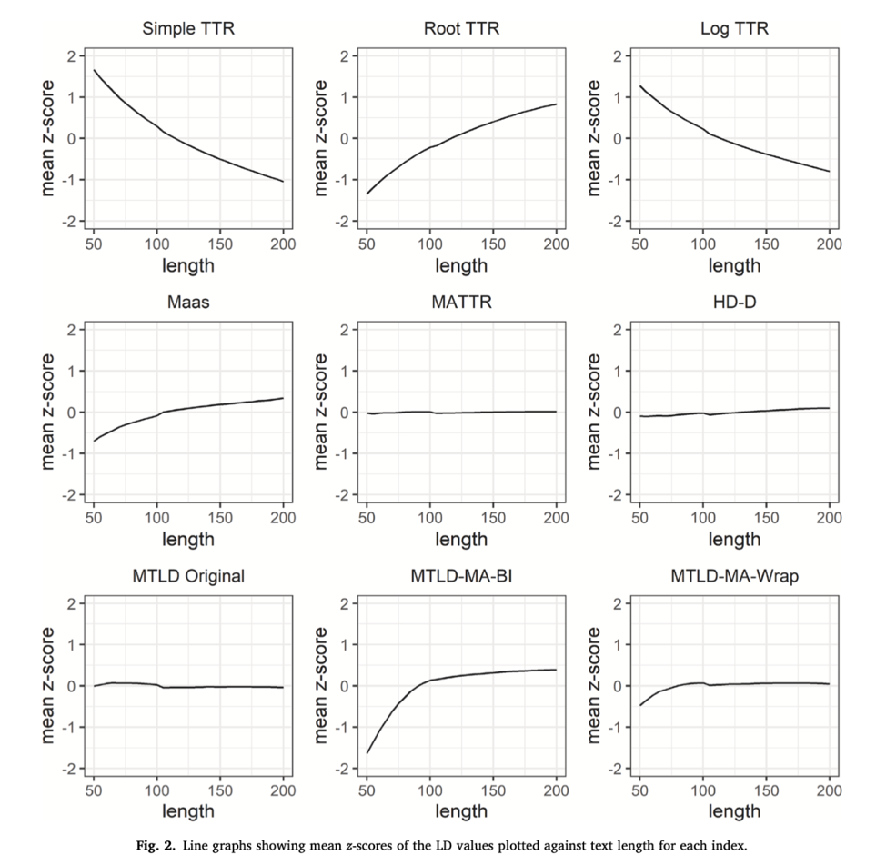

<h2 align="center">CLRA中文词汇特征分析器 V1.0 使用手册</h2>

2023/08/30

**CLRA 工具 (Chinese Lexical Richness Analyzer)** 由北京师范大学国际中文教育学院胡韧奋课题组主持研发，旨在为国际中文教育领域内的教材编撰、考试命题、学生写作以及口语产出研究提供 **词汇维度** 的量化分析支持。CLRA 参考《国际中文教育中文水平等级标准》三等九级词表，支持文本标注（分词、词性、词语等级）、词表生成、词汇复杂度和词汇多样性等多维度指标分析等功能。

### 1. 下载分析器

CLRA 工具提供了 Windows, MacOS (Intel), MacOS (Apple M1) 三种客户端程序，填写试用申请后可获得下载链接：[https://www.wjx.cn/vm/rUtXWDS.aspx](https://www.wjx.cn/vm/rUtXWDS.aspx)。请下载系统对应的程序，解压缩后无需安装：

- Windows 系统：双击直接打开；

- Mac OS系统：首次运行程序如提示开发者身份未验证，请 **右键点击** 打开，为方便后续使用，还可将程序拖至 Mac 应用程序目录，之后可通过启动台快捷访问 CLRA。

<small>CLRA 界面</small>

### 2. 文本标注工具

文本标注工具单次可处理 10 万字以内文本，包含 **分词**、**标注词性**、**标注新标准词语等级**、**标注新标准词语等级（含扩充词表）** 四项功能。

#### 2.1 文本标注工具使用方法

**Step1:** 将待分析文本粘贴至文本框内，文本框输入支持最长10万字符；

**Step2:** 选择用户所需要的对应功能，点击"文本标注"（注："新标准等级"和"新标准等级（含扩充词表）"不可同时选择）；

**Step3:** 文本框内显示标注成功后的文本，如需输入新文本，点击 **"清空文本"** 即可

#### 2.2 文本标注结果说明

A.  在具体的标注结果中，各等级词语的标注结果对应等级数字，七至九级对应数字 7；

B.  超纲词标为 `"oov"`，即 Out of Vocabulary；

C.  标点符号、数字词和字母词等标为 `"NA"`，即 Not
    Applied，无法查询等级；

D.  人名、地名和专名等如不在词表内，则标为 `"NE"`，即 Name
    Entity，同时不参与词汇指标计算。

#### 2.3 文本标注功能说明

**A. 标注等级**

词语等级信息参考《国际中文教育中文水平等级标准》词汇表（后文简称《新标准》词表），该表共收录 11092 个词语，包括一级 500 词、二级 772 词、三级 973 词、四级 1000 词、五级 1071 词、六级 1140 词、 七至九级 5636 词。

**B. 同形词等级消歧**

《新标准》词表收录了 128 个同形词，其中大多数分属不同等级，例如，"白"（形容词）属于一级，而"白"（副词）属于三级，如果仅在分词后进行词表匹配，则无法区分同形词的不同等级。为解决该问题，本工具利用词性、拼音等特征实现了级别自动消歧，如下例所示：

- 那/r_1 块/q_1 墙/n_2 刷/v_4 得/u_2 非常/d_1 `白/a_1`
    。/wp_NA

- 我/r_1 不/d_1 想/v_1 再/d_1 `白/d_3` 跑/v_1 一/m_1 趟/q_6
    了/u_1 。/wp_NA

**C. 扩充词表**

对于《新标准》词表未收录的词语，可根据语素的形式和意义对其 **是否真正超纲** 进行判定。在文本标注工具中选择"新标准等级（含扩充词表）"后，会提供基于扩充词表的标注结果，词语后加 `"\*"` 以示区分，如下例所示：

- 世界/n_3 `第一*/m_1` 商学院/n_oov 的/u_1 学生/n_1 却/d_4
    必须/d_2 用/p_1 它/r_2 写/v_1 作业/n_2 。/wp_NA

- `这个*/r_1` 苹果/n_3 看/v_1 起来/v_1 非常/d_1 新鲜/a_4
    。/wp_NA

- 莫言/nh_NE 有/v_1 很多\*/m_1 `代表作*/n_3` 。/wp_NA

注：《新标准》词表未收录"第一"、"这个"、"代表作"，但我们可以从词表中查询到：第（一级）、一（一级）、这（一级）、个（一级）、代表（三级）、作品（三级），且三个词语的含义均可由其语素义推理得到，因此将其加入扩充词表。

### 3. 词表生成与词汇丰富性指标分析

#### 3.1 使用说明

**Step1**: 点击"选择文件"上传txt格式文件，支持上传多个文件进行批量处理，上传文件限定最长 **100 万字符/文件**；

**Step2**: 点击"保存文件"指定输出文件位置，默认结果保存为 `xlsx` 格式表格文件；

**Step3**: 点击"词表生成"或者"指标分析"运行程序，程序运行进度在底部状态栏显示。程序处理速度约1万字/秒（与系统配置有关），如需处理较大规模语料，请耐心关注状态栏提示，运行过程中切勿点击其他按钮。

#### 3.2 词表生成功能

本工具可基于《新标准》词表或《新标准》词表（含扩充词表）生成各等级词表，以表格形式输出文件名、词语、词性、级别等信息，如下图所示：

#### 3.3 词汇丰富性指标分析功能

词汇复杂度、词汇多样性和词汇密度是常见的语言量化分析指标。CLRA 支持基于《新标准》词表或其扩充词表对各等级词语数量和比例进行分析，为测量词汇复杂度提供了适配国际中文教育领域需求的解决方案，此外，还提供了多维度的词汇多样性和词汇密度测量方法。

**3.3.1 词汇复杂度**

现有的词汇复杂度指标常基于词频信息统计常用词比例，不一定适配于语言学习场景。CLRA 工具支持计算文本中三等九级词语的数量、比例、开根比等 80 个量化指标（具体参见附录 A），可以为国际中文教育领域的文本词汇复杂度分析提供较好的解决方案。具体来说，在测量 **词汇复杂度** 时，推荐结合 **样本特点** 选用如下指标：

- 高等（七至九级）词形/词种占比

- 中高等（四至九级）词形/词种占比

- 超纲 词形/词种占比

- 高等（七至九级）和超纲 词形/词种占比

- 中高等（四至九级）和超纲 词形/词种占比

**3.3.2 词汇多样性和词汇密度指标**

CLRA 提供了多维度的词汇多样性和词汇密度测量方法，共 11 个指标（具体可参考附录B）。在测量词汇多样性时，传统的 TTR 和 RTTR 等指标容易受到文本长度影响，难以提供可靠的测量结果，参考 Zenker & Kyle (2021)的研究，我们集成了 MATTR、HDD、MLTD 等方法，在样本长度存在差异时也能提供稳定的测量结果。

注：Zenker & Kyle（2021）发现在 50 到 200 词的英语作文中，MATTR、HD-D、MTLD 这三项指标受文本长度的影响较小。

本研究得到教育部中外语言交流合作中心国际中文教育中外联合研究专项课题"基于新标准的智能化语言分析技术研究" (22YH04ZW) 资助。如果在您的研究中使用了 CLRA 工具，欢迎参考和引用：

> \[1\] 徐云洁, 王兆基, 胡韧奋. 基于新标准的汉语词汇复杂度自动分析工具及其应用. 第七届汉语中介语语料库建设与应用国际学术讨论会. 2021.

> \[2\] 徐云洁, 胡韧奋. 汉语词汇丰富性的自动分析研究. 数字人文与阅读分级学术研讨会. 2021.

CLRA 将持续迭代和更新，并集成更多丰富的功能，如果您对CLRA研发有任何问题或建议，欢迎与我们联系：<crystalxu@mail.bnu.edu.cn>。

### 附录：词汇维度分析指标类型介绍

#### A. 新标准等级词表指标（80个）

| **编号** | **指标**                          | **描述**                        |
| -------- | --------------------------------- | ------------------------------- |
| 1        | token_sum_of_words                | 词形数量                        |
| 2        | token_first_level                 | 一级词（词形）数量              |
| 3        | token_first_level_ratio           | 一级词（词形）占比              |
| 4        | token_first_level_rootratio       | 一级词（词形）开根占比          |
| 5        | token_second_level                | 二级词（词形）数量              |
| 6        | token_second_level_ratio          | 二级词（词形）占比              |
| 7        | token_second_level_rootratio      | 二级词（词形）开根占比          |
| 8        | token_third_level                 | 三级词（词形）数量              |
| 9        | token_third_level_ratio           | 三级词（词形）占比              |
| 10       | token_third_level_rootratio       | 三级词（词形）开根占比          |
| 11       | token_fourth_level                | 四级词（词形）数量              |
| 12       | token_fourth_level_ratio          | 四级词（词形）占比              |
| 13       | token_fourth_level_rootratio      | 四级词（词形）开根占比          |
| 14       | token_fifth_level                 | 五级词（词形）数量              |
| 15       | token_fifth_level_ratio           | 五级词（词形）占比              |
| 16       | token_fifth_level_rootratio       | 五级词（词形）开根占比          |
| 17       | token_sixth_level                 | 六级词（词形）数量              |
| 18       | token_sixth_level_ratio           | 六级词（词形）占比              |
| 19       | token_sixth_level_rootratio       | 六级词（词形）开根占比          |
| 20       | token_high_level                  | 七-九级词（词形）数量           |
| 21       | token_high_level_ratio            | 七-九级词（词形）占比           |
| 22       | token_high_level_rootratio        | 七-九级词（词形）开根占比       |
| 23       | token_elementary_level            | 一-三级词（词形）数量           |
| 24       | token_elementary_level_ratio      | 一-三级词（词形）占比           |
| 25       | token_elementary_level_rootratio  | 一-三级词（词形）开根占比       |
| 26       | token_medium_level                | 四-六级词（词形）数量           |
| 27       | token_medium_level_ratio          | 四-六级词（词形）占比           |
| 28       | token_medium_level_rootratio      | 四-六级词（词形）开根占比       |
| 29       | token_medium&high_level           | 四-九级词（词形）数量           |
| 30       | token_medium&high_level_ratio     | 四-九级词（词形）占比           |
| 31       | token_medium&high_level_rootratio | 四-九级词（词形）开根占比       |
| 32       | token_out_of_voc                  | 超纲词（词形）数量              |
| 33       | token_out_of_voc_ratio            | 超纲词（词形）占比              |
| 34       | token_out_of_voc_rootratio        | 超纲词（词形）开根占比          |
| 35       | token_medium_and_above            | 四-九级及超纲词（词形）数量     |
| 36       | token_medium_and_above_ratio      | 四-九级及超纲词（词形）占比     |
| 37       | token_medium_and_above_rootratio  | 四-九级及超纲词（词形）开根占比 |
| 38       | token_high_and_above              | 七-九级及超纲词（词形）数量     |
| 39       | token_high_and_above_ratio        | 七-九级及超纲词（词形）占比     |
| 40       | token_high_and_above_rootratio    | 七-九级及超纲词（词形）开根占比 |
| 41       | type_sum_of_words                 | 词种数量                        |
| 42       | type_first_level                  | 一级词（词种）数量              |
| 43       | type_first_level_ratio            | 一级词（词种）占比              |
| 44       | type_first_level_rootratio        | 一级词（词种）开根占比          |
| 45       | type_second_level                 | 二级词（词种）数量              |
| 46       | type_second_level_ratio           | 二级词（词种）占比              |
| 47       | type_second_level_rootratio       | 二级词（词种）开根占比          |
| 48       | type_third_level                  | 三级词（词种）数量              |
| 49       | type_third_level_ratio            | 三级词（词种）占比              |
| 50       | type_third_level_rootratio        | 三级词（词种）开根占比          |
| 51       | type_fourth_level                 | 四级词（词种）数量              |
| 52       | type_fourth_level_ratio           | 四级词（词种）占比              |
| 53       | type_fourth_level_rootratio       | 四级词（词种）开根占比          |
| 54       | type_fifth_level                  | 五级词（词种）数量              |
| 55       | type_fifth_level_ratio            | 五级词（词种）占比              |
| 56       | type_fifth_level_rootratio        | 五级词（词种）开根占比          |
| 57       | type_sixth_level                  | 六级词（词种）数量              |
| 58       | type_sixth_level_ratio            | 六级词（词种）占比              |
| 59       | type_sixth_level_rootratio        | 六级词（词种）开根占比          |
| 60       | type_high_level                   | 七-九级词（词种）数量           |
| 61       | type_high_level_ratio             | 七-九级词（词种）占比           |
| 62       | type_high_level_rootratio         | 七-九级词（词种）开根占比       |
| 63       | type_elementary_level             | 一-三级词（词种）数量           |
| 64       | type_elementary_level_ratio       | 一-三级词（词种）占比           |
| 65       | type_elementary_level_rootratio   | 一-三级词（词种）开根占比       |
| 66       | type_medium_level                 | 四-六级词（词种）数量           |
| 67       | type_medium_level_ratio           | 四-六级词（词种）占比           |
| 68       | type_medium_level_rootratio       | 四-六级词（词种）开根占比       |
| 69       | type_medium&high_level            | 四-九级词（词种）数量           |
| 70       | type_medium&high_level_ratio      | 四-九级词（词种）占比           |
| 71       | type_medium&high_level_rootratio  | 四-九级词（词种）开根占比       |
| 72       | type_out_of_voc                   | 超纲词（词种）数量              |
| 73       | type_out_of_voc_ratio             | 超纲词（词种）占比              |
| 74       | type_out_of_voc_rootratio         | 超纲词（词种）开根占比          |
| 75       | type_medium_and_above             | 四-九级及超纲词（词种）数量     |
| 76       | type_medium_and_above_ratio       | 四-九级及超纲词（词种）占比     |
| 77       | type_medium_and_above_rootratio   | 四-九级及超纲词（词种）开根占比 |
| 78       | type_high_and_above               | 七-九级及超纲词（词种）数量     |
| 79       | type_high_and_above_ratio         | 七-九级及超纲词（词种）占比     |
| 80       | type_high_and_above_rootratio     | 七-九级及超纲词（词种）开根占比 |

#### B. 词汇多样性和词汇密度指标（11个）

| **编号** | **指标**             | **描述**                                    |
| -------- | -------------------- | ------------------------------------------- |
| 1        | CHAR_NUM             | 字数                                        |
| 2        | WORD_NUM             | 词数                                        |
| 3        | LEXICAL_TTR          | Simple TTR                                  |
| 4        | LEXICAL_RTTR         | Root TTR                                    |
| 5        | LEXICAL_LOG_TTR      | Log TTR                                     |
| 6        | LEXICAL_MASS_TTR     | Mass TTR                                    |
| 7        | LEXICAL_MSTTR        | Mean segmental TTR (MSTTR)                  |
| 8        | LEXICAL_MATTR        | Moving average TTR (MATTR)                  |
| 9        | LEXICAL_HDD          | Hypergeometric distribution D (HDD)         |
| 10       | LEXICAL_MLTD         | Measure of lexical textual diversity (MTLD) |
| 11       | CONTENT_WORD_DENSITY | 词汇密度                                    |
