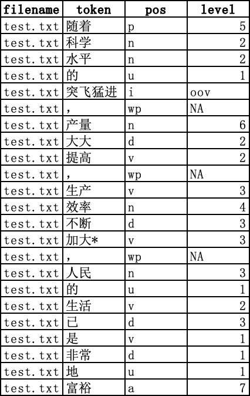

<h2 align="center">CLRA中文词汇特征分析器 V2.0 使用手册</h2>

2024/08/10

**CLRA 工具 (Chinese Lexical Richness Analyzer)** 由北京师范大学国际中文教育学院胡韧奋课题组主持研发，旨在为国际中文教育和语文教育领域的文本分析、教材编撰、考试命题等工作提供 **词汇维度** 的量化分析支持。

2023年9月，CLRA V1.0发布，其参考《国际中文教育中文水平等级标准》三等九级词表，支持文本标注（分词、词性、词语等级）、词表生成、词汇复杂度和词汇多样性等多维度指标分析功能。

**2024年6月，CLRA V2.0问世，依托课题组最新研究成果进行了如下更新：**

- 词语标注：新增基于《义务教育常用词表（草案）》（2019）的等级标注与词表生成功能，为中文母语教育提供支持；

- 词汇指标分析：支持词汇复杂度、词汇多样性、词汇密度和词汇长度等四个维度共60项指标分析。其中，词汇复杂度维度不仅新增了义务教育词表类指标，还扩充了基于词语常用度、词义和认知特征的指标：
  - 词语等级类指标：提供了分别基于《新标准》词表和义务教育词表的等级指标；
  - 词语常用度类指标：包括基于母语者教材语料库、二语教材语料库、通用现代汉语语料库的词语分布范围和词频类指标；
  - 词义认知类指标：提供了基于词语上下位信息、义项数量、阅读停留时间、平均注视时长等词义认知类特征的指标。

上述指标均经过筛选、验证，是受文本长度影响较小、预测效力较强的词汇丰富性指标。

## 1. 下载分析器

CLRA 工具提供了Windows, MacOS (Intel), MacOS (Apple M1-M3)三种客户端程序，填写试用申请后可获得下载链接：[https://docs.qq.com/form/page/DUGZFSndxV0pxVEdq](https://docs.qq.com/form/page/DUGZFSndxV0pxVEdq)。请下载系统对应的程序，解压缩后无需安装：

- Windows 系统：双击直接打开；

- Mac OS系统：首次运行程序如提示开发者身份未验证，请 **右键点击** 打开，为方便后续使用，还可将程序拖至 Mac 应用程序目录，之后可通过启动台快捷访问 CLRA。

<small>CLRA V2.0 界面</small>

## 2. 文本标注工具

文本标注工具单次可处理 10 万字以内文本，包含 **分词**、**标注词性**、**标注新标准词表等级（含扩充词表）**、**标注义务教育词表等级** 四项功能。

### 2.1 文本标注工具使用方法

**Step1:** 将待分析文本粘贴至文本框内，文本框输入支持最长 **10万字符**；

**Step2:** 选择用户所需要的对应功能，点击"文本标注"（**注："新标准等级（含扩充词表）"和"义务教育等级"不可同时选择**）；

**Step3:** 文本框内显示标注成功后的文本，如需输入新文本，点击 **"清空文本"** 即可

### 2.2 文本标注结果说明

- 在具体的标注结果中，如选择新标准等级，各等级词语的标注结果对应等级数字，七至九级对应数字7，如选择义务教育等级，各等级词语的标注结果对应等级数字；

- 超纲词标为 `"oov"`，即 Out of Vocabulary；

- 标点符号、数字词和字母词等标为“NA”，即 Not Applied，无法查询等级；

- 人名、地名和专名等如不在词表内，则标为“NE”，即 Name Entity，同时不参与词汇指标计算。

### 2.3 文本标注功能说明

#### 2.3.1 新标准等级（含扩充词表）

新标准等级参考《国际中文教育中文水平等级标准》词汇表（后文简称《新标准》词表），该表共收录 11092 个词语，包括一级 500 词、二级 772 词、三级 973 词、四级 1000 词、五级 1071 词、六级 1140 词、 七至九级 5636 词。为了实现更为精确的词语等级标定，本工具集成了语素扩充词表和同形词等级消歧两项功能。

**(1) 扩充词表**

对于《新标准》词表**未收录**的词语，工具可根据语素的形式和意义对其**是否真正超纲**进行判定。在文本标注工具中选择“新标准等级（含扩充词表）”后，会提供基于扩充词表的标注结果，词语后加 `“*”` 以示区分，如下例所示：

- 世界/n_3  `第一*/m_1`  商学院/n_oov  的/u_1  学生/n_1  却/d_4  必须/d_2  用/p_1  它/r_2  写/v_1  作业/n_2  。/wp_NA 
- `这个*/r_1`  苹果/n_3  看/v_1  起来/v_1  非常/d_1  新鲜/a_4  。/wp_NA
- 莫言/nh_NE  有/v_1  很多*/m_1  `代表作*/n_3`  。/wp_NA

注：《新标准》词表未收录“第一”、“这个”、“代表作”，但我们可以从词表中查询到：第（一级）、一（一级）、这（一级）、个（一级）、代表（三级）、作品（三级），且三个词语的含义均可由其语素义推理得到，因此将其加入扩充词表。

**(2) 级别消歧**

《新标准》词表收录了128个同形词，其中大多数分属不同等级，例如，“白”（形容词）属于一级，而“白”（副词）属于三级，如果仅在分词后进行词表匹配，则无法区分同形词的不同等级。为解决该问题，本工具利用词性、拼音等特征实现了级别自动消歧，如下例所示：

- 那/r_1 块/q_1 墙/n_2 刷/v_4 得/u_2 非常/d_1 `白/a_1`
    。/wp_NA

- 我/r_1 不/d_1 想/v_1 再/d_1 `白/d_3` 跑/v_1 一/m_1 趟/q_6
    了/u_1 。/wp_NA

#### 2.3.2 义务教育等级
义务教育等级参考《义务教育常用词表（草案）》（2019）（以下简称义务教育词表），该词表由教育部语言文字信息管理司组织编写，厦门大学国家语言资源监测与研究教育教材中心、两岸语言应用与叙事文化研究中心研制，厦门大学苏新春教授任主编。义务教育词表包括“音序表”和“义类表”。“音序表”为主表，共收录15114个词条，“义类表”为辅表，共收录17092个词语。义务教育词表将词语分为四级，对应义务教育的四个学段：一级词对应第一学段(小学1—2年级)，二级词对应第二学段(小学3—4年级)，三级词对应第三学段(小学5—6年级)，四级词对应第四学段(初中1—3年级)。

本工具主要按“义类表”标注等级，该表收录一级词2001个、二级词5503个、三级词5975个、四级词3613个。义务教育词表包含了503个同形异级词，工具将这些同形异级词的等级定为该词形在义务教育词表中出现的最低等级。

## 3. 词表生成与词汇丰富性指标分析

### 3.1 使用说明

**Step1**: 点击"选择文件"上传txt格式文件，支持上传多个文件进行批量处理，上传文件限定最长 **100 万字符/文件** ,最短 **100 字符/文件**；

**Step2**: 点击"保存文件"指定输出文件位置，默认结果保存为 `xlsx` 格式表格文件；

**Step3**: 点击"词表生成"或者"指标分析"运行程序，程序运行进度在底部状态栏显示。程序处理速度约1万字/秒（与系统配置有关），如需处理较大规模语料，请耐心关注状态栏提示，运行过程中切勿点击其他按钮。

### 3.2 词表生成功能

本工具可基于《新标准》词表（含扩充词表）或义务教育词表生成各等级词表，以表格形式输出文件名、词语、词性、级别等信息，如下图所示（以新标准等级为例）：

### 3.3 词汇丰富性指标分析功能

词汇复杂度、词汇多样性、词汇密度和词汇长度是常见的语言量化分析指标。CLRA V2.0在这四个维度都提供了较为全面的量化指标。这60个指标经过了稳定性、预测效力和独立性三个方面的检验和筛选。

#### 3.3.1 词汇复杂度

CLRA V2.0在词汇复杂度分析方面进行了大幅度更新，不仅新增了义务教育词表类指标，还扩充了基于词语常用度、词义和认知特征的指标：

- 词语等级类指标：提供了分别基于《新标准》词表和义务教育词表的等级指标；

- 词语常用度类指标：包括基于母语者教材语料库、二语教材语料库、通用现代汉语语料库的词语分布范围和词频类指标；

- 词义认知类指标：提供了基于词语上下位信息、义项数量、阅读停留时间、平均注视时长等词义认知类特征的指标。

词汇复杂度指标共计42个，其具体描述可参考《使用手册》附录。

#### 3.3.2 词汇多样性、词汇密度和词汇长度

CLRA V2.0提供了多维度的词汇多样性、词汇密度和词汇长度测量方法，包括8个词汇多样性指标，7个词汇密度类指标，3个词语长度类指标。

上述指标描述可参考《使用手册》附录。

#### 3.3.3 使用参考信息

前期实验发现，有48个指标在二语学习者写作质量评估研究中预测效力较好，这些指标在《使用手册》中的附录中以 `“*”` 号标记；有52个指标适用于二语教材文本难度分级研究，这些指标在《使用手册》中的附录中以“#”号标注。

根据不同应用场景下的实际需求，我们针对词汇复杂度、词汇多样性、词汇密度和词汇长度四个维度提出了指标应用参考建议，具体建议可参考本工具的相关论文。

本研究得到教育部中外语言交流合作中心国际中文教育中外联合研究专项课题“基于新标准的智能化语言分析技术研究”(22YH04ZW)资助。如果在您的研究中使用了 CLRA 工具，欢迎参考和引用：

> \[1\] 徐云洁. 汉语词汇丰富性的自动分析研究[D].北京师范大学, 2024.

CLRA将持续迭代和更新，并集成更多丰富的功能，如果您对CLRA研发有任何问题或建议，欢迎与我们联系：徐云洁 [crystalxu@mail.bnu.edu.cn](crystalxu@mail.bnu.edu.cn)、胡韧奋 [irishu@mail.bnu.edu.cn](irishu@mail.bnu.edu.cn)。

### 附录：词汇丰富性指标体系表

<table class=MsoTableGrid border=1 cellspacing=0 cellpadding=0
 style='border-collapse:collapse;border:none'>
 <tr>
  <td width=31 style='width:23.4pt;border:solid windowtext 1.0pt;background:
  #D9E2F3;padding:0cm 5.4pt 0cm 5.4pt'>
  
<b>ID</b>

  </td>
  <td width=233 style='width:174.8pt;border:solid windowtext 1.0pt;border-left:
  none;background:#D9E2F3;padding:0cm 5.4pt 0cm 5.4pt'>
  
<b>指标名称</b>

  </td>
  <td width=288 style='width:216.3pt;border:solid windowtext 1.0pt;border-left:
  none;background:#D9E2F3;padding:0cm 5.4pt 0cm 5.4pt'>
  
<b>指标描述</b>

  </td>
 </tr>
 <tr>
  <td width=553 colspan=3 style='width:414.5pt;border:solid windowtext 1.0pt;
  border-top:none;background:#E7E6E6;padding:0cm 5.4pt 0cm 5.4pt'>
  
<b>词汇复杂度</b><b>·</b><b>词语等级类</b>

  </td>
 </tr>
 <tr>
  <td width=31 style='width:23.4pt;border:solid windowtext 1.0pt;border-top:
  none;padding:0cm 5.4pt 0cm 5.4pt'>
  
1

  </td>
  <td width=233 style='width:174.8pt;border-top:none;border-left:none;
  border-bottom:solid windowtext 1.0pt;border-right:solid windowtext 1.0pt;
  padding:0cm 5.4pt 0cm 5.4pt'>
  
L1_Voc_Level_1_Token_Raito*

  </td>
  <td width=288 style='width:216.3pt;border-top:none;border-left:none;
  border-bottom:solid windowtext 1.0pt;border-right:solid windowtext 1.0pt;
  padding:0cm 5.4pt 0cm 5.4pt'>
  
义务教育词表一级词（词形）比例

  </td>
 </tr>
 <tr>
  <td width=31 style='width:23.4pt;border:solid windowtext 1.0pt;border-top:
  none;padding:0cm 5.4pt 0cm 5.4pt'>
  
2

  </td>
  <td width=233 style='width:174.8pt;border-top:none;border-left:none;
  border-bottom:solid windowtext 1.0pt;border-right:solid windowtext 1.0pt;
  padding:0cm 5.4pt 0cm 5.4pt'>
  
L1_Voc_Level_2_Token_Raito#

  </td>
  <td width=288 style='width:216.3pt;border-top:none;border-left:none;
  border-bottom:solid windowtext 1.0pt;border-right:solid windowtext 1.0pt;
  padding:0cm 5.4pt 0cm 5.4pt'>
  
义务教育词表二级词（词形）比例

  </td>
 </tr>
 <tr>
  <td width=31 style='width:23.4pt;border:solid windowtext 1.0pt;border-top:
  none;padding:0cm 5.4pt 0cm 5.4pt'>
  
3

  </td>
  <td width=233 style='width:174.8pt;border-top:none;border-left:none;
  border-bottom:solid windowtext 1.0pt;border-right:solid windowtext 1.0pt;
  padding:0cm 5.4pt 0cm 5.4pt'>
  
L1_Voc_Level_3_Token_Raito*#

  </td>
  <td width=288 style='width:216.3pt;border-top:none;border-left:none;
  border-bottom:solid windowtext 1.0pt;border-right:solid windowtext 1.0pt;
  padding:0cm 5.4pt 0cm 5.4pt'>
  
义务教育词表三级词（词形）比例

  </td>
 </tr>
 <tr>
  <td width=31 style='width:23.4pt;border:solid windowtext 1.0pt;border-top:
  none;padding:0cm 5.4pt 0cm 5.4pt'>
  
4

  </td>
  <td width=233 style='width:174.8pt;border-top:none;border-left:none;
  border-bottom:solid windowtext 1.0pt;border-right:solid windowtext 1.0pt;
  padding:0cm 5.4pt 0cm 5.4pt'>
  
L1_Voc_Level_4_Token_Raito*

  </td>
  <td width=288 style='width:216.3pt;border-top:none;border-left:none;
  border-bottom:solid windowtext 1.0pt;border-right:solid windowtext 1.0pt;
  padding:0cm 5.4pt 0cm 5.4pt'>
  
义务教育词表四级词（词形）比例

  </td>
 </tr>
 <tr>
  <td width=31 style='width:23.4pt;border:solid windowtext 1.0pt;border-top:
  none;padding:0cm 5.4pt 0cm 5.4pt'>
  
5

  </td>
  <td width=233 style='width:174.8pt;border-top:none;border-left:none;
  border-bottom:solid windowtext 1.0pt;border-right:solid windowtext 1.0pt;
  padding:0cm 5.4pt 0cm 5.4pt'>
  
L1_Voc_Level_oov_Token_Raito*#

  </td>
  <td width=288 style='width:216.3pt;border-top:none;border-left:none;
  border-bottom:solid windowtext 1.0pt;border-right:solid windowtext 1.0pt;
  padding:0cm 5.4pt 0cm 5.4pt'>
  
义务教育词表超纲词（词形）比例

  </td>
 </tr>
 <tr>
  <td width=31 style='width:23.4pt;border:solid windowtext 1.0pt;border-top:
  none;padding:0cm 5.4pt 0cm 5.4pt'>
  
6

  </td>
  <td width=233 style='width:174.8pt;border-top:none;border-left:none;
  border-bottom:solid windowtext 1.0pt;border-right:solid windowtext 1.0pt;
  padding:0cm 5.4pt 0cm 5.4pt'>
  
L1_Voc_Level_1_Type_Raito*

  </td>
  <td width=288 style='width:216.3pt;border-top:none;border-left:none;
  border-bottom:solid windowtext 1.0pt;border-right:solid windowtext 1.0pt;
  padding:0cm 5.4pt 0cm 5.4pt'>
  
义务教育词表一级词（词种）比例

  </td>
 </tr>
 <tr>
  <td width=31 style='width:23.4pt;border:solid windowtext 1.0pt;border-top:
  none;padding:0cm 5.4pt 0cm 5.4pt'>
  
7

  </td>
  <td width=233 style='width:174.8pt;border-top:none;border-left:none;
  border-bottom:solid windowtext 1.0pt;border-right:solid windowtext 1.0pt;
  padding:0cm 5.4pt 0cm 5.4pt'>
  
L1_Voc_Level_2_Type_Raito*#

  </td>
  <td width=288 style='width:216.3pt;border-top:none;border-left:none;
  border-bottom:solid windowtext 1.0pt;border-right:solid windowtext 1.0pt;
  padding:0cm 5.4pt 0cm 5.4pt'>
  
义务教育词表二级词（词种）比例

  </td>
 </tr>
 <tr>
  <td width=31 style='width:23.4pt;border:solid windowtext 1.0pt;border-top:
  none;padding:0cm 5.4pt 0cm 5.4pt'>
  
8

  </td>
  <td width=233 style='width:174.8pt;border-top:none;border-left:none;
  border-bottom:solid windowtext 1.0pt;border-right:solid windowtext 1.0pt;
  padding:0cm 5.4pt 0cm 5.4pt'>
  
L1_Voc_Level_3_Type_Raito*#

  </td>
  <td width=288 style='width:216.3pt;border-top:none;border-left:none;
  border-bottom:solid windowtext 1.0pt;border-right:solid windowtext 1.0pt;
  padding:0cm 5.4pt 0cm 5.4pt'>
  
义务教育词表三级词（词种）比例

  </td>
 </tr>
 <tr>
  <td width=31 style='width:23.4pt;border:solid windowtext 1.0pt;border-top:
  none;padding:0cm 5.4pt 0cm 5.4pt'>
  
9

  </td>
  <td width=233 style='width:174.8pt;border-top:none;border-left:none;
  border-bottom:solid windowtext 1.0pt;border-right:solid windowtext 1.0pt;
  padding:0cm 5.4pt 0cm 5.4pt'>
  
L1_Voc_Level_4_Type_Raito*

  </td>
  <td width=288 style='width:216.3pt;border-top:none;border-left:none;
  border-bottom:solid windowtext 1.0pt;border-right:solid windowtext 1.0pt;
  padding:0cm 5.4pt 0cm 5.4pt'>
  
义务教育词表四级词（词种）比例

  </td>
 </tr>
 <tr>
  <td width=31 style='width:23.4pt;border:solid windowtext 1.0pt;border-top:
  none;padding:0cm 5.4pt 0cm 5.4pt'>
  
10

  </td>
  <td width=233 style='width:174.8pt;border-top:none;border-left:none;
  border-bottom:solid windowtext 1.0pt;border-right:solid windowtext 1.0pt;
  padding:0cm 5.4pt 0cm 5.4pt'>
  
L1_Voc_Level_oov_Type_Raito*#

  </td>
  <td width=288 style='width:216.3pt;border-top:none;border-left:none;
  border-bottom:solid windowtext 1.0pt;border-right:solid windowtext 1.0pt;
  padding:0cm 5.4pt 0cm 5.4pt'>
  
义务教育词表超纲词（词种）比例

  </td>
 </tr>
 <tr>
  <td width=31 style='width:23.4pt;border:solid windowtext 1.0pt;border-top:
  none;padding:0cm 5.4pt 0cm 5.4pt'>
  
11

  </td>
  <td width=233 style='width:174.8pt;border-top:none;border-left:none;
  border-bottom:solid windowtext 1.0pt;border-right:solid windowtext 1.0pt;
  padding:0cm 5.4pt 0cm 5.4pt'>
  
L2_Voc_First_Level_Token_Ratio*#

  </td>
  <td width=288 style='width:216.3pt;border-top:none;border-left:none;
  border-bottom:solid windowtext 1.0pt;border-right:solid windowtext 1.0pt;
  padding:0cm 5.4pt 0cm 5.4pt'>
  
《新标准》词表一级词（词形）比例

  </td>
 </tr>
 <tr>
  <td width=31 style='width:23.4pt;border:solid windowtext 1.0pt;border-top:
  none;padding:0cm 5.4pt 0cm 5.4pt'>
  
12

  </td>
  <td width=233 style='width:174.8pt;border-top:none;border-left:none;
  border-bottom:solid windowtext 1.0pt;border-right:solid windowtext 1.0pt;
  padding:0cm 5.4pt 0cm 5.4pt'>
  
L2_Voc_Second_Level_Token_Ratio*#

  </td>
  <td width=288 style='width:216.3pt;border-top:none;border-left:none;
  border-bottom:solid windowtext 1.0pt;border-right:solid windowtext 1.0pt;
  padding:0cm 5.4pt 0cm 5.4pt'>
  
《新标准》词表二级词（词形）比例

  </td>
 </tr>
 <tr>
  <td width=31 style='width:23.4pt;border:solid windowtext 1.0pt;border-top:
  none;padding:0cm 5.4pt 0cm 5.4pt'>
  
13

  </td>
  <td width=233 style='width:174.8pt;border-top:none;border-left:none;
  border-bottom:solid windowtext 1.0pt;border-right:solid windowtext 1.0pt;
  padding:0cm 5.4pt 0cm 5.4pt'>
  
L2_Voc_Third_Level_Token_Ratio#

  </td>
  <td width=288 style='width:216.3pt;border-top:none;border-left:none;
  border-bottom:solid windowtext 1.0pt;border-right:solid windowtext 1.0pt;
  padding:0cm 5.4pt 0cm 5.4pt'>
  
《新标准》词表三级词（词形）比例

  </td>
 </tr>
 <tr>
  <td width=31 style='width:23.4pt;border:solid windowtext 1.0pt;border-top:
  none;padding:0cm 5.4pt 0cm 5.4pt'>
  
14

  </td>
  <td width=233 style='width:174.8pt;border-top:none;border-left:none;
  border-bottom:solid windowtext 1.0pt;border-right:solid windowtext 1.0pt;
  padding:0cm 5.4pt 0cm 5.4pt'>
  
L2_Voc_Fourth_Level_Token_Ratio*#

  </td>
  <td width=288 style='width:216.3pt;border-top:none;border-left:none;
  border-bottom:solid windowtext 1.0pt;border-right:solid windowtext 1.0pt;
  padding:0cm 5.4pt 0cm 5.4pt'>
  
《新标准》词表四级词（词形）比例

  </td>
 </tr>
 <tr>
  <td width=31 style='width:23.4pt;border:solid windowtext 1.0pt;border-top:
  none;padding:0cm 5.4pt 0cm 5.4pt'>
  
15

  </td>
  <td width=233 style='width:174.8pt;border-top:none;border-left:none;
  border-bottom:solid windowtext 1.0pt;border-right:solid windowtext 1.0pt;
  padding:0cm 5.4pt 0cm 5.4pt'>
  
L2_Voc_Fifth_Level_Token_Ratio*#

  </td>
  <td width=288 style='width:216.3pt;border-top:none;border-left:none;
  border-bottom:solid windowtext 1.0pt;border-right:solid windowtext 1.0pt;
  padding:0cm 5.4pt 0cm 5.4pt'>
  
《新标准》词表五级词（词形）比例

  </td>
 </tr>
 <tr>
  <td width=31 style='width:23.4pt;border:solid windowtext 1.0pt;border-top:
  none;padding:0cm 5.4pt 0cm 5.4pt'>
  
16

  </td>
  <td width=233 style='width:174.8pt;border-top:none;border-left:none;
  border-bottom:solid windowtext 1.0pt;border-right:solid windowtext 1.0pt;
  padding:0cm 5.4pt 0cm 5.4pt'>
  
L2_Voc_Sixth_Level_Token_Ratio*

  </td>
  <td width=288 style='width:216.3pt;border-top:none;border-left:none;
  border-bottom:solid windowtext 1.0pt;border-right:solid windowtext 1.0pt;
  padding:0cm 5.4pt 0cm 5.4pt'>
  
《新标准》词表六级词（词形）比例

  </td>
 </tr>
 <tr>
  <td width=31 style='width:23.4pt;border:solid windowtext 1.0pt;border-top:
  none;padding:0cm 5.4pt 0cm 5.4pt'>
  
17

  </td>
  <td width=233 style='width:174.8pt;border-top:none;border-left:none;
  border-bottom:solid windowtext 1.0pt;border-right:solid windowtext 1.0pt;
  padding:0cm 5.4pt 0cm 5.4pt'>
  
L2_Voc_High_Level_Token_Ratio*#

  </td>
  <td width=288 style='width:216.3pt;border-top:none;border-left:none;
  border-bottom:solid windowtext 1.0pt;border-right:solid windowtext 1.0pt;
  padding:0cm 5.4pt 0cm 5.4pt'>
  
《新标准》词表七-九级词（词形）比例

  </td>
 </tr>
 <tr>
  <td width=31 style='width:23.4pt;border:solid windowtext 1.0pt;border-top:
  none;padding:0cm 5.4pt 0cm 5.4pt'>
  
18

  </td>
  <td width=233 style='width:174.8pt;border-top:none;border-left:none;
  border-bottom:solid windowtext 1.0pt;border-right:solid windowtext 1.0pt;
  padding:0cm 5.4pt 0cm 5.4pt'>
  
L2_Voc_Elementary_Level_Token_Ratio*#

  </td>
  <td width=288 style='width:216.3pt;border-top:none;border-left:none;
  border-bottom:solid windowtext 1.0pt;border-right:solid windowtext 1.0pt;
  padding:0cm 5.4pt 0cm 5.4pt'>
  
《新标准》词表初等词（词形）比例

  </td>
 </tr>
 <tr>
  <td width=31 style='width:23.4pt;border:solid windowtext 1.0pt;border-top:
  none;padding:0cm 5.4pt 0cm 5.4pt'>
  
19

  </td>
  <td width=233 style='width:174.8pt;border-top:none;border-left:none;
  border-bottom:solid windowtext 1.0pt;border-right:solid windowtext 1.0pt;
  padding:0cm 5.4pt 0cm 5.4pt'>
  
L2_Voc_Medium_Level_Token_Ratio*#

  </td>
  <td width=288 style='width:216.3pt;border-top:none;border-left:none;
  border-bottom:solid windowtext 1.0pt;border-right:solid windowtext 1.0pt;
  padding:0cm 5.4pt 0cm 5.4pt'>
  
《新标准》词表中等词（词形）比例

  </td>
 </tr>
 <tr>
  <td width=31 style='width:23.4pt;border:solid windowtext 1.0pt;border-top:
  none;padding:0cm 5.4pt 0cm 5.4pt'>
  
20

  </td>
  <td width=233 style='width:174.8pt;border-top:none;border-left:none;
  border-bottom:solid windowtext 1.0pt;border-right:solid windowtext 1.0pt;
  padding:0cm 5.4pt 0cm 5.4pt'>
  
L2_Voc_Medium_And_High_Level_Token_Ratio*#

  </td>
  <td width=288 style='width:216.3pt;border-top:none;border-left:none;
  border-bottom:solid windowtext 1.0pt;border-right:solid windowtext 1.0pt;
  padding:0cm 5.4pt 0cm 5.4pt'>
  
《新标准》词表中高等词（词形）比例

  </td>
 </tr>
 <tr>
  <td width=31 style='width:23.4pt;border:solid windowtext 1.0pt;border-top:
  none;padding:0cm 5.4pt 0cm 5.4pt'>
  
21

  </td>
  <td width=233 style='width:174.8pt;border-top:none;border-left:none;
  border-bottom:solid windowtext 1.0pt;border-right:solid windowtext 1.0pt;
  padding:0cm 5.4pt 0cm 5.4pt'>
  
L2_Voc_Medium_And_Above_Token_Ratio*#

  </td>
  <td width=288 style='width:216.3pt;border-top:none;border-left:none;
  border-bottom:solid windowtext 1.0pt;border-right:solid windowtext 1.0pt;
  padding:0cm 5.4pt 0cm 5.4pt'>
  
《新标准》词表中高等及超纲词（词形）比例

  </td>
 </tr>
 <tr>
  <td width=31 style='width:23.4pt;border:solid windowtext 1.0pt;border-top:
  none;padding:0cm 5.4pt 0cm 5.4pt'>
  
22

  </td>
  <td width=233 style='width:174.8pt;border-top:none;border-left:none;
  border-bottom:solid windowtext 1.0pt;border-right:solid windowtext 1.0pt;
  padding:0cm 5.4pt 0cm 5.4pt'>
  
L2_Voc_High_And_Above_Token_Ratio*#

  </td>
  <td width=288 style='width:216.3pt;border-top:none;border-left:none;
  border-bottom:solid windowtext 1.0pt;border-right:solid windowtext 1.0pt;
  padding:0cm 5.4pt 0cm 5.4pt'>
  
《新标准》词表高等及超纲（词形）比例

  </td>
 </tr>
 <tr>
  <td width=31 style='width:23.4pt;border:solid windowtext 1.0pt;border-top:
  none;padding:0cm 5.4pt 0cm 5.4pt'>
  
23

  </td>
  <td width=233 style='width:174.8pt;border-top:none;border-left:none;
  border-bottom:solid windowtext 1.0pt;border-right:solid windowtext 1.0pt;
  padding:0cm 5.4pt 0cm 5.4pt'>
  
L2_Voc_First_Level_Type_Ratio*#

  </td>
  <td width=288 style='width:216.3pt;border-top:none;border-left:none;
  border-bottom:solid windowtext 1.0pt;border-right:solid windowtext 1.0pt;
  padding:0cm 5.4pt 0cm 5.4pt'>
  
《新标准》词表一级词（词种）比例

  </td>
 </tr>
 <tr>
  <td width=31 style='width:23.4pt;border:solid windowtext 1.0pt;border-top:
  none;padding:0cm 5.4pt 0cm 5.4pt'>
  
24

  </td>
  <td width=233 style='width:174.8pt;border-top:none;border-left:none;
  border-bottom:solid windowtext 1.0pt;border-right:solid windowtext 1.0pt;
  padding:0cm 5.4pt 0cm 5.4pt'>
  
L2_Voc_Second_Level_Type_Ratio*#

  </td>
  <td width=288 style='width:216.3pt;border-top:none;border-left:none;
  border-bottom:solid windowtext 1.0pt;border-right:solid windowtext 1.0pt;
  padding:0cm 5.4pt 0cm 5.4pt'>
  
《新标准》词表二级词（词种）比例

  </td>
 </tr>
 <tr>
  <td width=31 style='width:23.4pt;border:solid windowtext 1.0pt;border-top:
  none;padding:0cm 5.4pt 0cm 5.4pt'>
  
25

  </td>
  <td width=233 style='width:174.8pt;border-top:none;border-left:none;
  border-bottom:solid windowtext 1.0pt;border-right:solid windowtext 1.0pt;
  padding:0cm 5.4pt 0cm 5.4pt'>
  
L2_Voc_Third_Level_Type_Ratio#

  </td>
  <td width=288 style='width:216.3pt;border-top:none;border-left:none;
  border-bottom:solid windowtext 1.0pt;border-right:solid windowtext 1.0pt;
  padding:0cm 5.4pt 0cm 5.4pt'>
  
《新标准》词表三级词（词种）比例

  </td>
 </tr>
 <tr>
  <td width=31 style='width:23.4pt;border:solid windowtext 1.0pt;border-top:
  none;padding:0cm 5.4pt 0cm 5.4pt'>
  
26

  </td>
  <td width=233 style='width:174.8pt;border-top:none;border-left:none;
  border-bottom:solid windowtext 1.0pt;border-right:solid windowtext 1.0pt;
  padding:0cm 5.4pt 0cm 5.4pt'>
  
L2_Voc_Fourth_Level_Type_Ratio*#

  </td>
  <td width=288 style='width:216.3pt;border-top:none;border-left:none;
  border-bottom:solid windowtext 1.0pt;border-right:solid windowtext 1.0pt;
  padding:0cm 5.4pt 0cm 5.4pt'>
  
《新标准》词表四级词（词种）比例

  </td>
 </tr>
 <tr>
  <td width=31 style='width:23.4pt;border:solid windowtext 1.0pt;border-top:
  none;padding:0cm 5.4pt 0cm 5.4pt'>
  
27

  </td>
  <td width=233 style='width:174.8pt;border-top:none;border-left:none;
  border-bottom:solid windowtext 1.0pt;border-right:solid windowtext 1.0pt;
  padding:0cm 5.4pt 0cm 5.4pt'>
  
L2_Voc_Fifth_Level_Type_Ratio*#

  </td>
  <td width=288 style='width:216.3pt;border-top:none;border-left:none;
  border-bottom:solid windowtext 1.0pt;border-right:solid windowtext 1.0pt;
  padding:0cm 5.4pt 0cm 5.4pt'>
  
《新标准》词表五级词（词种）比例

  </td>
 </tr>
 <tr>
  <td width=31 style='width:23.4pt;border:solid windowtext 1.0pt;border-top:
  none;padding:0cm 5.4pt 0cm 5.4pt'>
  
28

  </td>
  <td width=233 style='width:174.8pt;border-top:none;border-left:none;
  border-bottom:solid windowtext 1.0pt;border-right:solid windowtext 1.0pt;
  padding:0cm 5.4pt 0cm 5.4pt'>
  
L2_Voc_Sixth_Level_Type_Ratio*

  </td>
  <td width=288 style='width:216.3pt;border-top:none;border-left:none;
  border-bottom:solid windowtext 1.0pt;border-right:solid windowtext 1.0pt;
  padding:0cm 5.4pt 0cm 5.4pt'>
  
《新标准》词表六级词（词种）比例

  </td>
 </tr>
 <tr>
  <td width=31 style='width:23.4pt;border:solid windowtext 1.0pt;border-top:
  none;padding:0cm 5.4pt 0cm 5.4pt'>
  
29

  </td>
  <td width=233 style='width:174.8pt;border-top:none;border-left:none;
  border-bottom:solid windowtext 1.0pt;border-right:solid windowtext 1.0pt;
  padding:0cm 5.4pt 0cm 5.4pt'>
  
L2_Voc_High_Level_Type_Ratio*#

  </td>
  <td width=288 style='width:216.3pt;border-top:none;border-left:none;
  border-bottom:solid windowtext 1.0pt;border-right:solid windowtext 1.0pt;
  padding:0cm 5.4pt 0cm 5.4pt'>
  
《新标准》词表七-九级词（词种）比例

  </td>
 </tr>
 <tr>
  <td width=31 style='width:23.4pt;border:solid windowtext 1.0pt;border-top:
  none;padding:0cm 5.4pt 0cm 5.4pt'>
  
30

  </td>
  <td width=233 style='width:174.8pt;border-top:none;border-left:none;
  border-bottom:solid windowtext 1.0pt;border-right:solid windowtext 1.0pt;
  padding:0cm 5.4pt 0cm 5.4pt'>
  
L2_Voc_Elementary_Level_Type_Ratio*#

  </td>
  <td width=288 style='width:216.3pt;border-top:none;border-left:none;
  border-bottom:solid windowtext 1.0pt;border-right:solid windowtext 1.0pt;
  padding:0cm 5.4pt 0cm 5.4pt'>
  
《新标准》词表初等词（词种）比例

  </td>
 </tr>
 <tr>
  <td width=31 style='width:23.4pt;border:solid windowtext 1.0pt;border-top:
  none;padding:0cm 5.4pt 0cm 5.4pt'>
  
31

  </td>
  <td width=233 style='width:174.8pt;border-top:none;border-left:none;
  border-bottom:solid windowtext 1.0pt;border-right:solid windowtext 1.0pt;
  padding:0cm 5.4pt 0cm 5.4pt'>
  
L2_Voc_Medium_Level_Type_Ratio*#

  </td>
  <td width=288 style='width:216.3pt;border-top:none;border-left:none;
  border-bottom:solid windowtext 1.0pt;border-right:solid windowtext 1.0pt;
  padding:0cm 5.4pt 0cm 5.4pt'>
  
《新标准》词表中等词（词种）比例

  </td>
 </tr>
 <tr>
  <td width=31 style='width:23.4pt;border:solid windowtext 1.0pt;border-top:
  none;padding:0cm 5.4pt 0cm 5.4pt'>
  
32

  </td>
  <td width=233 style='width:174.8pt;border-top:none;border-left:none;
  border-bottom:solid windowtext 1.0pt;border-right:solid windowtext 1.0pt;
  padding:0cm 5.4pt 0cm 5.4pt'>
  
L2_Voc_Medium_And_High_Level_Type_Ratio*#

  </td>
  <td width=288 style='width:216.3pt;border-top:none;border-left:none;
  border-bottom:solid windowtext 1.0pt;border-right:solid windowtext 1.0pt;
  padding:0cm 5.4pt 0cm 5.4pt'>
  
《新标准》词表中高等词（词种）比例

  </td>
 </tr>
 <tr>
  <td width=31 style='width:23.4pt;border:solid windowtext 1.0pt;border-top:
  none;padding:0cm 5.4pt 0cm 5.4pt'>
  
33

  </td>
  <td width=233 style='width:174.8pt;border-top:none;border-left:none;
  border-bottom:solid windowtext 1.0pt;border-right:solid windowtext 1.0pt;
  padding:0cm 5.4pt 0cm 5.4pt'>
  
L2_Voc_Medium_And_Above_Type_Ratio*#

  </td>
  <td width=288 style='width:216.3pt;border-top:none;border-left:none;
  border-bottom:solid windowtext 1.0pt;border-right:solid windowtext 1.0pt;
  padding:0cm 5.4pt 0cm 5.4pt'>
  
《新标准》词表中高等及超纲词（词种）比例

  </td>
 </tr>
 <tr>
  <td width=31 style='width:23.4pt;border:solid windowtext 1.0pt;border-top:
  none;padding:0cm 5.4pt 0cm 5.4pt'>
  
34

  </td>
  <td width=233 style='width:174.8pt;border-top:none;border-left:none;
  border-bottom:solid windowtext 1.0pt;border-right:solid windowtext 1.0pt;
  padding:0cm 5.4pt 0cm 5.4pt'>
  
L2_Voc_High_And_Above_Type_Ratio*#

  </td>
  <td width=288 style='width:216.3pt;border-top:none;border-left:none;
  border-bottom:solid windowtext 1.0pt;border-right:solid windowtext 1.0pt;
  padding:0cm 5.4pt 0cm 5.4pt'>
  
《新标准》词表高等及超纲词（词种）比例

  </td>
 </tr>
 <tr>
  <td width=553 colspan=3 style='width:414.5pt;border:solid windowtext 1.0pt;
  border-top:none;background:#E7E6E6;padding:0cm 5.4pt 0cm 5.4pt'>
  
<b>词汇复杂度</b><b>·</b><b>词语常用度类</b>

  </td>
 </tr>
 <tr>
  <td width=31 style='width:23.4pt;border:solid windowtext 1.0pt;border-top:
  none;padding:0cm 5.4pt 0cm 5.4pt'>
  
35

  </td>
  <td width=233 style='width:174.8pt;border-top:none;border-left:none;
  border-bottom:solid windowtext 1.0pt;border-right:solid windowtext 1.0pt;
  padding:0cm 5.4pt 0cm 5.4pt'>
  
L1_Textbook_Type_Mean_Range*#

  </td>
  <td width=288 style='width:216.3pt;border-top:none;border-left:none;
  border-bottom:solid windowtext 1.0pt;border-right:solid windowtext 1.0pt;
  padding:0cm 5.4pt 0cm 5.4pt'>
  
平均母语教材词语分布范围

  </td>
 </tr>
 <tr>
  <td width=31 style='width:23.4pt;border:solid windowtext 1.0pt;border-top:
  none;padding:0cm 5.4pt 0cm 5.4pt'>
  
36

  </td>
  <td width=233 style='width:174.8pt;border-top:none;border-left:none;
  border-bottom:solid windowtext 1.0pt;border-right:solid windowtext 1.0pt;
  padding:0cm 5.4pt 0cm 5.4pt'>
  
L2_Textbook_Type_Mean_Frequency*#

  </td>
  <td width=288 style='width:216.3pt;border-top:none;border-left:none;
  border-bottom:solid windowtext 1.0pt;border-right:solid windowtext 1.0pt;
  padding:0cm 5.4pt 0cm 5.4pt'>
  
二语教材平均对数词频

  </td>
 </tr>
 <tr>
  <td width=31 style='width:23.4pt;border:solid windowtext 1.0pt;border-top:
  none;padding:0cm 5.4pt 0cm 5.4pt'>
  
37

  </td>
  <td width=233 style='width:174.8pt;border-top:none;border-left:none;
  border-bottom:solid windowtext 1.0pt;border-right:solid windowtext 1.0pt;
  padding:0cm 5.4pt 0cm 5.4pt'>
  
L2_Textbook_Type_Mean_Range*#

  </td>
  <td width=288 style='width:216.3pt;border-top:none;border-left:none;
  border-bottom:solid windowtext 1.0pt;border-right:solid windowtext 1.0pt;
  padding:0cm 5.4pt 0cm 5.4pt'>
  
平均二语教材词语分布范围

  </td>
 </tr>
 <tr>
  <td width=31 style='width:23.4pt;border:solid windowtext 1.0pt;border-top:
  none;padding:0cm 5.4pt 0cm 5.4pt'>
  
38

  </td>
  <td width=233 style='width:174.8pt;border-top:none;border-left:none;
  border-bottom:solid windowtext 1.0pt;border-right:solid windowtext 1.0pt;
  padding:0cm 5.4pt 0cm 5.4pt'>
  
MCC_Type_Mean_Frequency*#

  </td>
  <td width=288 style='width:216.3pt;border-top:none;border-left:none;
  border-bottom:solid windowtext 1.0pt;border-right:solid windowtext 1.0pt;
  padding:0cm 5.4pt 0cm 5.4pt'>
  
现代汉语语料库平均对数词频

  </td>
 </tr>
 <tr>
  <td width=553 colspan=3 style='width:414.5pt;border:solid windowtext 1.0pt;
  border-top:none;background:#E7E6E6;padding:0cm 5.4pt 0cm 5.4pt'>
  
<b>词汇复杂度</b><b>·</b><b>词义认知类</b>

  </td>
 </tr>
 <tr>
  <td width=31 style='width:23.4pt;border:solid windowtext 1.0pt;border-top:
  none;padding:0cm 5.4pt 0cm 5.4pt'>
  
39

  </td>
  <td width=233 style='width:174.8pt;border-top:none;border-left:none;
  border-bottom:solid windowtext 1.0pt;border-right:solid windowtext 1.0pt;
  padding:0cm 5.4pt 0cm 5.4pt'>
  
Hypernyms_Type_Mean_Num*#

  </td>
  <td width=288 style='width:216.3pt;border-top:none;border-left:none;
  border-bottom:solid windowtext 1.0pt;border-right:solid windowtext 1.0pt;
  padding:0cm 5.4pt 0cm 5.4pt'>
  
平均上位词数量

  </td>
 </tr>
 <tr>
  <td width=31 style='width:23.4pt;border:solid windowtext 1.0pt;border-top:
  none;padding:0cm 5.4pt 0cm 5.4pt'>
  
40

  </td>
  <td width=233 style='width:174.8pt;border-top:none;border-left:none;
  border-bottom:solid windowtext 1.0pt;border-right:solid windowtext 1.0pt;
  padding:0cm 5.4pt 0cm 5.4pt'>
  
Meanings_Type_Mean_Num*#

  </td>
  <td width=288 style='width:216.3pt;border-top:none;border-left:none;
  border-bottom:solid windowtext 1.0pt;border-right:solid windowtext 1.0pt;
  padding:0cm 5.4pt 0cm 5.4pt'>
  
平均义项数

  </td>
 </tr>
 <tr>
  <td width=31 style='width:23.4pt;border:solid windowtext 1.0pt;border-top:
  none;padding:0cm 5.4pt 0cm 5.4pt'>
  
41

  </td>
  <td width=233 style='width:174.8pt;border-top:none;border-left:none;
  border-bottom:solid windowtext 1.0pt;border-right:solid windowtext 1.0pt;
  padding:0cm 5.4pt 0cm 5.4pt'>
  
Mean_FPF*#

  </td>
  <td width=288 style='width:216.3pt;border-top:none;border-left:none;
  border-bottom:solid windowtext 1.0pt;border-right:solid windowtext 1.0pt;
  padding:0cm 5.4pt 0cm 5.4pt'>
  
首遍阅读停留时间比例（First-pass reading fixation
  proportion）平均值

  </td>
 </tr>
 <tr>
  <td width=31 style='width:23.4pt;border:solid windowtext 1.0pt;border-top:
  none;padding:0cm 5.4pt 0cm 5.4pt'>
  
42

  </td>
  <td width=233 style='width:174.8pt;border-top:none;border-left:none;
  border-bottom:solid windowtext 1.0pt;border-right:solid windowtext 1.0pt;
  padding:0cm 5.4pt 0cm 5.4pt'>
  
SD_GD*#

  </td>
  <td width=288 style='width:216.3pt;border-top:none;border-left:none;
  border-bottom:solid windowtext 1.0pt;border-right:solid windowtext 1.0pt;
  padding:0cm 5.4pt 0cm 5.4pt'>
  
平均注视时长（Gaze duration）标准差

  </td>
 </tr>
 <tr>
  <td width=553 colspan=3 style='width:414.5pt;border:solid windowtext 1.0pt;
  border-top:none;background:#E7E6E6;padding:0cm 5.4pt 0cm 5.4pt'>
  
<b>词汇多样性</b>

  </td>
 </tr>
 <tr>
  <td width=31 style='width:23.4pt;border:solid windowtext 1.0pt;border-top:
  none;padding:0cm 5.4pt 0cm 5.4pt'>
  
43

  </td>
  <td width=233 style='width:174.8pt;border-top:none;border-left:none;
  border-bottom:solid windowtext 1.0pt;border-right:solid windowtext 1.0pt;
  padding:0cm 5.4pt 0cm 5.4pt'>
  
TTR#

  </td>
  <td width=288 style='width:216.3pt;border-top:none;border-left:none;
  border-bottom:solid windowtext 1.0pt;border-right:solid windowtext 1.0pt;
  padding:0cm 5.4pt 0cm 5.4pt'>
  
类符形符比（Simple TTR）

  </td>
 </tr>
 <tr>
  <td width=31 style='width:23.4pt;border:solid windowtext 1.0pt;border-top:
  none;padding:0cm 5.4pt 0cm 5.4pt'>
  
44

  </td>
  <td width=233 style='width:174.8pt;border-top:none;border-left:none;
  border-bottom:solid windowtext 1.0pt;border-right:solid windowtext 1.0pt;
  padding:0cm 5.4pt 0cm 5.4pt'>
  
RTTR*#

  </td>
  <td width=288 style='width:216.3pt;border-top:none;border-left:none;
  border-bottom:solid windowtext 1.0pt;border-right:solid windowtext 1.0pt;
  padding:0cm 5.4pt 0cm 5.4pt'>
  
类符形符比（分母开根，Root TTR）

  </td>
 </tr>
 <tr>
  <td width=31 style='width:23.4pt;border:solid windowtext 1.0pt;border-top:
  none;padding:0cm 5.4pt 0cm 5.4pt'>
  
45

  </td>
  <td width=233 style='width:174.8pt;border-top:none;border-left:none;
  border-bottom:solid windowtext 1.0pt;border-right:solid windowtext 1.0pt;
  padding:0cm 5.4pt 0cm 5.4pt'>
  
LOG_TTR*#

  </td>
  <td width=288 style='width:216.3pt;border-top:none;border-left:none;
  border-bottom:solid windowtext 1.0pt;border-right:solid windowtext 1.0pt;
  padding:0cm 5.4pt 0cm 5.4pt'>
  
类符形符比（对数，Log TTR）

  </td>
 </tr>
 <tr>
  <td width=31 style='width:23.4pt;border:solid windowtext 1.0pt;border-top:
  none;padding:0cm 5.4pt 0cm 5.4pt'>
  
46

  </td>
  <td width=233 style='width:174.8pt;border-top:none;border-left:none;
  border-bottom:solid windowtext 1.0pt;border-right:solid windowtext 1.0pt;
  padding:0cm 5.4pt 0cm 5.4pt'>
  
MAAS_TTR*#

  </td>
  <td width=288 style='width:216.3pt;border-top:none;border-left:none;
  border-bottom:solid windowtext 1.0pt;border-right:solid windowtext 1.0pt;
  padding:0cm 5.4pt 0cm 5.4pt'>
  
类符形符比（Maas，1972）

  </td>
 </tr>
 <tr>
  <td width=31 style='width:23.4pt;border:solid windowtext 1.0pt;border-top:
  none;padding:0cm 5.4pt 0cm 5.4pt'>
  
47

  </td>
  <td width=233 style='width:174.8pt;border-top:none;border-left:none;
  border-bottom:solid windowtext 1.0pt;border-right:solid windowtext 1.0pt;
  padding:0cm 5.4pt 0cm 5.4pt'>
  
MATTR*#

  </td>
  <td width=288 style='width:216.3pt;border-top:none;border-left:none;
  border-bottom:solid windowtext 1.0pt;border-right:solid windowtext 1.0pt;
  padding:0cm 5.4pt 0cm 5.4pt'>
  
基于滑动窗口的类符形符比(Moving-average TTR；Covington &amp; McFall, 2010)

  </td>
 </tr>
 <tr>
  <td width=31 style='width:23.4pt;border:solid windowtext 1.0pt;border-top:
  none;padding:0cm 5.4pt 0cm 5.4pt'>
  
48

  </td>
  <td width=233 style='width:174.8pt;border-top:none;border-left:none;
  border-bottom:solid windowtext 1.0pt;border-right:solid windowtext 1.0pt;
  padding:0cm 5.4pt 0cm 5.4pt'>
  
HDD*#

  </td>
  <td width=288 style='width:216.3pt;border-top:none;border-left:none;
  border-bottom:solid windowtext 1.0pt;border-right:solid windowtext 1.0pt;
  padding:0cm 5.4pt 0cm 5.4pt'>
  
超几何分布多样性指数（The hypergeometric
  distribution diversity index；McCarthy
  et al.，2007）

  </td>
 </tr>
 <tr>
  <td width=31 style='width:23.4pt;border:solid windowtext 1.0pt;border-top:
  none;padding:0cm 5.4pt 0cm 5.4pt'>
  
49

  </td>
  <td width=233 style='width:174.8pt;border-top:none;border-left:none;
  border-bottom:solid windowtext 1.0pt;border-right:solid windowtext 1.0pt;
  padding:0cm 5.4pt 0cm 5.4pt'>
  
MLTD_MA_BID*#

  </td>
  <td width=288 style='width:216.3pt;border-top:none;border-left:none;
  border-bottom:solid windowtext 1.0pt;border-right:solid windowtext 1.0pt;
  padding:0cm 5.4pt 0cm 5.4pt'>
  
基于滑动窗口的双向文本词汇多样性指数（Moving-average bidirectional
  the measure of lexical diversity；McCarthy &amp; Jarvis, 2010）

  </td>
 </tr>
 <tr>
  <td width=31 style='width:23.4pt;border:solid windowtext 1.0pt;border-top:
  none;padding:0cm 5.4pt 0cm 5.4pt'>
  
50

  </td>
  <td width=233 style='width:174.8pt;border-top:none;border-left:none;
  border-bottom:solid windowtext 1.0pt;border-right:solid windowtext 1.0pt;
  padding:0cm 5.4pt 0cm 5.4pt'>
  
MLTD_MA_WRAP*#

  </td>
  <td width=288 style='width:216.3pt;border-top:none;border-left:none;
  border-bottom:solid windowtext 1.0pt;border-right:solid windowtext 1.0pt;
  padding:0cm 5.4pt 0cm 5.4pt'>
  
基于滑动窗口的回环文本词汇多样性指数（Moving-average wrapped the
  measure of lexical diversity；McCarthy
  &amp; Jarvis, 2010）

  </td>
 </tr>
 <tr>
  <td width=553 colspan=3 style='width:414.5pt;border:solid windowtext 1.0pt;
  border-top:none;background:#E7E6E6;padding:0cm 5.4pt 0cm 5.4pt'>
  
<b>词汇密度</b>

  </td>
 </tr>
 <tr>
  <td width=31 style='width:23.4pt;border:solid windowtext 1.0pt;border-top:
  none;padding:0cm 5.4pt 0cm 5.4pt'>
  
51

  </td>
  <td width=233 style='width:174.8pt;border-top:none;border-left:none;
  border-bottom:solid windowtext 1.0pt;border-right:solid windowtext 1.0pt;
  padding:0cm 5.4pt 0cm 5.4pt'>
  
Content_Word_Ratio#

  </td>
  <td width=288 style='width:216.3pt;border-top:none;border-left:none;
  border-bottom:solid windowtext 1.0pt;border-right:solid windowtext 1.0pt;
  padding:0cm 5.4pt 0cm 5.4pt'>
  
实词密度

  </td>
 </tr>
 <tr>
  <td width=31 style='width:23.4pt;border:solid windowtext 1.0pt;border-top:
  none;padding:0cm 5.4pt 0cm 5.4pt'>
  
52

  </td>
  <td width=233 style='width:174.8pt;border-top:none;border-left:none;
  border-bottom:solid windowtext 1.0pt;border-right:solid windowtext 1.0pt;
  padding:0cm 5.4pt 0cm 5.4pt'>
  
Noun_Word_Ratio#

  </td>
  <td width=288 style='width:216.3pt;border-top:none;border-left:none;
  border-bottom:solid windowtext 1.0pt;border-right:solid windowtext 1.0pt;
  padding:0cm 5.4pt 0cm 5.4pt'>
  
名词密度

  </td>
 </tr>
 <tr>
  <td width=31 style='width:23.4pt;border:solid windowtext 1.0pt;border-top:
  none;padding:0cm 5.4pt 0cm 5.4pt'>
  
53

  </td>
  <td width=233 style='width:174.8pt;border-top:none;border-left:none;
  border-bottom:solid windowtext 1.0pt;border-right:solid windowtext 1.0pt;
  padding:0cm 5.4pt 0cm 5.4pt'>
  
Verb_Word_Ratio#

  </td>
  <td width=288 style='width:216.3pt;border-top:none;border-left:none;
  border-bottom:solid windowtext 1.0pt;border-right:solid windowtext 1.0pt;
  padding:0cm 5.4pt 0cm 5.4pt'>
  
动词密度

  </td>
 </tr>
 <tr>
  <td width=31 style='width:23.4pt;border:solid windowtext 1.0pt;border-top:
  none;padding:0cm 5.4pt 0cm 5.4pt'>
  
54

  </td>
  <td width=233 style='width:174.8pt;border-top:none;border-left:none;
  border-bottom:solid windowtext 1.0pt;border-right:solid windowtext 1.0pt;
  padding:0cm 5.4pt 0cm 5.4pt'>
  
Adjective_Word_Ratio#

  </td>
  <td width=288 style='width:216.3pt;border-top:none;border-left:none;
  border-bottom:solid windowtext 1.0pt;border-right:solid windowtext 1.0pt;
  padding:0cm 5.4pt 0cm 5.4pt'>
  
形容词密度

  </td>
 </tr>
 <tr>
  <td width=31 style='width:23.4pt;border:solid windowtext 1.0pt;border-top:
  none;padding:0cm 5.4pt 0cm 5.4pt'>
  
55

  </td>
  <td width=233 style='width:174.8pt;border-top:none;border-left:none;
  border-bottom:solid windowtext 1.0pt;border-right:solid windowtext 1.0pt;
  padding:0cm 5.4pt 0cm 5.4pt'>
  
Adverb_Word_Ratio#

  </td>
  <td width=288 style='width:216.3pt;border-top:none;border-left:none;
  border-bottom:solid windowtext 1.0pt;border-right:solid windowtext 1.0pt;
  padding:0cm 5.4pt 0cm 5.4pt'>
  
副词密度

  </td>
 </tr>
 <tr>
  <td width=31 style='width:23.4pt;border:solid windowtext 1.0pt;border-top:
  none;padding:0cm 5.4pt 0cm 5.4pt'>
  
56

  </td>
  <td width=233 style='width:174.8pt;border-top:none;border-left:none;
  border-bottom:solid windowtext 1.0pt;border-right:solid windowtext 1.0pt;
  padding:0cm 5.4pt 0cm 5.4pt'>
  
Idiom_Word_Ratio*#

  </td>
  <td width=288 style='width:216.3pt;border-top:none;border-left:none;
  border-bottom:solid windowtext 1.0pt;border-right:solid windowtext 1.0pt;
  padding:0cm 5.4pt 0cm 5.4pt'>
  
成语密度

  </td>
 </tr>
 <tr>
  <td width=31 style='width:23.4pt;border:solid windowtext 1.0pt;border-top:
  none;padding:0cm 5.4pt 0cm 5.4pt'>
  
57

  </td>
  <td width=233 style='width:174.8pt;border-top:none;border-left:none;
  border-bottom:solid windowtext 1.0pt;border-right:solid windowtext 1.0pt;
  padding:0cm 5.4pt 0cm 5.4pt'>
  
Function_Word_Ratio#

  </td>
  <td width=288 style='width:216.3pt;border-top:none;border-left:none;
  border-bottom:solid windowtext 1.0pt;border-right:solid windowtext 1.0pt;
  padding:0cm 5.4pt 0cm 5.4pt'>
  
虚词密度

  </td>
 </tr>
 <tr>
  <td width=553 colspan=3 style='width:414.5pt;border:solid windowtext 1.0pt;
  border-top:none;background:#E7E6E6;padding:0cm 5.4pt 0cm 5.4pt'>
  
<b>词汇长度</b>

  </td>
 </tr>
 <tr>
  <td width=31 style='width:23.4pt;border:solid windowtext 1.0pt;border-top:
  none;padding:0cm 5.4pt 0cm 5.4pt'>
  
58

  </td>
  <td width=233 style='width:174.8pt;border-top:none;border-left:none;
  border-bottom:solid windowtext 1.0pt;border-right:solid windowtext 1.0pt;
  padding:0cm 5.4pt 0cm 5.4pt'>
  
Char_Word_Ratio

  </td>
  <td width=288 style='width:216.3pt;border-top:none;border-left:none;
  border-bottom:solid windowtext 1.0pt;border-right:solid windowtext 1.0pt;
  padding:0cm 5.4pt 0cm 5.4pt'>
  
字词比例

  </td>
 </tr>
 <tr>
  <td width=31 style='width:23.4pt;border:solid windowtext 1.0pt;border-top:
  none;padding:0cm 5.4pt 0cm 5.4pt'>
  
59

  </td>
  <td width=233 style='width:174.8pt;border-top:none;border-left:none;
  border-bottom:solid windowtext 1.0pt;border-right:solid windowtext 1.0pt;
  padding:0cm 5.4pt 0cm 5.4pt'>
  
Two-Syllable_Words_Ratio

  </td>
  <td width=288 style='width:216.3pt;border-top:none;border-left:none;
  border-bottom:solid windowtext 1.0pt;border-right:solid windowtext 1.0pt;
  padding:0cm 5.4pt 0cm 5.4pt'>
  
双字词比例

  </td>
 </tr>
 <tr>
  <td width=31 style='width:23.4pt;border:solid windowtext 1.0pt;border-top:
  none;padding:0cm 5.4pt 0cm 5.4pt'>
  
60

  </td>
  <td width=233 style='width:174.8pt;border-top:none;border-left:none;
  border-bottom:solid windowtext 1.0pt;border-right:solid windowtext 1.0pt;
  padding:0cm 5.4pt 0cm 5.4pt'>
  
Four-Syllable_Words_Ratio*#

  </td>
  <td width=288 style='width:216.3pt;border-top:none;border-left:none;
  border-bottom:solid windowtext 1.0pt;border-right:solid windowtext 1.0pt;
  padding:0cm 5.4pt 0cm 5.4pt'>
  
四字词比例

  </td>
 </tr>
</table>
